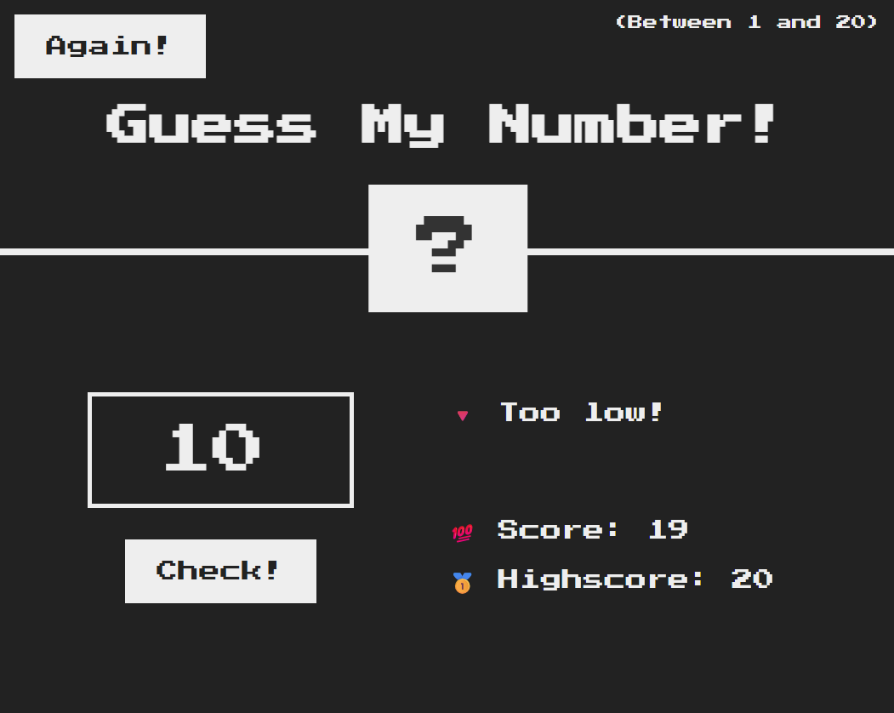

# 🎯 Guess My Number

A simple browser-based number guessing game built with vanilla JavaScript, HTML, and CSS. The player must guess a random number between 1 and 20. The game gives feedback on whether the guess is too high or too low and keeps track of the current score and high score.

 <!-- Optional: Add a real screenshot file named preview.png -->

---

## 🧠 How to Play

1. Click the **"Check!"** button after entering a number between 1 and 20.
2. The game will tell you if your guess is:
   - 🔺 Too high
   - 🔻 Too low
   - 🎉 Correct
3. You start with a score of 20. Each wrong guess decreases your score by 1.
4. If your score drops to 0, you lose 💥
5. Press the **"Again!"** button to restart the game.

---

## 🚀 Features

- Random number generation between 1–20
- Dynamic feedback on guess
- Score and high score tracking
- UI state updates on win/lose
- Responsive retro-style interface

---

## 📁 Project Structure

```
.
├── index.html        # Game layout
├── style.css         # Styling and layout
├── script.js         # Game logic
└── README.md         # Project documentation
```

---

## 💡 Technologies Used

- HTML5
- CSS3
- JavaScript (ES6)

---

## 🛠️ Setup & Run

To run locally:

1. Clone this repository or download the files.
2. Open `index.html` in your browser.
3. Play!

> No build tools or installations required.

---
