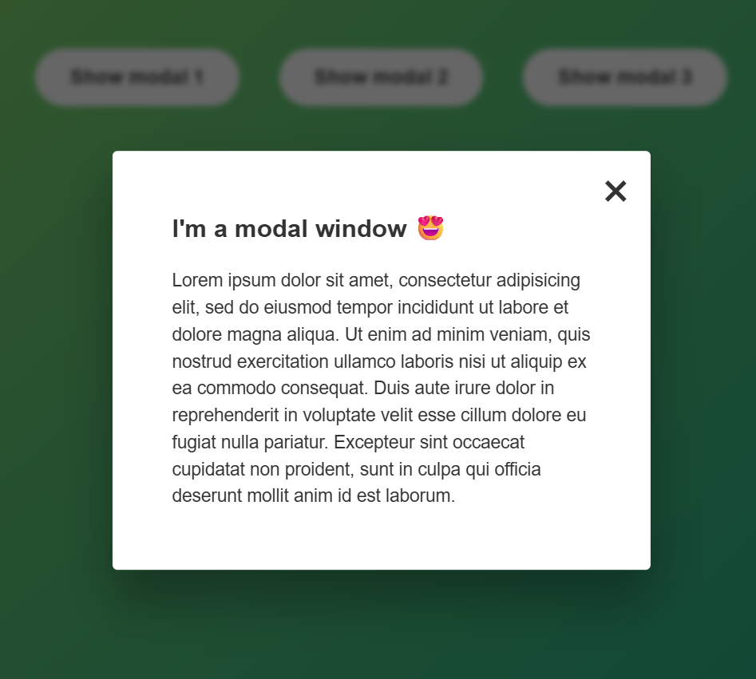

# 🪟 Modal Window Project

This project is a simple demonstration of how to create a modal window using **HTML**, **CSS**, and **JavaScript**. It's a beginner-friendly exercise to understand DOM manipulation and styling overlays.

## ✨ Features

- Open modal from any of three buttons.
- Close modal by:
  - Clicking the close (×) button.
  - Clicking outside the modal (overlay).
  - Pressing the `Escape` key.
- Clean, responsive layout using `flexbox` and modern CSS.
- Smooth overlay with blurred background (`backdrop-filter`).

## 🧱 Technologies

- **HTML5** – Structure of the modal and buttons.
- **CSS3** – Styling the modal, overlay, and layout.
- **JavaScript** – Modal toggle logic and keyboard event handling.

## 📂 Project Structure

```

modal-window/
├── index.html        # Markup structure
├── style.css         # Styling for modal and layout
└── script.js         # JS logic for open/close modal behavior

```

## 🖼️ Screenshot



## 🏁 Getting Started

To try it out:

1. Clone/download the repo.
2. Open `index.html` in your browser.
3. Click any "Show modal" button to test functionality.
