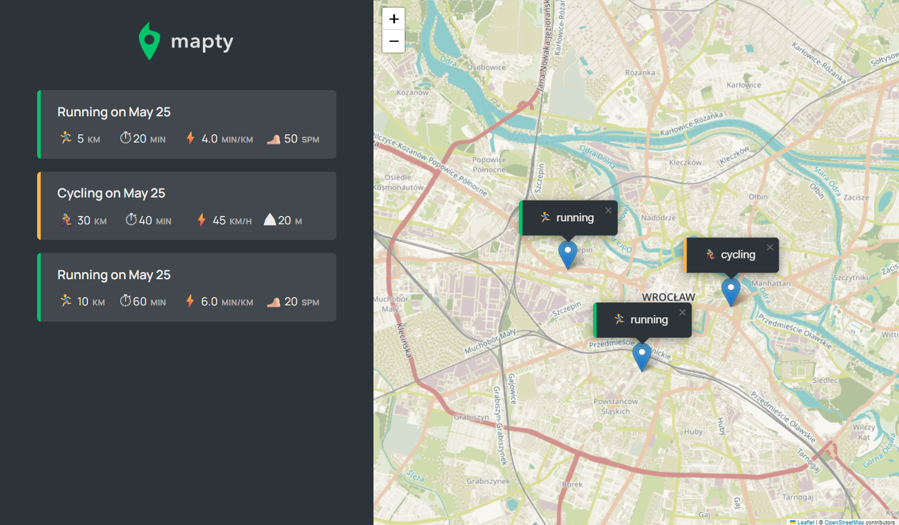

# 🗺️ Mapty - Workout Tracker with Map Integration

> Log your running or cycling workouts and display them interactively on a map.



## 📦 Features

- Geolocation to detect user's position
- Leaflet map integration
- Logging of workouts: running and cycling
- Inputs with validation
- Workouts rendered in a sidebar list
- Workout markers on the map with custom popup
- Persistent storage using LocalStorage

## 🚀 Technologies Used

- **JavaScript (ES6+)**
- **HTML/CSS**
- **Leaflet.js** for interactive maps

---

## 📄 JavaScript Breakdown

### 🌍 Geolocation API and Map Setup

```js
_getPosition() {
  navigator?.geolocation?.getCurrentPosition(
    this._loadMap.bind(this),
    function () {
      alert('Could not get your position');
    }
  );
}

_loadMap(position) {
  const { latitude, longitude } = position.coords;
  this.#map = L.map('map').setView([latitude, longitude], this.#mapZoomLevel);

  L.tileLayer('https://{s}.tile.openstreetmap.fr/hot/{z}/{x}/{y}.png', {
    attribution: '&copy; OpenStreetMap contributors',
  }).addTo(this.#map);

  this.#map.on('click', this._showForm.bind(this));
}
```

### 🏋️ Workout Class Hierarchy

**Base class:**

```js
class Workout {
  constructor(type, coords, distance, duration) {
    this.date = new Date();
    this.type = type;
    this.coords = coords;
    this.distance = distance;
    this.duration = duration;
    this.id = `${Date.now()}-${Math.trunc(Math.random() * 1e6)}`;
    this.#setDescription();
  }
  #setDescription() {
    const months = [...];
    this.description = `${this.type[0].toUpperCase() + this.type.slice(1)} on ${months[this.date.getMonth()]} ${this.date.getDate()}`;
  }
}
```

**Running:**

```js
class Running extends Workout {
  constructor(...args, cadence) {
    super(...args);
    this.cadence = cadence;
    this.#calcPace();
  }

  #calcPace() {
    this.pace = this.duration / this.distance;
  }
}
```

**Cycling:**

```js
class Cycling extends Workout {
  constructor(...args, elevationGain) {
    super(...args);
    this.elevationGain = elevationGain;
    this.#calcSpeed();
  }

  #calcSpeed() {
    this.speed = this.distance / (this.duration / 60);
  }
}
```

### ➕ Adding a New Workout

```js
_newWorkout(e) {
  e.preventDefault();
  const type = inputType.value;
  const distance = +inputDistance.value;
  const duration = +inputDuration.value;
  const { lat, lng } = this.#mapEvent.latlng;
  let workout;

  if (type === 'running') {
    const cadence = +inputCadence.value;
    if (!validInputs(distance, duration, cadence) || !allPositive(...)) return;
    workout = new Running('running', [lat, lng], distance, duration, cadence);
  }

  if (type === 'cycling') {
    const elevation = +inputElevation.value;
    if (!validInputs(...) || !allPositive(...)) return;
    workout = new Cycling('cycling', [lat, lng], distance, duration, elevation);
  }

  this.#workouts.push(workout);
  this.#renderWorkoutMarker(workout);
  this.#renderWorkout(workout);
  this.#hideForm();
  this.#setLocalStorage();
}
```

### 📌 Rendering Workouts

```js
#renderWorkoutMarker(workout) {
  L.marker(workout.coords)
    .addTo(this.#map)
    .bindPopup(
      L.popup({ maxWidth: 250, autoClose: false, closeOnClick: false, className: `${workout.type}-popup` })
    )
    .setPopupContent(`${workout.type === 'running' ? '🏃‍♂️' : '🚴‍♀️'} ${workout.type}`)
    .openPopup();
}
```

```js
#renderWorkout(workout) {
  let html = `...common HTML...`;
  if (workout.type === 'running') html += `...cadence/pace markup...`;
  if (workout.type === 'cycling') html += `...elevation/speed markup...`;
  form.insertAdjacentHTML('afterend', html);
}
```

### 💾 Local Storage Persistence

```js
#setLocalStorage() {
  localStorage.setItem('workouts', JSON.stringify(this.#workouts));
}

#getLocalStorage() {
  const data = JSON.parse(localStorage.getItem('workouts'));
  if (!data) return;
  this.#workouts = data;
  this.#workouts.forEach(work => this.#renderWorkout(work));
}

reset() {
  localStorage.removeItem('workouts');
  location.reload();
}
```

### 🧪 Input Validation Utilities

```js
const validInputs = (...inputs) => inputs.every(inp => Number.isFinite(inp));
const allPositive = (...inputs) => inputs.every(inp => inp > 0);
```

## 🧹 Reset Instructions

Use the browser console to call:

```js
app.reset();
```

This will clear localStorage and reset the app.
