# JavaScript Course Notes <!-- omit from toc -->

📘 This repository contains my personal notes as I follow The Complete JavaScript Course on Udemy. It includes projects I've worked on during the course, and serves as a living document to reinforce what I'm learning and as a future reference.

## 📚 Table of Contents <!-- omit from toc -->

- [1. Fundamentals](#1-fundamentals)
  - [1.1. 🧠 What is JavaScript?](#11--what-is-javascript)
  - [1.2. 🧾 Variable Naming Conventionss](#12--variable-naming-conventionss)
  - [1.3. 🧮 Data Types](#13--data-types)
    - [1.3.1. `Number`](#131-number)
    - [1.3.2. `String`](#132-string)
    - [1.3.3. `Boolean`](#133-boolean)
    - [1.3.4. `Undefined`](#134-undefined)
    - [1.3.5. `Null`](#135-null)
    - [1.3.6. `Symbol` _(ES6 / 2015)_](#136-symbol-es6--2015)
    - [1.3.7. `BigInt` _(ES2020)_](#137-bigint-es2020)
  - [1.4. 📦 Variable Declarations](#14--variable-declarations)
    - [1.4.1. `let`](#141-let)
    - [1.4.2. `const`](#142-const)
    - [1.4.3. `var` (❗avoid using it)](#143-var-avoid-using-it)
  - [1.5. ➗ Operators](#15--operators)
  - [1.6. 📝 Template Literals](#16--template-literals)
  - [1.7. 🔄 Type Conversion and Coercion](#17--type-conversion-and-coercion)
    - [1.7.1. Type Conversion (Manual)](#171-type-conversion-manual)
    - [1.7.2. Type Coercion (Automatic)](#172-type-coercion-automatic)
  - [1.8. ⚖️ Truthy and Falsy Values](#18-️-truthy-and-falsy-values)
  - [1.9. 🟰 Equality Operators](#19--equality-operators)
    - [1.9.1. Strict Equality (`===`)](#191-strict-equality-)
    - [1.9.2. Loose Equality (`==`)](#192-loose-equality-)
    - [1.9.3. Inequalities](#193-inequalities)
    - [1.9.4. Best Practice](#194-best-practice)
  - [1.10. 🧷 Strict Mode](#110--strict-mode)
  - [1.11. 📐 Function Declarations vs Expressions](#111--function-declarations-vs-expressions)
  - [1.12. 🏹 Arrow Functions](#112--arrow-functions)
  - [1.13. 🔢 Arrays](#113--arrays)
    - [1.13.1. Basic Array Operations (Methods)](#1131-basic-array-operations-methods)
      - [1.13.1.1. Adding elements](#11311-adding-elements)
      - [1.13.1.2. Removing elements](#11312-removing-elements)
      - [1.13.1.3. Finding elements](#11313-finding-elements)
  - [1.14. 🧱 Objects](#114--objects)
    - [1.14.1. Dot vs. Bracket Notation](#1141-dot-vs-bracket-notation)
    - [1.14.2. Object Methods](#1142-object-methods)
- [2. Developer Skills](#2-developer-skills)
  - [2.1. 🧩 Problem Solving](#21--problem-solving)
  - [2.2. 🛠️ Debugging](#22-️-debugging)
  - [2.3. 🤖 Using AI for coding](#23--using-ai-for-coding)
- [3. JavaScript in the Browser: DOM and Events](#3-javascript-in-the-browser-dom-and-events)
  - [3.1. 📄 DOM](#31--dom)
    - [3.1.1. Selecting Elements](#311-selecting-elements)
    - [3.1.2. Updating Content and Styling](#312-updating-content-and-styling)
  - [3.2. 🖱️ Events](#32-️-events)
    - [3.2.1. Handling Events](#321-handling-events)
    - [3.2.2. Keyboard Events](#322-keyboard-events)
- [4. How JavaScript Works Behind The Scenes](#4-how-javascript-works-behind-the-scenes)
  - [4.1. 💡 Definition again](#41--definition-again)
    - [4.1.1. High-level](#411-high-level)
    - [4.1.2. Interpreted or just-in-time](#412-interpreted-or-just-in-time)
    - [4.1.3. Multi-paradigm](#413-multi-paradigm)
    - [4.1.4. Procedural](#414-procedural)
    - [4.1.5. Object-Oriented Programming (OOP)](#415-object-oriented-programming-oop)
    - [4.1.6. Functional Programming (FP)](#416-functional-programming-fp)
    - [4.1.7. Prototype-based object-oriented approach](#417-prototype-based-object-oriented-approach)
    - [4.1.8. First-class Functions](#418-first-class-functions)
    - [4.1.9. Dynamic](#419-dynamic)
    - [4.1.10. Single-threaded and non-blocking event loop](#4110-single-threaded-and-non-blocking-event-loop)
  - [4.2. ⚙️ Engine and Runtime](#42-️-engine-and-runtime)
    - [4.2.1. Engine](#421-engine)
      - [4.2.1.1. Compilation vs Interpretation](#4211-compilation-vs-interpretation)
    - [4.2.2. Runtime](#422-runtime)
  - [4.3. 🔁 Execution Contexts and the Call Stack](#43--execution-contexts-and-the-call-stack)
    - [4.3.1. What’s inside an execution context?](#431-whats-inside-an-execution-context)
    - [4.3.2. What is the call stack?](#432-what-is-the-call-stack)
    - [4.3.3. Scope and Scope Chain](#433-scope-and-scope-chain)
  - [4.4. 🪄 Variable Environment: Hoisting and the TDZ](#44--variable-environment-hoisting-and-the-tdz)
  - [4.5. 🔍 `this` keyword](#45--this-keyword)
    - [4.5.1. Function called as a **method**](#451-function-called-as-a-method)
    - [4.5.2. Simple function call](#452-simple-function-call)
    - [4.5.3. Arrow Function](#453-arrow-function)
    - [4.5.4. Event Listener](#454-event-listener)
    - [4.5.5. Examples](#455-examples)
  - [4.6. 🧼 Memory Management: Primitives vs Objects](#46--memory-management-primitives-vs-objects)
    - [4.6.1. Reference](#461-reference)
      - [4.6.1.1. Shallow copy](#4611-shallow-copy)
      - [4.6.1.2. Deep copy](#4612-deep-copy)

# 1. Fundamentals

## 1.1. 🧠 What is JavaScript?

> JavaScript is a **high-level, object-oriented, multi-paradigm programming language**

It has evolved significantly since its creation:

- **ES5 (2009)**: Served as the standard for many years.
- **ES6 / ES2015 (2015)**: A major update introducing many modern features:
  - `let` / `const`
  - Arrow functions (`=>`)
  - Template literals
  - Classes
  - Destructuring
  - And many more
- **ES2016 – ES2022**: Smaller annual updates adding new features.

Modern browsers automatically support the latest features.  
For older browsers, tools like **Babel** can transpile modern code to ES5.

The language continues to evolve, with new features proposed through a **4-stage process** before being officially included in the standard.

## 1.2. 🧾 Variable Naming Conventionss

In JavaScript, the standard for naming variables is **camelCase**, starting with a lowercase letter.

```js
let userAge = 25;
let totalPrice = 19.99;
```

Variable names **cannot begin with a number**, but they can include letters, digits, underscores (`_`), and dollar signs (`$`).

```js
let 1stUser = 'John';     // ❌ Invalid: starts with a number
let count1 = 1;           // ✅ Valid
let _internal = 'yes';    // ✅ Valid
let $response = 200;      // ✅ Valid
```

**Reserved keywords** like `let`, `function`, or `return` cannot be used directly as variable names.

```js
let let = 5;              // ❌ Invalid: 'let' is reserved
```

While you technically can prefix reserved words with `_` or `$` (e.g., `_class`, `$return`), it’s discouraged for clarity and readability.

```js
let _class = "Warrior"; // ✅ Legal, but discouraged
let $return = "value"; // ✅ Legal, but discouraged
```

The variable name `name` is technically allowed, but it can conflict with built-in browser objects, so it's best avoided.

```js
let name = "Alice"; // ⚠️ Allowed, but may cause issues
```

Constants that **never change** should be written in **all uppercase**, using underscores to separate words.

```js
const MAX_USERS = 100;
const API_KEY = "abc123";
```

Regardless of syntax rules, always aim for **clear and descriptive** names that reflect the purpose of the variable.

```js
let x = 42; // ❌ Vague
let userScore = 42; // ✅ Descriptive
```

## 1.3. 🧮 Data Types

**JavaScript uses dynamic typing.**

You do **not** need to manually define the data type of a variable. The type is determined **automatically at runtime** based on the value assigned.

Keep in mind that **values** have types, not the variables themselves. Variables simply hold those values.

One quirky detail worth remembering — `null` is a primitive type, but `typeof null` returns `object` due to a long-standing bug in JavaScript's type system. It was never fixed to avoid breaking legacy code.

```js
console.log(typeof null); // "object" — known bug 🐞
```

### 1.3.1. `Number`

Represents floating-point numbers. Used for both integers and decimals.

```js
let age = 23;
let price = 19.99;
```

### 1.3.2. `String`

A sequence of characters, used for textual data. Can be written with single or double quotes.

```js
let firstName = "Jonas";
let lastName = "Smith";
```

### 1.3.3. `Boolean`

Logical type with only two possible values: `true` or `false`. Commonly used in conditionals.

```js
let isAdult = true;
let hasLicense = false;
```

### 1.3.4. `Undefined`

A variable that has been declared but **not assigned** a value yet.

```js
let children;
console.log(children); // undefined
```

### 1.3.5. `Null`

Represents an explicitly **empty** or unknown value.  
Often used intentionally to reset or clear a variable.

```js
let selectedProduct = null;
```

### 1.3.6. `Symbol` _(ES6 / 2015)_

A unique and immutable value, often used as object property keys to avoid naming conflicts.

```js
const id = Symbol("id");
```

### 1.3.7. `BigInt` _(ES2020)_

Used to represent integers **larger than the `Number` type can safely handle**.

```js
const huge = 1234567890123456789012345678901234567890n;
```

## 1.4. 📦 Variable Declarations

### 1.4.1. `let`

Use `let` to declare variables that can be reassigned (mutable).

```js
let age = 30;
age = 31; // ✅ valid
```

### 1.4.2. `const`

Use `const` for variables that should never change (immutable). You must assign a value immediately when using `const`.

```js
const birthYear = 1991;
birthYear = 1990; // ❌ Error: Assignment to constant variable

const job; // ❌ Error: Missing initializer in const declaration
```

### 1.4.3. `var` (❗avoid using it)

`var` is the old way of declaring variables before ES6. While it may appear similar to `let`, it behaves differently under the hood.

```js
var job = "programmer";
job = "teacher";
```

The key difference:

- `let` is **block scoped**
- `var` is **function scoped**

---

You can even assign a value to a variable without declaring it — but this is strongly discouraged.

```js
lastName = "Schmedtmann"; // no let, const, or var
console.log(lastName); // ⚠️ works, but...
```

This implicitly creates a global variable (adds a property to the global object), which can easily lead to bugs and hard-to-maintain code. **Avoid doing this**.

## 1.5. ➗ Operators

Exponentiation (`**`)
Raises the first number to the power of the second:

```js
console.log(2 ** 3); // 8
```

[Operator precedence table (MDN)](https://developer.mozilla.org/en-US/docs/Web/JavaScript/Reference/Operators/Operator_precedence#table)

## 1.6. 📝 Template Literals

Template literals (introduced in ES6) are an easier, cleaner way to build strings in JavaScript.  
They allow embedding expressions directly inside the string using backticks <code>\` \`</code> and the `${}` syntax.

```js
const firstName = "Jonas";
const job = "teacher";
const birthYear = 1991;
const year = 2037;

// Traditional string concatenation
const jonas =
  "I'm " + firstName + ", a " + (year - birthYear) + " years old " + job + "!";
console.log(jonas); // "I'm Jonas, a 46 years old teacher!"

// Template literal version (cleaner)
const jonasNew = `I'm ${firstName}, a ${year - birthYear} years old ${job}!`;
console.log(jonasNew); // "I'm Jonas, a 46 years old teacher!"

// Multiline Strings with Template Literals
const multiline = `This is a string
that spans multiple
lines without using \\n`;
```

Template literals make the code more readable and easier to write, especially when mixing strings with variables or expressions even across multiple lines.

## 1.7. 🔄 Type Conversion and Coercion

### 1.7.1. Type Conversion (Manual)

**Type conversion** is when you manually convert a value from one type to another.

```js
const inputYear = "1991";
console.log(Number(inputYear), inputYear); // 1991 '1991'
console.log(Number(inputYear) + 18); // 2009

console.log(Number("Jonas")); // NaN → Not a Number
console.log(typeof NaN); // 'number' → NaN is still of type number

console.log(String(23)); // '23' → Appears white in the console (string)
```

### 1.7.2. Type Coercion (Automatic)

**Type coercion** occurs when JavaScript automatically converts one data type to another behind the scenes.
It happens whenever an operation involves values of different types, and JavaScript attempts to make them compatible by converting one to match the other.

```js
console.log("I am " + 23 + " years old"); // 'I am 23 years old'
console.log("23" - "10" - 3); // 10 → '-' forces number conversion
console.log("23" * "2"); // 46 → '*' converts both to numbers

let n = "1" + 1; // '11' → '+' triggers string concatenation
n = n - 1; // 10 → '-' coerces '11' to number
console.log(n); // 10

n = 2 + 3 + 4 + "5";
console.log(n); // '95' → 2+3+4=9 → '9'+'5' = '95'

n = "10" - "4" - "3" - 2 + "5";
console.log(n); // '15' → 10-4-3-2=1 → 1+'5' = '15'
```

Understanding when JavaScript converts types automatically helps you avoid unexpected bugs.

## 1.8. ⚖️ Truthy and Falsy Values

In JavaScript, **falsy values** are values that automatically convert to `false` when evaluated in a boolean context.

There are exactly **five falsy values**:

- `0`
- `''` (empty string)
- `undefined`
- `null`
- `NaN`

All other values are considered **truthy**, meaning they convert to `true`.

```js
console.log(Boolean(0)); // false
console.log(Boolean(undefined)); // false
console.log(Boolean("Jonas")); // true
console.log(Boolean({})); // true
```

## 1.9. 🟰 Equality Operators

In JavaScript, there are two main types of equality operators:

### 1.9.1. Strict Equality (`===`)

The **strict equality operator** (`===`) checks whether two values are exactly the same **without performing type coercion**. This means both the value and the type must match.

```js
console.log(3 === 3); // true  (same value and same type)
console.log("3" === 3); // false (different types: string vs number)
console.log(true === 1); // false (different types: boolean vs number)
console.log(undefined === null); // false (different types)
```

### 1.9.2. Loose Equality (`==`)

The **loose equality operator** (`==`) performs **type coercion**. This means it converts one or both values to the same type before making the comparison.

```js
console.log(3 == 3); // true  (same value, same type)
console.log("3" == 3); // true  (loose coercion, string '3' is converted to number 3)
console.log(true == 1); // true  (loose coercion, true is converted to 1)
console.log(undefined == null); // true  (both are treated as "empty" values)
```

### 1.9.3. Inequalities

The strict inequality operator (`!==`) checks if two values are not equal in both value and type without type coercion, while the loose inequality operator (`!=`) does type coercion before checking inequality.

### 1.9.4. Best Practice

Always prefer strict equality (`===`) and strict inequality (`!==`) to avoid unexpected type coercion.

## 1.10. 🧷 Strict Mode

Strict mode helps you write cleaner, more secure JavaScript.  
Place `'use strict';` at the beginning of your script (or function) to enable it.

It prevents certain silent errors by throwing exceptions, forbids the use of reserved keywords, and generally enforces better coding practices.

```js
"use strict";

let hasDriversLicense = false;
const passTest = true;

if (passTest) hasDriverLicense = true; // ❌ Uncaught ReferenceError: hasDriverLicense is not defined
if (hasDriversLicense) console.log("I can drive :D");

const interface = "Audio"; // ❌ Uncaught SyntaxError: Unexpected strict mode reserved word
```

## 1.11. 📐 Function Declarations vs Expressions

### Function Declaration <!-- omit from toc -->

```js
function calcAge1(birthYear) {
  return 2037 - birthYear;
}
const age1 = calcAge1(1991);
```

### Function Expression <!-- omit from toc -->

```js
const calcAge2 = function (birthYear) {
  return 2037 - birthYear;
};
const age2 = calcAge2(1991);
console.log(age1, age2); // Both produce the same result
```

The main difference is that **function declarations are hoisted**, meaning they can be called **before** they are defined in the code.  
**Function expressions**, however, are **not hoisted** and will throw an error if called before their definition:

```js
// ✅ This works
const age1 = calcAge1(1991);
function calcAge1(birthYear) {
  return 2037 - birthYear;
}

// ❌ This causes an error
const age2 = calcAge2(1991);
const calcAge2 = function (birthYear) {
  return 2037 - birthYear;
};
```

Both are valid in JavaScript. The choice often depends on personal preference and use case.

## 1.12. 🏹 Arrow Functions

Arrow functions were introduced in **ES6** as a more concise way to write function expressions — especially useful for **simple one-liners**.

### Examples <!-- omit from toc -->

```js
// Arrow function with one parameter and implicit return
const square = (number) => number ** 2;
const result = square(5);
console.log(result); // 25

// Arrow function with multiple parameters and multiple lines
const greetPerson = (name, age) => {
  const message = `Hello, ${name}! You are ${age} years old.`;
  return message;
};
console.log(greetPerson("Alice", 30)); // Hello, Alice! You are 30 years old.
```

### Key points about arrow functions: <!-- omit from toc -->

- For one parameter and one-line body, you can omit parentheses around parameters and curly braces.
- With a one-liner without curly braces, the return is implicit.
- For multiple parameters, you need parentheses: `(param1, param2) => expression`.
- For multiple lines of code, you need curly braces and an explicit `return` statement.
- Arrow functions don't have their own `this` keyword (important for more advanced JavaScript).

## 1.13. 🔢 Arrays

Arrays allow us to store multiple related values in a single variable, rather than creating separate variables for each value.

```js
// Instead of this:
const friend1 = "Michael";
const friend2 = "Steven";
const friend3 = "Peter";
// We can use an array:
const friends = ["Michael", "Steven", "Peter"];
console.log(friends);
// Alternative syntax (less common)
const years = new Array(1991, 1984, 2008, 2020);
```

Accessing array elements (using zero-based indexing).

```js
console.log(friends[0]); // Michael
console.log(friends[2]); // Peter
// Getting the array length
console.log(friends.length); // 3
// Getting the last element
console.log(friends[friends.length - 1]); // Pete
```

Arrays can be mutated even when declared with const.

```js
friends[1] = "Jay"; // Replace 'Steven' with 'Jay'
console.log(friends); // ['Michael', 'Jay', 'Peter']
// However, this would not work:
// friends = ['Bob', 'Alice']; // Error! Cannot reassign const
variable;
```

Arrays can hold values of **different types**.

```js
const jonas = ["Jonas", "Schmedtmann", 2037 - 1991, "teacher", friends];
console.log(jonas);
```

When you use the `+` operator between a string and an array, JavaScript converts the array to a string (comma-separated values) and then concatenates. When using the `-` operator with an array and a string (or number), JavaScript tries to convert both operands to numbers. If it fails (like when one is a string or an array of strings), the result is `NaN`.

```js
// + operator (concatenation)
console.log("Hello " + [1, 2, 3]); // "Hello 1,2,3"

// - operator (numeric coercion)
console.log("Hello" - [1, 2, 3]); // NaN
```

### 1.13.1. Basic Array Operations (Methods)

JavaScript provides built-in methods to manipulate arrays:

#### 1.13.1.1. Adding elements

```js
const friends = ["Michael", "Steven", "Peter"];
// Add to end
friends.push("Jay");
console.log(friends); // ['Michael', 'Steven', 'Peter', 'Jay']
// Add to beginning
friends.unshift("John");
console.log(friends); // ['John', 'Michael', 'Steven', 'Peter', 'Jay']
```

Push and unshift both return the new array length.

```js
const newLength = friends.push("Andrew");
console.log(newLength); // 6
```

#### 1.13.1.2. Removing elements

```js
// Remove from end
const popped = friends.pop();
console.log(friends); // ['John', 'Michael', 'Steven', 'Peter', 'Jay']
console.log(popped); // 'Andrew'
// Remove from beginning
const shifted = friends.shift();
console.log(friends); // ['Michael', 'Steven', 'Peter', 'Jay']
console.log(shifted); // 'John'
```

#### 1.13.1.3. Finding elements

```js
console.log(friends.indexOf("Steven")); // 1
console.log(friends.indexOf("Bob")); // -1 (not found)
// ES6 method - returns boolean
console.log(friends.includes("Steven")); // true
console.log(friends.includes("Bob")); // false
```

The `includes` method is useful for conditionals.

```js
if (friends.includes("Peter")) {
  console.log("You have a friend called Peter!");
}
```

## 1.14. 🧱 Objects

While arrays are great for ordered data, objects let us define key-value pairs.

```js
const jonas = {
  firstName: "Jonas",
  lastName: "Schmedtmann",
  age: 2037 - 1991,
  job: "teacher",
  friends: ["Michael", "Peter", "Steven"],
};
```

This is called an object literal syntax - we're literally writing down the object content.
Objects allow us to:

- Give each piece of data a name (key or property name)
- Store unstructured and related data
- Access data by its name rather than position

Unlike arrays, the order of properties in objects doesn't matter when retrieving data.

### 1.14.1. Dot vs. Bracket Notation

There are two ways to access object properties.

#### Dot Notation <!-- omit from toc -->

```js
const jonas = {
  firstName: "Jonas",
  lastName: "Schmedtmann",
  age: 2037 - 1991,
  job: "teacher",
  friends: ["Michael", "Peter", "Steven"],
};
console.log(jonas.lastName); // 'Schmedtmann'
```

#### Bracket Notation <!-- omit from toc -->

```js
console.log(jonas["lastName"]); // 'Schmedtmann'
```

The main difference is that bracket notation allows us to use expressions.

```js
const nameKey = "Name";
console.log(jonas["first" + nameKey]); // 'Jonas'
console.log(jonas["last" + nameKey]); // 'Schmedtmann'
// This would NOT work with dot notation:
// console.log(jonas.'last' + nameKey); // Error
```

Bracket notation is useful when we don't know which property to access until runtime.

```js
const interestedIn = prompt('What do you want to know about Jonas?');
if (jonas[interestedIn]) {
 console.log(jonas[interestedIn]);
} else {
 console.log(
 'Wrong request! Choose between firstName, lastName, age, job and
friends.',
 );
}
```

We can also add new properties to objects using either notation.

```js
jonas.location = "Portugal";
jonas["twitter"] = "@jonasschmedtman";
console.log(jonas);
```

### 1.14.2. Object Methods

Since functions are just values in JavaScript, we can add them as properties to objects.

```js
const jonas = {
  firstName: "Jonas",
  lastName: "Schmedtmann",
  birthYear: 1991,
  job: "teacher",
  friends: ["Michael", "Peter", "Steven"],
  hasDriversLicense: true,
  // Method (function as property)
  calcAge: function () {
    // 'this' refers to the current object (jonas)
    this.age = 2037 - this.birthYear;
    return this.age;
  },
  getSummary: function () {
    return `${this.firstName} ${
      this.lastName
    } is a ${this.calcAge()}-year old ${this.job}. He has ${
      this.friends.length
    } friends and ${this.hasDriversLicense ? "a" : "no"} driver's
    license.`;
  },
};
```

Functions attached to objects are called methods. We can call them like this.

```js
console.log(jonas.calcAge()); // 46
console.log(jonas["calcAge"]()); // 46
console.log(jonas.age); // 46
// Using the getSummary method
console.log(jonas.getSummary()); // "Jonas Schmedtmann is a 46-year old teacher. He has 3 friends and a driver's license."
```

# 2. Developer Skills

## 2.1. 🧩 Problem Solving

1. **Understand the Problem Thoroughly**  
   Ask the right questions to get a clear and complete picture of what you're solving.

2. **Divide and Conquer**  
   Break the big problem into smaller, manageable sub-problems.

3. **Research Relentlessly**  
   Don’t hesitate to dig deep — use resources like Google, Stack Overflow, and MDN.

4. **Plan Before You Code**  
   For larger problems, write pseudo-code first to map out your logic clearly before jumping into real code.

## 2.2. 🛠️ Debugging

1. **Identify the Bug**

   - When does it appear?
     - During development
     - During software testing
     - Reported by users in production
   - What’s the context?
     - Specific browsers?
     - Specific devices or user actions?

2. **Find the Cause**

   - Use the developer console for simple issues
   - Use the debugger for more complex problems

3. **Fix the Bug**

   - Replace the incorrect solution with a correct one
   - Confirm that the fix works and doesn't break other code

4. **Prevent Future Bugs**
   - Search for similar code where the same issue might exist
   - Write tests using testing tools to catch regressions early

## 2.3. 🤖 Using AI for coding

**AIs:** ChatGPT, GitHub Copilot, Cursor

We can use AI for:

- Writing code snippets, functions, or even generating full files
- Using code-aware autocomplete
- Chatting with your codebase

---

### The workflow of using AI for coding <!-- omit from toc -->

1. Make sure you **100% understand the problem**.
   Ask questions to get a clear picture.

2. Choose the right AI and give it a **very specific prompt**.

3. Let the AI generate the solution as code.

4. **Review and test** the output. Make sure you're not introducing bugs into your app.

---

### Only Incorporate AI Code When <!-- omit from toc -->

1. You could have **written it yourself**.

2. You **truly understand** what it does.

3. You've verified it's **100% correct**.

4. You're not using it for **mission-critical** parts of your application.

> ⚠️ Don’t just use AI blindly — it can make you a **worse programmer** if you rely on it without understanding.

# 3. JavaScript in the Browser: DOM and Events

## 3.1. 📄 DOM

**Document Object Model (DOM)**  
A structured representation of HTML documents.  
It allows JavaScript to:

- Access HTML documents
- Access and manipulate HTML elements and styles

**DOM Methods and Properties**  
DOM manipulation is **not part of JavaScript itself**.  
It is part of the **Web APIs**, which JavaScript can interact with in the browser.

---

### 3.1.1. Selecting Elements

You can use `document.querySelector()` and `querySelectorAll()` to access specific DOM nodes.

```js
const checkBtn = document.querySelector(".check");
const inputField = document.querySelector(".guess");
const messageDisplay = document.querySelector(".message");

const btnsOpenModal = document.querySelectorAll(".show-modal");
```

This allows you to modify, listen to, or control the selected elements dynamically.

---

### 3.1.2. Updating Content and Styling

You can change content and styling of elements directly using `.textContent` and `.style`.

```js
document.querySelector(".message").textContent = "🎉 Correct Number!";
document.querySelector("body").style.backgroundColor = "#60b347";
document.querySelector(".number").style.width = "30rem";
```

This is useful for creating immediate feedback in the UI based on game state.

---

## 3.2. 🖱️ Events

### 3.2.1. Handling Events

You can respond to user actions by attaching event listeners with `.addEventListener()`.

```js
document.querySelector(".check").addEventListener("click", function () {
  // logic to handle guess
});
```

This enables your application to respond to clicks, inputs, and other interactions in real time.

---

You can attach event listeners using reusable function expressions instead of writing the function inline:

```js
btnsOpenModal.forEach((btn) => {
  btn.addEventListener("click", openModal);
});

btnCloseModal.addEventListener("click", closeModal);
overlay.addEventListener("click", closeModal);
```

This keeps the code cleaner and avoids repetition.

---

### 3.2.2. Keyboard Events

You can listen for global key presses using `document.addEventListener('keydown')`:

```js
document.addEventListener("keydown", function (e) {
  if (e.key === "Escape" && !modal.classList.contains("hidden")) {
    closeModal();
  }
});
```

This adds a user-friendly way to close the modal with the Escape key.

---

# 4. How JavaScript Works Behind The Scenes

## 4.1. 💡 Definition again

Getting back to the definition, here's a more complicated one:

> JavaScript is a **high-level**, prototype-based **object-oriented**, **multi-paradigm**, **interpreted or just-in-time** compiled, **dynamic**, single-threaded, garbage-collected programming language with **first-class functions** and a non-blocking event loop concurrency model.

### 4.1.1. High-level

We do not need to manage resources thanks to the garbage collector, which removes old unused objects from memory.

### 4.1.2. Interpreted or just-in-time

### 4.1.3. Multi-paradigm

Paradigm – an approach and mindset of structuring code, which will direct your coding style and technique.

We can classify paradigms as **imperative** or **declarative**.

### 4.1.4. Procedural

### 4.1.5. Object-Oriented Programming (OOP)

### 4.1.6. Functional Programming (FP)

### 4.1.7. Prototype-based object-oriented approach

Almost everything in JavaScript is an object except for primitive values.

### 4.1.8. First-class Functions

In a language with **first-class functions**, functions are simply **treated as variables**. We can pass them into other functions and return them from functions.

### 4.1.9. Dynamic

A dynamically-typed language has no data type definitions. Types become known at runtime. The data type of a variable can automatically change.

### 4.1.10. Single-threaded and non-blocking event loop

**Concurrency model** – how the JavaScript engine handles multiple tasks happening at the same time.

> Why do we need that?

JavaScript runs in one **single thread**, so it can only do one thing at a time.

> So what about long-running tasks?

Sounds like it would block the single thread. However, we want non-blocking behavior!

> How do we achieve that?

By using an **event loop**: it takes long-running tasks, executes them in the background, and puts them back in the main thread once they are finished.

## 4.2. ⚙️ Engine and Runtime

### 4.2.1. Engine

**Engine** – program that executes JS code, e.g., the V8 engine used by Chrome.

**Components**:

- **Call stack**: where all code is actually executed using something like an execution context
- **Heap**: unstructured memory pool which stores all the objects the application needs

#### 4.2.1.1. Compilation vs Interpretation

- **Compilation** – Entire code is converted into machine code at once and written to a binary file that can be executed by a computer

  

- **Interpretation** – Interpreter runs through the source code and executes it line by line

  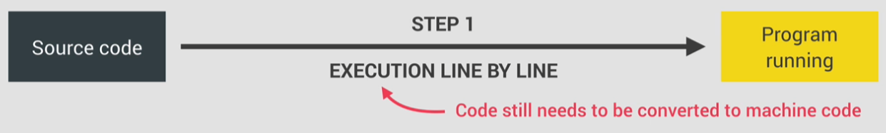

- **Just-in-time (JIT) compilation** – Entire code is converted into machine code at once, then executed immediately

  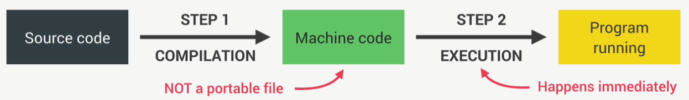

JavaScript is JIT compiled.

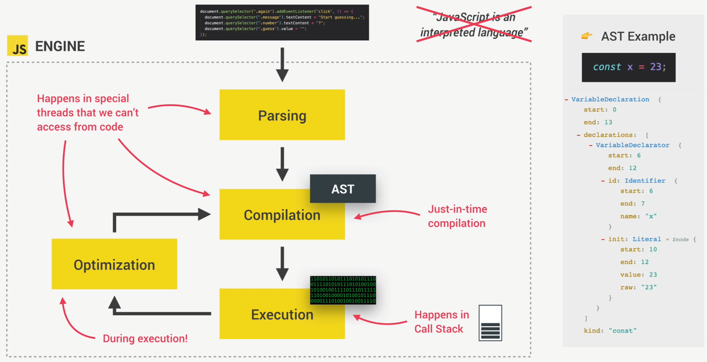

### 4.2.2. Runtime

**Runtime** – container including all the things we need to use JavaScript (e.g., in the browser)

Includes the JS engine, Web APIs, and the callback queue.

When events happen (e.g., a click):

1. Callback function is put into the callback queue
2. When the call stack is empty, the callback function is passed to the stack, so it can be executed
   - This is handled by the **event loop**, which takes callbacks from the queue and puts them into the call stack

This is how JavaScript’s non-blocking concurrency model is implemented.

**JavaScript in the browser**:  
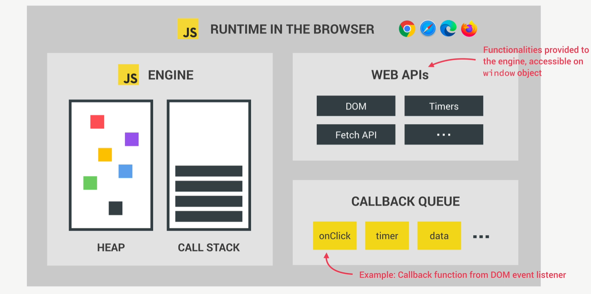

**JavaScript in Node.js**:  
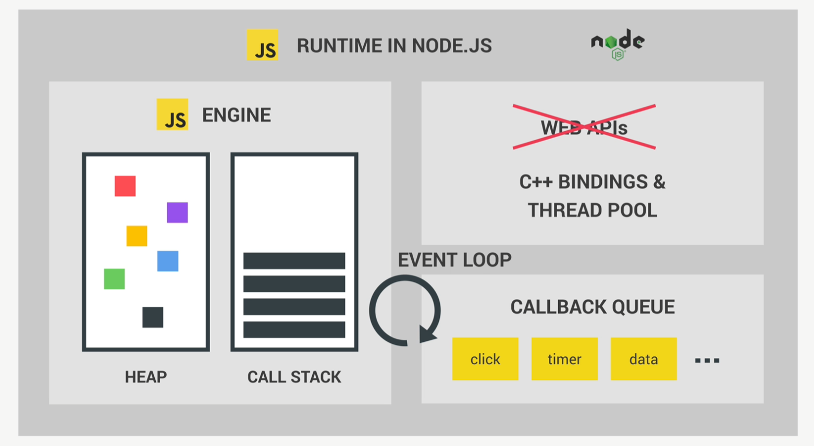

## 4.3. 🔁 Execution Contexts and the Call Stack

So our code just finished compiling and is ready to be executed.

The **global execution context** is created for the top-level code (code outside functions).

**Execution context** – environment in which a piece of JavaScript is executed. Stores all necessary information, like local variables and arguments.

There is exactly **one** global execution context. Once it is finished, functions start to execute. For each function call, a new execution context is created with the information needed to run that function.

When all functions are done, the engine waits for callback functions to arrive (e.g., click event handlers), which are provided by the event loop.

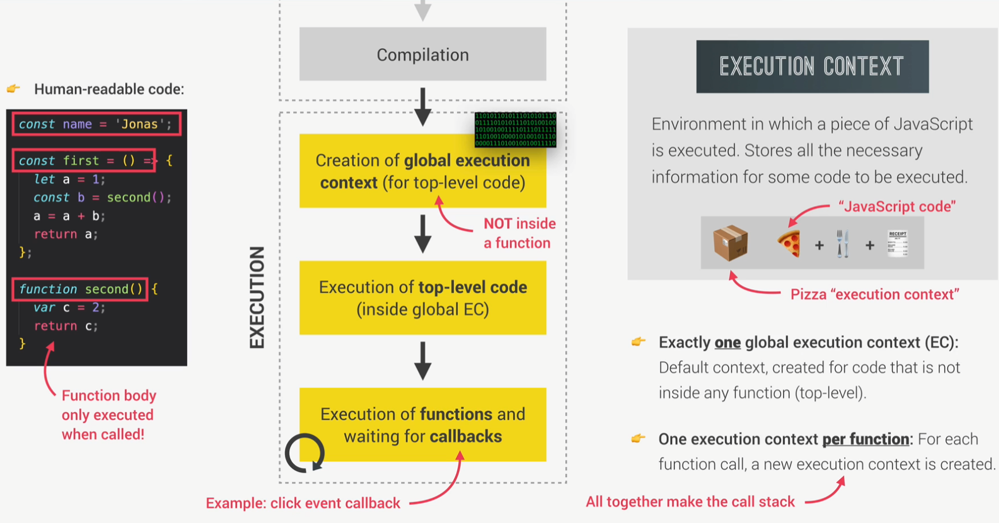

### 4.3.1. What’s inside an execution context?

1. **Variable Environment**
   - `let`, `const`, `var` declarations
   - Functions
   - `arguments` object
2. **Scope Chain**
   - References to variables outside the current function
3. **`this` keyword**

Arrow functions’ execution context:

1. **Variable Environment**
   - `let`, `const`, `var` declarations
   - Functions
   - <span style="color: red;">~~arguments object~~</span>
2. **Scope Chain**
   - References to variables outside the current function
3. <span style="color: red;">~~this keyword~~</span>

### 4.3.2. What is the call stack?

Place where execution contexts are stacked to keep track of where we are in execution.  
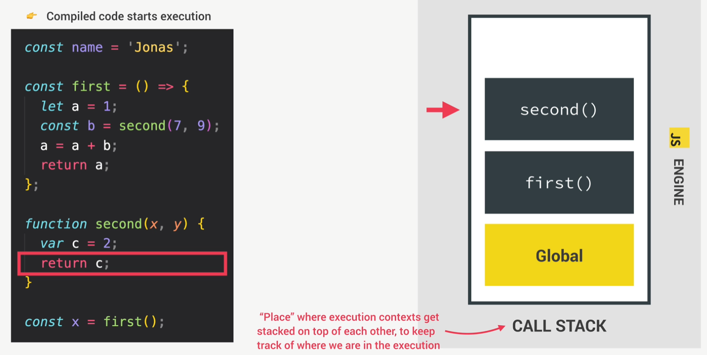

### 4.3.3. Scope and Scope Chain

**Scoping** controls how variables are organized and accessed:

> "Where do variables live?"  
> "Where can we access a certain variable, and where not?"

**Lexical scoping** – scoping is controlled by placement of functions and blocks in code.

**Scope** – environment where a variable is **declared**. There is:

- **Global** scope
- **Function** scope
- **Block** scope

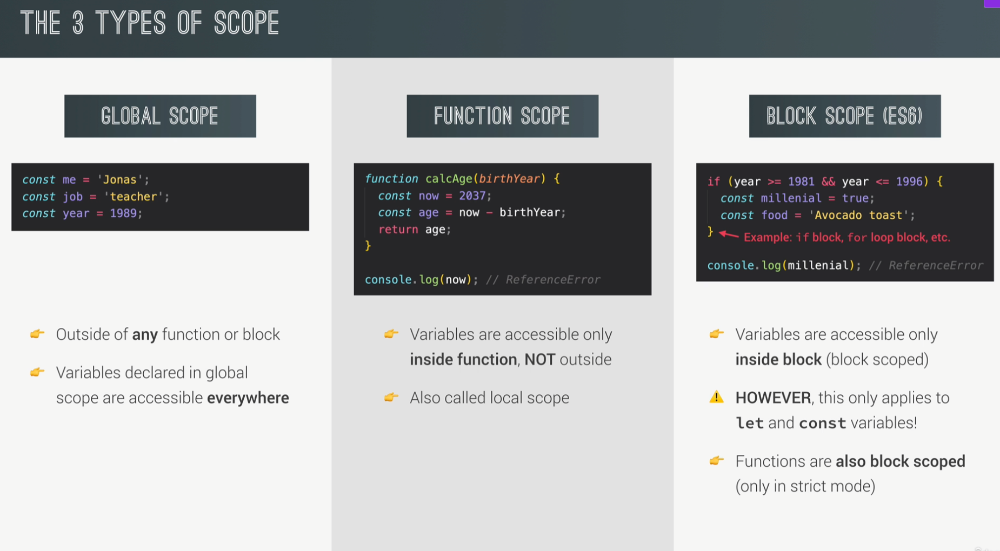

**Scope of a variable** - Region of out code where a certain variable can be accessed

Scope chain is created in order in which functions are **written in the code**. It has **nothing** to do with order in which functions were **called**!

**summary**
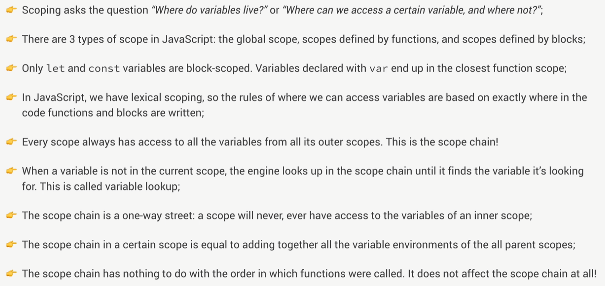

## 4.4. 🪄 Variable Environment: Hoisting and the TDZ

**Hoisting** makes some types of variables accessible/usable in the code before they are actually declared. "Variables lifted to the top of their scope".

`let` and `const` variables are technically hoisted but their value is set to uninitialized (TDZ - Temporal Dead Zone). If we attempt to use `let` or `const` variable before it's declared we get an error.

Functions are simply variables so they behave the exact same way as variables in regards of hoisting.

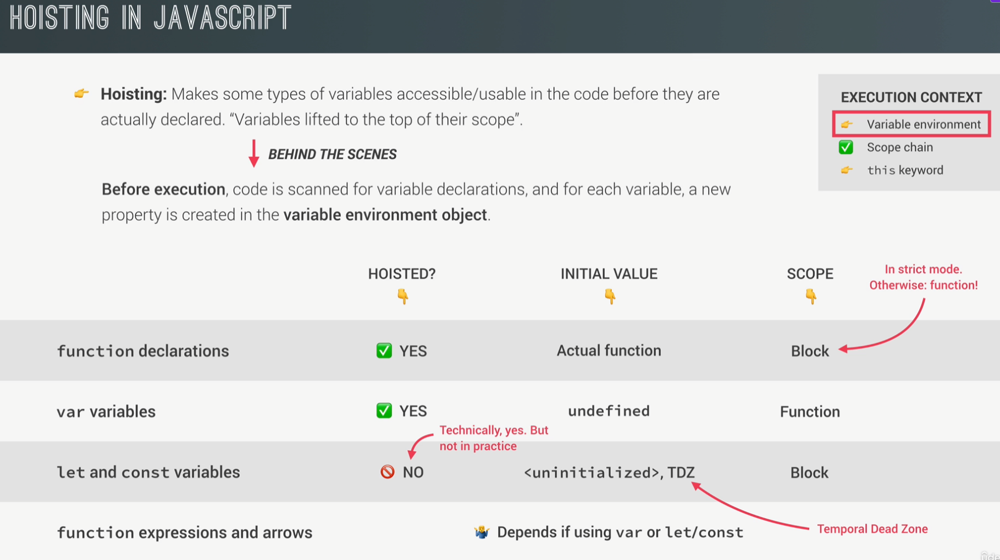

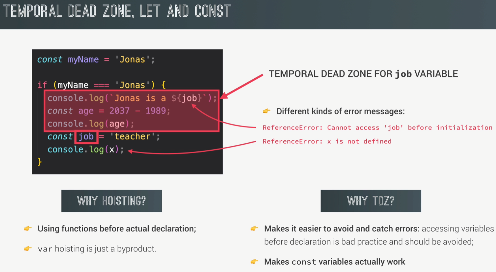

## 4.5. 🔍 `this` keyword

- `this` is a **special variable** that is created for every execution context (i.e., every function).
- It **refers to the 'owner'** of the function in which the `this` keyword is used.
- `this` is **not static** — its value depends on **how the function is called**, not where it's defined.
- The value of `this` is only assigned when the function is **actually called**.
- `this` does **NOT** point to the function itself
- `this` does **NOT** point to the variable environment of the function

---

### 4.5.1. Function called as a **method**

```javascript
const obj = {
  name: "Alice",
  greet() {
    console.log(this.name);
  },
};

obj.greet(); // 'this' refers to obj → logs "Alice"
```

> `this` = the **object** that is calling the method (`obj` in this case)

---

### 4.5.2. Simple function call

```javascript
function greet() {
  console.log(this);
}

greet(); // In strict mode: undefined. Otherwise: window (in browsers)
```

> `this` = `undefined` in strict mode<br> `this` = `window` (global object) in non-strict mode (in the browser)

---

### 4.5.3. Arrow Function

```javascript
const jonas = {
  firstName: "Alice",
  greet: () => {
    console.log(`Hey ${this.firstName}`);
  },
};

jonas.greet(); // Hey undefined - this keyword is pointing to parents this. In this case a Window object. Window object does not have a property of firstName.
```

> `this` = value from the **lexical scope** where the arrow function was defined<br> Arrow functions do **not have their own `this`**, they inherit it from the parent scope

⚠️ Note that jonas object is not a code block - it is an object literal. And thus it does not create scope

In JavaScript, an object literal like `const jonas = { ... }` is **not a block of code** — it's just a **value**, an object. It does **not create a new scope** like a function or block (`{}` in `if`, `for`, etc.) would.

### 4.5.4. Event Listener

```javascript
const button = document.querySelector("button");

button.addEventListener("click", function () {
  console.log(this); // 'this' refers to the button element
});
```

> `this` = the **DOM element** the event listener is attached to (`button` in this case)

If you use an **arrow function**, `this` behaves differently:

```javascript
button.addEventListener("click", () => {
  console.log(this); // 'this' refers to the surrounding (lexical) scope
});
```

> `this` = inherited from the **outer scope**, _not_ the button<br>Often results in `this` being `undefined` or `window` (depending on context)

### 4.5.5. Examples

**Example of `this` dynamic Binding Behavior in Nested Functions**

This highlights the core issue: when calling isMillenial() inside the calcAge method, The inner function doesn’t automatically inherit `this` from the outer method; instead, **it binds `this` dynamically based on how the function is called**, which, in this case, results in `this` being `undefined` (or the global object in non-strict mode).

```js
const jonas = {
  firstName: "Jonas",
  year: 1991,
  calcAge: function () {
    const isMillenial = function () {
      console.log(this); // undefined
      console.log(this.year >= 1981 && this.year <= 1996); // ❌ Error - Cannot read property 'year' of undefined
    };
    isMillenial();
  },
};
```

**Solution 1: `self = this` (Workaround)**

```js
const jonas = {
  firstName: "Jonas",
  year: 1991,
  calcAge: function () {
    // Solution 1
    const self = this; // Capture the outer `this`
    const isMillenial = function () {
      console.log(self); // Refers to `jonas`
      console.log(self.year >= 1981 && self.year <= 1996); // Works because `self` is `jonas`
    };
    isMillenial();
  },
};
```

The `self = this` workaround captures the value of `this` (which is the `jonas` object) in a variable before calling the inner function. This way, the inner function uses `self`, which still refers to `jonas`, avoiding the issue of dynamic binding.

**Solution 2: Arrow Function (Preferred)**

```js
const jonas = {
  firstName: "Jonas",
  year: 1991,
  calcAge: function () {
    // Solution 2
    const isMillenial = () => {
      console.log(this); // Refers to `jonas` because arrow function lexically binds `this`
      console.log(this.year >= 1981 && this.year <= 1996); // Works because `this` is inherited from `calcAge`
    };
    isMillenial();
  },
};
```

Arrow functions **lexically bind `this`**, meaning they automatically inherit the value of `this` from the surrounding context. In this case, the arrow function inside `calcAge` inherits `this` from `calcAge`, which is the `jonas` object, thus resolving the issue.

---

**Example of `argument` object in execution context**

```js
function addAll() {
  let sum = 0;
  for (let i = 0; i < arguments.length; i++) {
    sum += arguments[i];
  }
  console.log("Sum:", sum);
  return sum;
}

addAll(1, 2, 3, 4); // Logs: Sum: 10
addAll(5, 10); // Logs: Sum: 15
```

- ✅ `arguments` works in regular functions
- ✅ You can loop through it and perform operations (like adding)

**Arrow Function (throws error with `arguments`)**

```js
const addAllArrow = () => {
  let sum = 0;
  for (let i = 0; i < arguments.length; i++) {
    // ❌ ReferenceError
    sum += arguments[i];
  }
  console.log("Sum:", sum);
  return sum;
};

addAllArrow(1, 2, 3); // ❌ ReferenceError: arguments is not defined
```

**Arrow Function (correct version using rest parameters)**

```js
const addAllArrowFixed = (...args) => {
  const sum = args.reduce((acc, curr) => acc + curr, 0);
  console.log("Sum:", sum);
  return sum;
};

addAllArrowFixed(1, 2, 3, 4); // Logs: Sum: 10
addAllArrowFixed(5, 10); // Logs: Sum: 15
```

- ✅ Use `...args` in arrow functions instead of arguments

- ✅ Cleaner and more flexible

## 4.6. 🧼 Memory Management: Primitives vs Objects

Memory management in the context of JavaScript is how the JavaScript Engine allocates space in memory for creating variables and later frees up that memory space if variables are no longer needed so that our applications runs smoothly and efficiently without running out of memory.

> How and where are variables created in JavaScript?

Unlike some other languages, **memory is automatically managed** by JavaScript behind the scenes.

Every value we create in JavaScript goes through a **memory lifecycle**.

1. **Allocate** memory

   ```js
   let temp = 23.7;
   ```

   Whenever we assign a value to a new variable, the engine automatically allocates (reserves) a **piece of memory to store the value**.

   - **Primitive values** (like numbers, strings, booleans, etc.) are stored **in the call stack**, specifically within the **Execution Context** in which they were created.

   - **Objects** (including arrays and functions) are stored **in the heap**, a region of memory used for more complex or larger data structures.

   - **References to objects** are stored in the call stack.

   > ⚠️ **Note:** Modern JavaScript engines are highly optimized and may introduce exceptions to these general rules.
   > For example, an extremely long string (even though it's a primitive) might be stored in the **heap** for performance reasons.

2. **Use** memory

   ```js
   temp = temp + 5;
   round(temp);
   ```

   While code is running, **the value is written, read, and updated** in the allocated piece of memory.

3. **Release** memory

   > _**temp** is removed from memory_

   When no longer needed, **the value is deleted from memory** to free up resources. The released memory is used for new values.

   > How is memory freed up after we no longer need a value?

   1. **Call stack**

      Variable environment is **simply deleted when Execution Context pops off stack**

   2. **Heap**

      **Garbage collection** (central memory management tool). It's the engine that runs garbage collection automatically whenever it sees fit. We developers cannot control when heap memory is cleared by the garbage collector.

      **Mark-and-Sweep Algorithm**:

      1. **Mark**

         Mark all objects that are **reachable** from a root as 'alive'. Many things can be roots but the most obvious ones are:

         - Global Execution Context
         - Execution Context of running functions
         - Event Listeners and Active Timers
         - Closures

         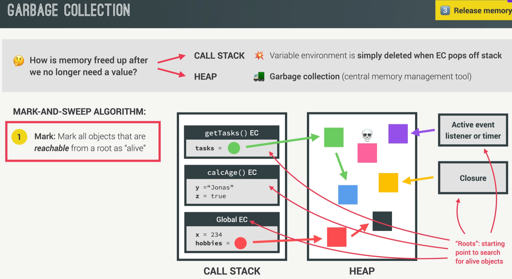

      2. **Sweep**

         Delete un-marked (**unreachable**) objects and reclaim memory for future allocations

      **Memory Leak**:

      When objects that are no longer needed are **incorrectly still reachable**, and therefore **not being garbage collected**

      One major source of these wrong and undesired references are old and unnecessary event listeners and timers. If fe. a timer creates an object this object will always be reachable unless developer actively deletes the timer when they no longer need it. Otherwise if the timer just stays around keep running it will forever reference unnecessary objects causing memory leak. The same is true for Event Listener that might be no longer needed at some point. Also avoid declaring large objects as global objects because these will also never be garbage collected as Global Execution Context is always reachable.

### 4.6.1. Reference

**Example of copying by reference**
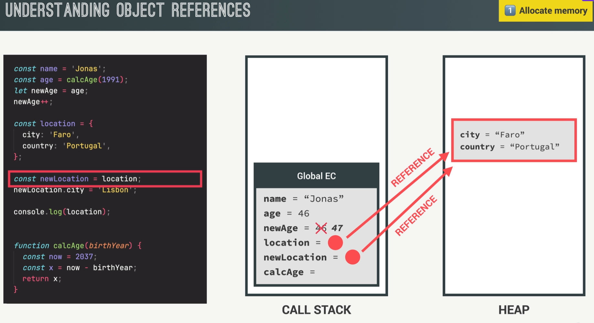

If we change the value of city in newLocation it will also change the value for location as it points to the same object.

**Example: changing a value via one variable affects the other due to shared reference**
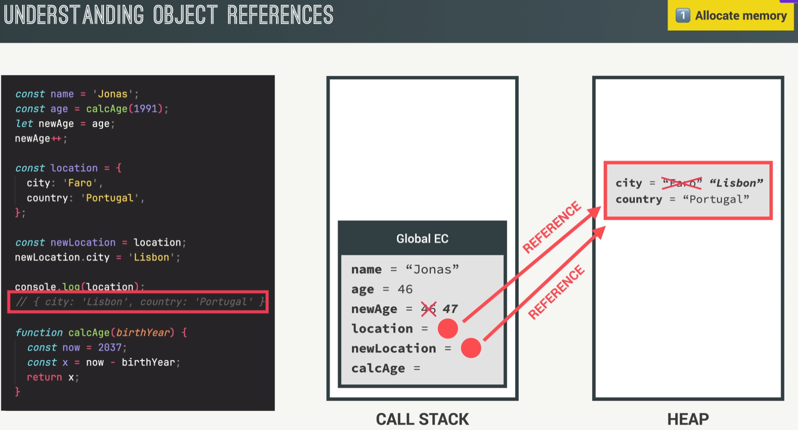

Functions are, behind the scenes, just objects — which means they are also stored in the heap.

**Example of storing a function**
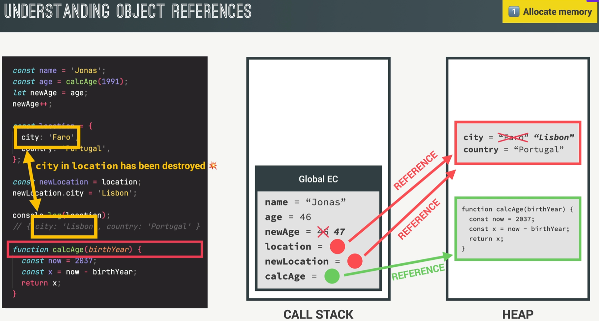

---

**Example of passing object as an argument**

When an object is passed as an argument, we pass its reference, not a copy. This means any changes made to the object inside the function will directly affect the original object outside the function.

```js
const jessica1 = {
  firstName: "Jessica",
  lastName: "Williams",
  age: 27,
};

function marryPerson(originalPerson, newLastName) {
  originalPerson.lastName = newLastName;
  return originalPerson;
}

const marriedJessica = marryPerson(jessica1, "Davis");

const marriedJessica = jessica1;
marriedJessica.lastName = "Davis";

console.log("Before:", jessica1); // lastName = Davis
console.log("After:", marriedJessica); // lastName = Davis
```

#### 4.6.1.1. Shallow copy

A **shallow copy** creates a new object, but only **copies the references** to the nested objects (or arrays) inside the original object. In other words, the new object will have the same properties as the original object, but if those properties reference other objects or arrays, **both the original and the copied object will point to the same nested objects or arrays**.

We can make a shallow copy by using the spread operator

```js
const jessica = {
  firstName: "Jessica",
  lastName: "Williams",
  age: 27,
  family: ["Alice", "Bob"],
};

// Shallow copy using spread operator
const jessicaCopy = { ...jessica };

// Modify the copy's properties
jessicaCopy.lastName = "Davis"; // Changes lastName in the copied object
jessicaCopy.family.push("Charlie"); // Adds "Charlie" to the family array

console.log("Original Jessica:", jessica); // { firstName: "Jessica", lastName: "Williams", age: 27, family: ["Alice", "Bob", "Charlie"] }

console.log("Copy of Jessica:", jessicaCopy); // { firstName: "Jessica", lastName: "Davis", age: 27, family: ["Alice", "Bob", "Charlie"] }

// The copied object has a new lastName, but both objects share the same family array.
```

1. We use the spread operator (`...`) to create a shallow copy of the `jessica` object.
2. **Primitive values** like `lastName` are copied by value, so modifying `jessicaCopy.lastName` does not affect `jessica.lastName`.
3. However, **nested objects** (like the `family` array) are **not deeply copied**. Instead, both `jessica` and `jessicaCopy` will share the same reference to the `family` array.

#### 4.6.1.2. Deep copy

A **deep copy** creates a new object where all the properties, including nested objects and arrays, are recursively copied. This means that the new object will have no references to the original object’s data — it will be completely independent, and changes made to one object will not affect the other.

```js
// Original object
const jessica = {
  firstName: "Jessica",
  lastName: "Williams",
  age: 27,
  family: ["Alice", "Bob"],
};

// Deep copy/clone using structuredClone
const jessicaClone = structuredClone(jessica);
jessicaClone.family.push("Mary");
jessicaClone.family.push("John");

console.log("Original:", jessica); // ["Alice", "Bob"]
console.log("Clone:", jessicaClone); // ["Alice", "Bob", "Mary", "John"]
```

- **`structuredClone()`** creates a **deep copy** of the `jessica` object. All nested properties, such as the `family` array, are fully cloned and independent of the original object.
- Modifying `jessicaClone.family` does **not** affect the `family` array in the original `jessica` object.

This is different from a **shallow copy**, where nested objects or arrays would still share references between the original and the copy.

> ⚠️ **Note:** `structuredClone` is a method introduced in modern JavaScript that performs a deep copy of objects, including complex types like `Map`, `Set`, and `Date`. Unlike shallow copy methods, it ensures nested objects are fully copied, but it doesn't handle functions or circular references and is not yet supported in Node.js.
