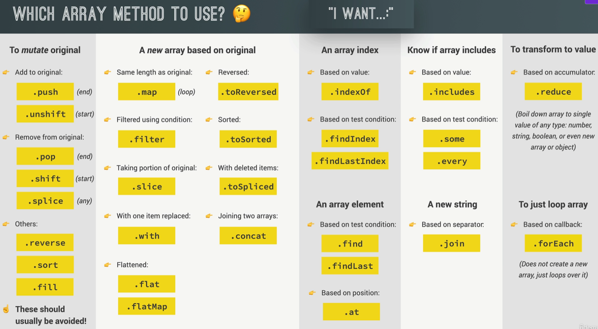
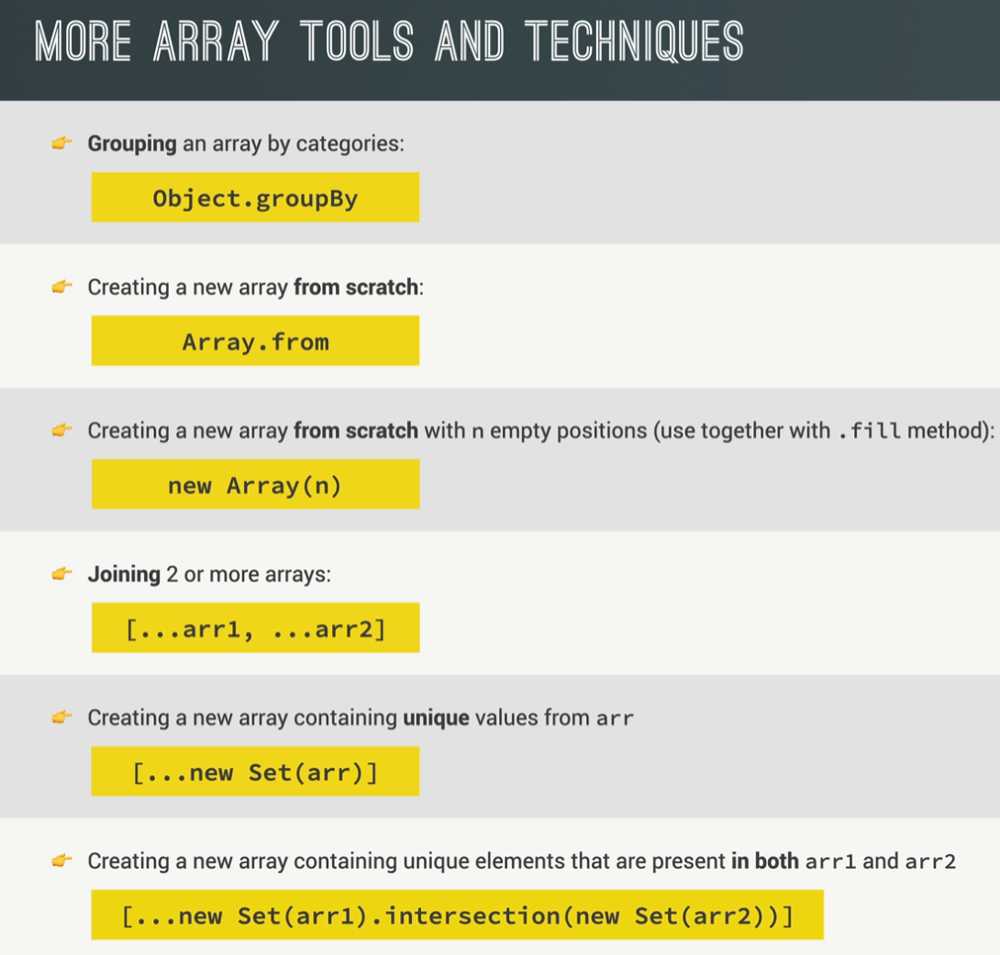
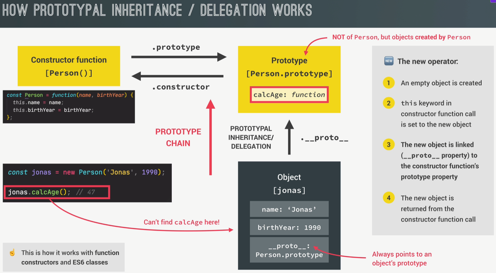
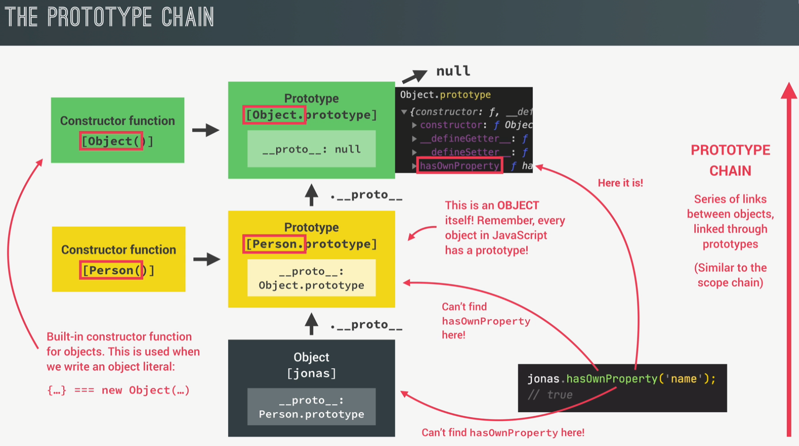
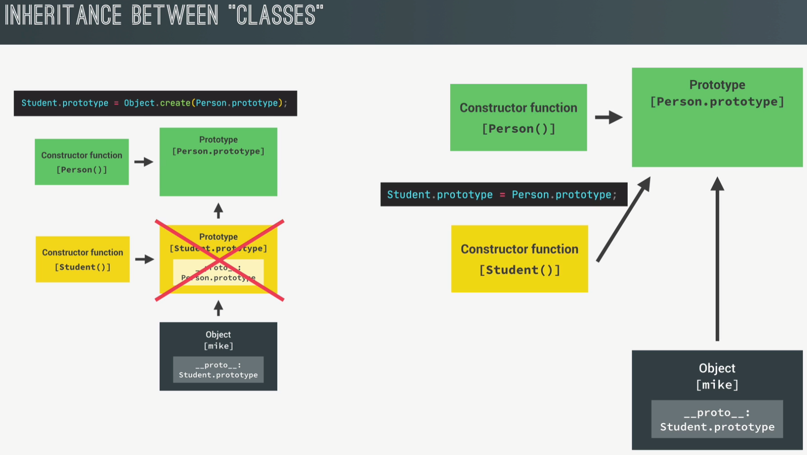
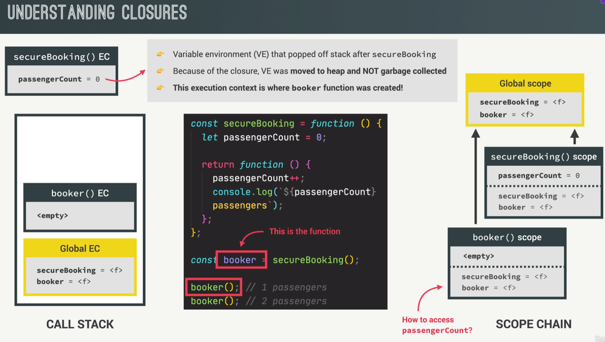

# JavaScript Course Notes <!-- omit from toc -->

📘 This repository contains my personal notes as I follow The Complete JavaScript Course on Udemy. It includes projects I've worked on during the course, and serves as a living document to reinforce what I'm learning and as a future reference.

## 📚 Table of Contents <!-- omit from toc -->

- [1. Fundamentals](#1-fundamentals)
  - [1.1. 🧠 What is JavaScript?](#11--what-is-javascript)
  - [1.2. 🧾 Variable Naming Conventionss](#12--variable-naming-conventionss)
  - [1.3. 🧮 Data Types](#13--data-types)
    - [1.3.1. `Number`](#131-number)
    - [1.3.2. `String`](#132-string)
    - [1.3.3. `Boolean`](#133-boolean)
    - [1.3.4. `Undefined`](#134-undefined)
    - [1.3.5. `Null`](#135-null)
    - [1.3.6. `Symbol` _(ES6+)_](#136-symbol-es6)
    - [1.3.7. `BigInt` _(ES2020+)_](#137-bigint-es2020)
  - [1.4. 📦 Variable Declarations](#14--variable-declarations)
    - [1.4.1. `let`](#141-let)
    - [1.4.2. `const`](#142-const)
    - [1.4.3. `var` (❗avoid using it)](#143-var-avoid-using-it)
  - [1.5. ➗ Operators](#15--operators)
  - [1.6. 📝 Template Literals](#16--template-literals)
  - [1.7. 🔄 Type Conversion and Coercion](#17--type-conversion-and-coercion)
    - [1.7.1. Type Conversion (Manual)](#171-type-conversion-manual)
    - [1.7.2. Type Coercion (Automatic)](#172-type-coercion-automatic)
  - [1.8. ⚖️ Truthy and Falsy Values](#18-️-truthy-and-falsy-values)
  - [1.9. 🟰 Equality Operators](#19--equality-operators)
    - [1.9.1. Strict Equality (`===`)](#191-strict-equality-)
    - [1.9.2. Loose Equality (`==`)](#192-loose-equality-)
    - [1.9.3. Inequalities](#193-inequalities)
    - [1.9.4. Best Practice](#194-best-practice)
  - [1.10. 🧷 Strict Mode](#110--strict-mode)
  - [1.11. 📐 Function Declarations vs Expressions](#111--function-declarations-vs-expressions)
  - [1.12. 🏹 Arrow Functions](#112--arrow-functions)
  - [1.13. 🔢 Arrays](#113--arrays)
    - [1.13.1. Adding elements](#1131-adding-elements)
    - [1.13.2. Removing elements](#1132-removing-elements)
    - [1.13.3. Finding elements](#1133-finding-elements)
    - [1.13.4. `slice()` – Extracting Portions Without Mutating](#1134-slice--extracting-portions-without-mutating)
    - [1.13.5. `splice()` – Removing/Changing Elements (Mutates Original)](#1135-splice--removingchanging-elements-mutates-original)
    - [1.13.6. `reverse()` – Reversing Order (Mutates Original)](#1136-reverse--reversing-order-mutates-original)
    - [1.13.7. `concat()` – Merging Arrays (Does NOT Mutate)](#1137-concat--merging-arrays-does-not-mutate)
    - [1.13.8. `join()` – Combining Array Elements into String](#1138-join--combining-array-elements-into-string)
    - [1.13.9. `at()` – Accessing Elements by Index (Including Negative)](#1139-at--accessing-elements-by-index-including-negative)
    - [1.13.10. `forEach` – Looping Over Arrays](#11310-foreach--looping-over-arrays)
    - [1.13.11. `map` – Transforming Arrays](#11311-map--transforming-arrays)
    - [1.13.12. `filter` – Filtering Arrays](#11312-filter--filtering-arrays)
    - [1.13.13. `reduce` – Reducing Arrays to a Single Value](#11313-reduce--reducing-arrays-to-a-single-value)
    - [1.13.14. `find` – Finding the First Match](#11314-find--finding-the-first-match)
    - [1.13.15. `findIndex` – Finding the Index of the First Match](#11315-findindex--finding-the-index-of-the-first-match)
    - [1.13.16. `findLast` – Find Last Matching Element](#11316-findlast--find-last-matching-element)
    - [1.13.17. `findLastIndex` – Index of Last Match](#11317-findlastindex--index-of-last-match)
    - [1.13.18. `some` – At Least One Match](#11318-some--at-least-one-match)
    - [1.13.19. `every` – All Must Match](#11319-every--all-must-match)
    - [1.13.20. `flat` – Flattening Nested Arrays](#11320-flat--flattening-nested-arrays)
    - [1.13.21. `flatMap` – Map + Flat](#11321-flatmap--map--flat)
    - [1.13.22. `sort` – Sorting Arrays](#11322-sort--sorting-arrays)
    - [1.13.23. Grouping Arrays – `Object.groupBy()`](#11323-grouping-arrays--objectgroupby)
    - [1.13.24. Creating and Filling Arrays](#11324-creating-and-filling-arrays)
      - [1.13.24.1. `new Array()`](#113241-new-array)
      - [1.13.24.2. `.fill(value, start?, end?)`](#113242-fillvalue-start-end)
      - [1.13.24.3. `Array.from(arrayLike, mapFn?, thisArg?)`](#113243-arrayfromarraylike-mapfn-thisarg)
    - [1.13.25. Nondestructive Array Methods](#11325-nondestructive-array-methods)
      - [1.13.25.1. `toReversed()`](#113251-toreversed)
      - [1.13.25.2. `toSorted(compareFn?)`](#113252-tosortedcomparefn)
      - [1.13.25.3. `toSpliced(start, deleteCount?, ...items)`](#113253-tosplicedstart-deletecount-items)
      - [1.13.25.4. `with(index, value)`](#113254-withindex-value)
  - [1.14. 🧱 Objects](#114--objects)
    - [1.14.1. Dot vs. Bracket Notation](#1141-dot-vs-bracket-notation)
    - [1.14.2. Object Methods](#1142-object-methods)
- [2. Developer Skills](#2-developer-skills)
  - [2.1. 🧩 Problem Solving](#21--problem-solving)
  - [2.2. 🛠️ Debugging](#22-️-debugging)
  - [2.3. 🤖 Using AI for coding](#23--using-ai-for-coding)
- [3. JavaScript in the Browser: DOM and Events](#3-javascript-in-the-browser-dom-and-events)
  - [3.1. 📄 DOM](#31--dom)
    - [3.1.1. Selecting Elements](#311-selecting-elements)
    - [3.1.2. Updating Content and Styling](#312-updating-content-and-styling)
  - [3.2. 🖱️ Events](#32-️-events)
    - [3.2.1. Handling Events](#321-handling-events)
    - [3.2.2. Keyboard Events](#322-keyboard-events)
- [4. How JavaScript Works Behind The Scenes](#4-how-javascript-works-behind-the-scenes)
  - [4.1. 💡 Definition again](#41--definition-again)
    - [4.1.1. High-level](#411-high-level)
    - [4.1.2. Interpreted or just-in-time](#412-interpreted-or-just-in-time)
    - [4.1.3. Multi-paradigm](#413-multi-paradigm)
    - [4.1.4. Procedural](#414-procedural)
    - [4.1.5. Object-Oriented Programming (OOP)](#415-object-oriented-programming-oop)
      - [4.1.5.1. Abstraction](#4151-abstraction)
      - [4.1.5.2. Encapsulation](#4152-encapsulation)
      - [4.1.5.3. Inheritance](#4153-inheritance)
      - [4.1.5.4. Polymorphism](#4154-polymorphism)
      - [4.1.5.5. OOP in JS: Prototypes](#4155-oop-in-js-prototypes)
      - [4.1.5.6. Constructor functions](#4156-constructor-functions)
      - [4.1.5.7. ES6 Classes](#4157-es6-classes)
      - [4.1.5.8. `Object.create()`](#4158-objectcreate)
      - [4.1.5.9. Getters and Setters](#4159-getters-and-setters)
      - [4.1.5.10. Static Methods](#41510-static-methods)
      - [4.1.5.11. Inheritence between "Classes": Constructor Functions](#41511-inheritence-between-classes-constructor-functions)
      - [4.1.5.12. Private Class Fields and Methods (ES2022+)](#41512-private-class-fields-and-methods-es2022)
      - [4.1.5.13. Summary](#41513-summary)
    - [4.1.6. Functional Programming (FP)](#416-functional-programming-fp)
    - [4.1.7. Prototype-based object-oriented approach](#417-prototype-based-object-oriented-approach)
    - [4.1.8. First-class Functions](#418-first-class-functions)
    - [4.1.9. Dynamic](#419-dynamic)
    - [4.1.10. Single-threaded and non-blocking event loop](#4110-single-threaded-and-non-blocking-event-loop)
  - [4.2. ⚙️ Engine and Runtime](#42-️-engine-and-runtime)
    - [4.2.1. Engine](#421-engine)
      - [4.2.1.1. Compilation vs Interpretation](#4211-compilation-vs-interpretation)
    - [4.2.2. Runtime](#422-runtime)
  - [4.3. 🔁 Execution Contexts and the Call Stack](#43--execution-contexts-and-the-call-stack)
    - [4.3.1. What’s inside an execution context?](#431-whats-inside-an-execution-context)
    - [4.3.2. What is the call stack?](#432-what-is-the-call-stack)
    - [4.3.3. Scope and Scope Chain](#433-scope-and-scope-chain)
  - [4.4. 🪄 Variable Environment: Hoisting and the TDZ](#44--variable-environment-hoisting-and-the-tdz)
  - [4.5. 🔍 `this` keyword](#45--this-keyword)
    - [4.5.1. Function called as a **method**](#451-function-called-as-a-method)
    - [4.5.2. Simple function call](#452-simple-function-call)
    - [4.5.3. Arrow Function](#453-arrow-function)
    - [4.5.4. Event Listener](#454-event-listener)
    - [4.5.5. Examples](#455-examples)
  - [4.6. 🧼 Memory Management: Primitives vs Objects](#46--memory-management-primitives-vs-objects)
    - [4.6.1. Reference](#461-reference)
      - [4.6.1.1. Shallow copy](#4611-shallow-copy)
      - [4.6.1.2. Deep copy](#4612-deep-copy)
- [5. Data Structures, Modern Operators, and Strings](#5-data-structures-modern-operators-and-strings)
  - [5.1. 🧬 Destructuring Arrays](#51--destructuring-arrays)
    - [5.1.1. Basic Example](#511-basic-example)
    - [5.1.2. Skipping Elements](#512-skipping-elements)
    - [5.1.3. Switching Variables](#513-switching-variables)
    - [5.1.4. Destructuring from Function Return](#514-destructuring-from-function-return)
    - [5.1.5. Destructuring Nested Arrays](#515-destructuring-nested-arrays)
    - [5.1.6. Destructuring with Default Values](#516-destructuring-with-default-values)
  - [5.2. 🧬 Destructuring Objects](#52--destructuring-objects)
    - [5.2.1. Basic Object Destructuring](#521-basic-object-destructuring)
    - [5.2.2. Renaming Variables While Destructuring](#522-renaming-variables-while-destructuring)
    - [5.2.3. Using Default Values](#523-using-default-values)
    - [5.2.4. Mutating Existing Variables](#524-mutating-existing-variables)
    - [5.2.5. Nested Object Destructuring](#525-nested-object-destructuring)
    - [5.2.6. Destructuring in Function Parameters](#526-destructuring-in-function-parameters)
  - [5.3. 📤 5.3. Spread Operator](#53--53-spread-operator)
    - [5.3.1. Adding Elements to an Array](#531-adding-elements-to-an-array)
    - [5.3.2. Passing Arguments into Functions](#532-passing-arguments-into-functions)
    - [5.3.3. Copying an Array](#533-copying-an-array)
    - [5.3.4. Joining Two Arrays](#534-joining-two-arrays)
    - [5.3.5. Spread Works on Iterables (Arrays, Strings, Maps, Sets)](#535-spread-works-on-iterables-arrays-strings-maps-sets)
    - [5.3.6. Using Spread with Functions](#536-using-spread-with-functions)
    - [5.3.7. Spread with Objects _(ES2018+)_](#537-spread-with-objects-es2018)
    - [5.3.8. Shallow Copy of an Object](#538-shallow-copy-of-an-object)
  - [5.4. 🧺 Rest Pattern and Parameters](#54--rest-pattern-and-parameters)
    - [5.4.1. Rest in Arrays](#541-rest-in-arrays)
    - [5.4.2. Skipping and Rest Elements](#542-skipping-and-rest-elements)
    - [5.4.3. Rest in Objects](#543-rest-in-objects)
    - [5.4.4. Rest Parameters in Functions](#544-rest-parameters-in-functions)
  - [5.5. ⚡ Short Circuiting](#55--short-circuiting)
    - [5.5.1. `||` Logical OR](#551--logical-or)
    - [5.5.2. `&&` Logical AND](#552--logical-and)
    - [5.5.3. `??` Nullish Coalescing Operator _(ES2020+)_](#553--nullish-coalescing-operator-es2020)
  - [5.6. ⚡ Logical Assignment Operators _(ES2021+)_](#56--logical-assignment-operators-es2021)
    - [5.6.1. `||=` OR Assignment](#561--or-assignment)
    - [5.6.2. `&&=` AND Assignment](#562--and-assignment)
    - [5.6.3. `??=` Nullish Coalescing Assignment](#563--nullish-coalescing-assignment)
  - [5.7. 🔁 Iterating with `for-of` Loops _(ES6+)_](#57--iterating-with-for-of-loops-es6)
  - [5.8. 🧱 Enhanced Object Literals _(ES6+)_](#58--enhanced-object-literals-es6)
    - [5.8.1. Property Shorthand](#581-property-shorthand)
    - [5.8.2. Concise Method Definitions](#582-concise-method-definitions)
    - [5.8.3. Computed Property Names](#583-computed-property-names)
  - [5.9. 🔗 Optional Chaining](#59--optional-chaining)
    - [5.9.1. Optional Chaining on Methods](#591-optional-chaining-on-methods)
    - [5.9.2. Optional Chaining with Arrays](#592-optional-chaining-with-arrays)
  - [5.10. 🔁 Looping Over Objects](#510--looping-over-objects)
    - [5.10.1. `Object.keys()` Looping Over Property Names](#5101-objectkeys-looping-over-property-names)
    - [5.10.2. `Object.values()` Looping Over Property Values](#5102-objectvalues-looping-over-property-values)
    - [5.10.3. `Object.entries()` Looping Over Key–Value Pairs](#5103-objectentries-looping-over-keyvalue-pairs)
  - [5.11. 🗃️ Sets _(ES6+)_](#511-️-sets-es6)
    - [5.11.1. Creating a Set](#5111-creating-a-set)
    - [5.11.2. Set Properties \& Methods](#5112-set-properties--methods)
    - [5.11.3. Iterating Over a Set](#5113-iterating-over-a-set)
    - [5.11.4. Use Case: Removing Duplicates from an Array](#5114-use-case-removing-duplicates-from-an-array)
    - [5.11.5. New Set Operations _(ES2025)_](#5115-new-set-operations-es2025)
      - [5.11.5.1. Intersection](#51151-intersection)
      - [5.11.5.2. Union](#51152-union)
      - [5.11.5.3. Difference](#51153-difference)
      - [5.11.5.4. Symmetric Difference](#51154-symmetric-difference)
      - [5.11.5.5. Disjoint Check](#51155-disjoint-check)
      - [5.11.5.6. Subset and Superset Checks](#51156-subset-and-superset-checks)
  - [5.12. 🗺️ Maps _(ES6+)_](#512-️-maps-es6)
    - [5.12.1. Creating and Modifying Maps](#5121-creating-and-modifying-maps)
    - [5.12.2. Reading and Using Values](#5122-reading-and-using-values)
    - [5.12.3. Core Map Methods](#5123-core-map-methods)
    - [5.12.4. Key Identity](#5124-key-identity)
    - [5.12.5. Using DOM Elements as Keys](#5125-using-dom-elements-as-keys)
    - [5.12.6. Iterating Over a Map](#5126-iterating-over-a-map)
    - [5.12.7. Converting Between Maps and Objects](#5127-converting-between-maps-and-objects)
  - [5.13. 📌 Which Data Structure to Use?](#513--which-data-structure-to-use)
    - [5.13.1. Sources of Data](#5131-sources-of-data)
    - [5.13.2. Arrays vs Sets](#5132-arrays-vs-sets)
    - [5.13.3. Objects vs Maps](#5133-objects-vs-maps)
  - [5.14. 🔤 Strings](#514--strings)
    - [5.14.1. Accessing Characters](#5141-accessing-characters)
    - [5.14.2. Length](#5142-length)
    - [5.14.3. Searching](#5143-searching)
    - [5.14.4. Slicing Strings](#5144-slicing-strings)
    - [5.14.5. Behind the Scenes: Boxing](#5145-behind-the-scenes-boxing)
    - [5.14.6. Changing Case](#5146-changing-case)
    - [5.14.7. Trimming and Normalizing](#5147-trimming-and-normalizing)
    - [5.14.8. Replacing](#5148-replacing)
    - [5.14.9. Booleans](#5149-booleans)
    - [5.14.10. Splitting and Joining](#51410-splitting-and-joining)
    - [5.14.11. Padding](#51411-padding)
    - [5.14.12. Repeat](#51412-repeat)
    - [5.14.13. Tip: Searching String Methods](#51413-tip-searching-string-methods)
- [6. Functions](#6-functions)
  - [6.1. Default Parameters (ES6+)](#61-default-parameters-es6)
  - [6.2. Value vs Reference](#62-value-vs-reference)
  - [6.3. First-Class and Higher-Order Functions](#63-first-class-and-higher-order-functions)
    - [6.3.1. First-Class Functions](#631-first-class-functions)
    - [6.3.2. Higher-Order Functions](#632-higher-order-functions)
  - [6.4. The `call`, `apply`, and `bind` Methods](#64-the-call-apply-and-bind-methods)
    - [6.4.1. `call()` Method](#641-call-method)
    - [6.4.2. `apply()` Method](#642-apply-method)
    - [6.4.3. `bind()` Method](#643-bind-method)
    - [6.4.4. Summary Table](#644-summary-table)
  - [6.5. Immediately Invoked Function Expressions (IIFE)](#65-immediately-invoked-function-expressions-iife)
  - [6.6. Closures](#66-closures)
- [7. 🐛 JavaScript Quirks](#7--javascript-quirks)
  - [7.1. Console Logs Capture References, Not Values](#71-console-logs-capture-references-not-values)

# 1. Fundamentals

## 1.1. 🧠 What is JavaScript?

> JavaScript is a **high-level, object-oriented, multi-paradigm programming language**

It has evolved significantly since its creation:

- **ES5 (2009)**: Served as the standard for many years.
- **ES6 / ES2015 (2015)**: A major update introducing many modern features:
  - `let` / `const`
  - Arrow functions (`=>`)
  - Template literals
  - Classes
  - Destructuring
  - And many more
- **ES2016 – ES2025**: Smaller annual updates adding new features.

Modern browsers automatically support the latest features.  
For older browsers, tools like **Babel** can transpile modern code to ES5.

The language continues to evolve, with new features proposed through a **4-stage process** before being officially included in the standard.

## 1.2. 🧾 Variable Naming Conventionss

In JavaScript, the standard for naming variables is **camelCase**, starting with a lowercase letter.

```js
let userAge = 25;
let totalPrice = 19.99;
```

Variable names **cannot begin with a number**, but they can include letters, digits, underscores (`_`), and dollar signs (`$`).

```js
let 1stUser = 'John';     // ❌ Invalid: starts with a number
let count1 = 1;           // ✅ Valid
let _internal = 'yes';    // ✅ Valid
let $response = 200;      // ✅ Valid
```

**Reserved keywords** like `let`, `function`, or `return` cannot be used directly as variable names.

```js
let let = 5;              // ❌ Invalid: 'let' is reserved
```

While you technically can prefix reserved words with `_` or `$` (e.g., `_class`, `$return`), it’s discouraged for clarity and readability.

```js
let _class = "Warrior"; // ✅ Legal, but discouraged
let $return = "value"; // ✅ Legal, but discouraged
```

The variable name `name` is technically allowed, but it can conflict with built-in browser objects, so it's best avoided.

```js
let name = "Alice"; // ⚠️ Allowed, but may cause issues
```

Constants that **never change** should be written in **all uppercase**, using underscores to separate words.

```js
const MAX_USERS = 100;
const API_KEY = "abc123";
```

Regardless of syntax rules, always aim for **clear and descriptive** names that reflect the purpose of the variable.

```js
let x = 42; // ❌ Vague
let userScore = 42; // ✅ Descriptive
```

## 1.3. 🧮 Data Types

**JavaScript uses dynamic typing.**

You do **not** need to manually define the data type of a variable. The type is determined **automatically at runtime** based on the value assigned.

Keep in mind that **values** have types, not the variables themselves. Variables simply hold those values.

One quirky detail worth remembering — `null` is a primitive type, but `typeof null` returns `object` due to a long-standing bug in JavaScript's type system. It was never fixed to avoid breaking legacy code.

```js
console.log(typeof null); // "object" — known bug 🐞
```

### 1.3.1. `Number`

Represents floating-point numbers. Used for both integers and decimals.

```js
let age = 23;
let price = 19.99;
```

### 1.3.2. `String`

A sequence of characters, used for textual data. Can be written with single or double quotes.

```js
let firstName = "Jonas";
let lastName = "Smith";
```

### 1.3.3. `Boolean`

Logical type with only two possible values: `true` or `false`. Commonly used in conditionals.

```js
let isAdult = true;
let hasLicense = false;
```

### 1.3.4. `Undefined`

A variable that has been declared but **not assigned** a value yet.

```js
let children;
console.log(children); // undefined
```

### 1.3.5. `Null`

Represents an explicitly **empty** or unknown value.  
Often used intentionally to reset or clear a variable.

```js
let selectedProduct = null;
```

### 1.3.6. `Symbol` _(ES6+)_

A unique and immutable value, often used as object property keys to avoid naming conflicts.

```js
const id = Symbol("id");
```

### 1.3.7. `BigInt` _(ES2020+)_

Used to represent integers **larger than the `Number` type can safely handle**.

```js
const huge = 1234567890123456789012345678901234567890n;
```

## 1.4. 📦 Variable Declarations

### 1.4.1. `let`

Use `let` to declare variables that can be reassigned (mutable).

```js
let age = 30;
age = 31; // ✅ valid
```

### 1.4.2. `const`

Use `const` for variables that should never change (immutable). You must assign a value immediately when using `const`.

```js
const birthYear = 1991;
birthYear = 1990; // ❌ Error: Assignment to constant variable

const job; // ❌ Error: Missing initializer in const declaration
```

### 1.4.3. `var` (❗avoid using it)

`var` is the old way of declaring variables before ES6. While it may appear similar to `let`, it behaves differently under the hood.

```js
var job = "programmer";
job = "teacher";
```

The key difference:

- `let` is **block scoped**
- `var` is **function scoped**

---

You can even assign a value to a variable without declaring it — but this is strongly discouraged.

```js
lastName = "Schmedtmann"; // no let, const, or var
console.log(lastName); // ⚠️ works, but...
```

This implicitly creates a global variable (adds a property to the global object), which can easily lead to bugs and hard-to-maintain code. **Avoid doing this**.

## 1.5. ➗ Operators

Exponentiation (`**`)
Raises the first number to the power of the second:

```js
console.log(2 ** 3); // 8
```

[Operator precedence table (MDN)](https://developer.mozilla.org/en-US/docs/Web/JavaScript/Reference/Operators/Operator_precedence#table)

## 1.6. 📝 Template Literals

Template literals (introduced in ES6) are an easier, cleaner way to build strings in JavaScript.  
They allow embedding expressions directly inside the string using backticks <code>\` \`</code> and the `${}` syntax.

```js
const firstName = "Jonas";
const job = "teacher";
const birthYear = 1991;
const year = 2037;

// Traditional string concatenation
const jonas =
  "I'm " + firstName + ", a " + (year - birthYear) + " years old " + job + "!";
console.log(jonas); // "I'm Jonas, a 46 years old teacher!"

// Template literal version (cleaner)
const jonasNew = `I'm ${firstName}, a ${year - birthYear} years old ${job}!`;
console.log(jonasNew); // "I'm Jonas, a 46 years old teacher!"

// Multiline Strings with Template Literals
const multiline = `This is a string
that spans multiple
lines without using \\n`;
```

Template literals make the code more readable and easier to write, especially when mixing strings with variables or expressions even across multiple lines.

## 1.7. 🔄 Type Conversion and Coercion

### 1.7.1. Type Conversion (Manual)

**Type conversion** is when you manually convert a value from one type to another.

```js
const inputYear = "1991";
console.log(Number(inputYear), inputYear); // 1991 '1991'
console.log(Number(inputYear) + 18); // 2009

console.log(Number("Jonas")); // NaN → Not a Number
console.log(typeof NaN); // 'number' → NaN is still of type number

console.log(String(23)); // '23' → Appears white in the console (string)
```

### 1.7.2. Type Coercion (Automatic)

**Type coercion** occurs when JavaScript automatically converts one data type to another behind the scenes.
It happens whenever an operation involves values of different types, and JavaScript attempts to make them compatible by converting one to match the other.

```js
console.log("I am " + 23 + " years old"); // 'I am 23 years old'
console.log("23" - "10" - 3); // 10 → '-' forces number conversion
console.log("23" * "2"); // 46 → '*' converts both to numbers

let n = "1" + 1; // '11' → '+' triggers string concatenation
n = n - 1; // 10 → '-' coerces '11' to number
console.log(n); // 10

n = 2 + 3 + 4 + "5";
console.log(n); // '95' → 2+3+4=9 → '9'+'5' = '95'

n = "10" - "4" - "3" - 2 + "5";
console.log(n); // '15' → 10-4-3-2=1 → 1+'5' = '15'
```

Understanding when JavaScript converts types automatically helps you avoid unexpected bugs.

## 1.8. ⚖️ Truthy and Falsy Values

In JavaScript, **falsy values** are values that automatically convert to `false` when evaluated in a boolean context.

There are exactly **five falsy values**:

- `0`
- `''` (empty string)
- `undefined`
- `null`
- `NaN`

All other values are considered **truthy**, meaning they convert to `true`.

```js
console.log(Boolean(0)); // false
console.log(Boolean(undefined)); // false
console.log(Boolean("Jonas")); // true
console.log(Boolean({})); // true
```

## 1.9. 🟰 Equality Operators

In JavaScript, there are two main types of equality operators:

### 1.9.1. Strict Equality (`===`)

The **strict equality operator** (`===`) checks whether two values are exactly the same **without performing type coercion**. This means both the value and the type must match.

```js
console.log(3 === 3); // true  (same value and same type)
console.log("3" === 3); // false (different types: string vs number)
console.log(true === 1); // false (different types: boolean vs number)
console.log(undefined === null); // false (different types)
```

### 1.9.2. Loose Equality (`==`)

The **loose equality operator** (`==`) performs **type coercion**. This means it converts one or both values to the same type before making the comparison.

```js
console.log(3 == 3); // true  (same value, same type)
console.log("3" == 3); // true  (loose coercion, string '3' is converted to number 3)
console.log(true == 1); // true  (loose coercion, true is converted to 1)
console.log(undefined == null); // true  (both are treated as "empty" values)
```

### 1.9.3. Inequalities

The strict inequality operator (`!==`) checks if two values are not equal in both value and type without type coercion, while the loose inequality operator (`!=`) does type coercion before checking inequality.

### 1.9.4. Best Practice

Always prefer strict equality (`===`) and strict inequality (`!==`) to avoid unexpected type coercion.

## 1.10. 🧷 Strict Mode

Strict mode helps you write cleaner, more secure JavaScript.  
Place `'use strict';` at the beginning of your script (or function) to enable it.

It prevents certain silent errors by throwing exceptions, forbids the use of reserved keywords, and generally enforces better coding practices.

```js
"use strict";

let hasDriversLicense = false;
const passTest = true;

if (passTest) hasDriverLicense = true; // ❌ Uncaught ReferenceError: hasDriverLicense is not defined
if (hasDriversLicense) console.log("I can drive :D");

const interface = "Audio"; // ❌ Uncaught SyntaxError: Unexpected strict mode reserved word
```

## 1.11. 📐 Function Declarations vs Expressions

### Function Declaration <!-- omit from toc -->

```js
function calcAge1(birthYear) {
  return 2037 - birthYear;
}
const age1 = calcAge1(1991);
```

### Function Expression <!-- omit from toc -->

```js
const calcAge2 = function (birthYear) {
  return 2037 - birthYear;
};
const age2 = calcAge2(1991);
console.log(age1, age2); // Both produce the same result
```

The main difference is that **function declarations are hoisted**, meaning they can be called **before** they are defined in the code.  
**Function expressions**, however, are **not hoisted** and will throw an error if called before their definition:

```js
// ✅ This works
const age1 = calcAge1(1991);
function calcAge1(birthYear) {
  return 2037 - birthYear;
}

// ❌ This causes an error
const age2 = calcAge2(1991);
const calcAge2 = function (birthYear) {
  return 2037 - birthYear;
};
```

Both are valid in JavaScript. The choice often depends on personal preference and use case.

## 1.12. 🏹 Arrow Functions

Arrow functions were introduced in **ES6** as a more concise way to write function expressions — especially useful for **simple one-liners**.

### Examples <!-- omit from toc -->

```js
// Arrow function with one parameter and implicit return
const square = (number) => number ** 2;
const result = square(5);
console.log(result); // 25

// Arrow function with multiple parameters and multiple lines
const greetPerson = (name, age) => {
  const message = `Hello, ${name}! You are ${age} years old.`;
  return message;
};
console.log(greetPerson("Alice", 30)); // Hello, Alice! You are 30 years old.
```

### Key points about arrow functions: <!-- omit from toc -->

- For one parameter and one-line body, you can omit parentheses around parameters and curly braces.
- With a one-liner without curly braces, the return is implicit.
- For multiple parameters, you need parentheses: `(param1, param2) => expression`.
- For multiple lines of code, you need curly braces and an explicit `return` statement.
- Arrow functions don't have their own `this` keyword (important for more advanced JavaScript).

## 1.13. 🔢 Arrays

Arrays allow us to store multiple related values in a single variable, rather than creating separate variables for each value.

```js
// Instead of this:
const friend1 = "Michael";
const friend2 = "Steven";
const friend3 = "Peter";
// We can use an array:
const friends = ["Michael", "Steven", "Peter"];
console.log(friends);
// Alternative syntax (less common)
const years = new Array(1991, 1984, 2008, 2020);
```

Accessing array elements (using zero-based indexing).

```js
console.log(friends[0]); // Michael
console.log(friends[2]); // Peter
// Getting the array length
console.log(friends.length); // 3
// Getting the last element
console.log(friends[friends.length - 1]); // Pete
```

Arrays can be mutated even when declared with const.

```js
friends[1] = "Jay"; // Replace 'Steven' with 'Jay'
console.log(friends); // ['Michael', 'Jay', 'Peter']
// However, this would not work:
// friends = ['Bob', 'Alice']; // Error! Cannot reassign const
variable;
```

Arrays can hold values of **different types**.

```js
const jonas = ["Jonas", "Schmedtmann", 2037 - 1991, "teacher", friends];
console.log(jonas);
```

When you use the `+` operator between a string and an array, JavaScript converts the array to a string (comma-separated values) and then concatenates. When using the `-` operator with an array and a string (or number), JavaScript tries to convert both operands to numbers. If it fails (like when one is a string or an array of strings), the result is `NaN`.

```js
// + operator (concatenation)
console.log("Hello " + [1, 2, 3]); // "Hello 1,2,3"

// - operator (numeric coercion)
console.log("Hello" - [1, 2, 3]); // NaN
```

**Array Methods**





### 1.13.1. Adding elements

```js
const friends = ["Michael", "Steven", "Peter"];
// Add to end
friends.push("Jay");
console.log(friends); // ['Michael', 'Steven', 'Peter', 'Jay']
// Add to beginning
friends.unshift("John");
console.log(friends); // ['John', 'Michael', 'Steven', 'Peter', 'Jay']
```

Push and unshift both return the new array length.

```js
const newLength = friends.push("Andrew");
console.log(newLength); // 6
```

### 1.13.2. Removing elements

```js
// Remove from end
const popped = friends.pop();
console.log(friends); // ['John', 'Michael', 'Steven', 'Peter', 'Jay']
console.log(popped); // 'Andrew'
// Remove from beginning
const shifted = friends.shift();
console.log(friends); // ['Michael', 'Steven', 'Peter', 'Jay']
console.log(shifted); // 'John'
```

### 1.13.3. Finding elements

```js
console.log(friends.indexOf("Steven")); // 1
console.log(friends.indexOf("Bob")); // -1 (not found)
// ES6 method - returns boolean
console.log(friends.includes("Steven")); // true
console.log(friends.includes("Bob")); // false
```

The `includes` method is useful for conditionals.

```js
if (friends.includes("Peter")) {
  console.log("You have a friend called Peter!");
}
```

### 1.13.4. `slice()` – Extracting Portions Without Mutating

Returns a **shallow copy** of a portion of an array without modifying the original.

```js
let arr = ["a", "b", "c", "d", "e"];

console.log(arr.slice(2, 4)); // ['c', 'd']
console.log(arr.slice(-1)); // ['e']
console.log(arr.slice(1, -1)); // ['b', 'c', 'd']
console.log(arr.slice()); // ['a', 'b', 'c', 'd', 'e'] (shallow copy)
console.log([...arr]); // same as slice()
```

### 1.13.5. `splice()` – Removing/Changing Elements (Mutates Original)

Modifies the original array by removing or replacing elements.

```js
console.log(arr.splice(2)); // ['c', 'd', 'e']
console.log(arr); // ['a', 'b']

arr = ["a", "b", "c", "d", "e"];
console.log(arr.splice(-1)); // ['e']
console.log(arr); // ['a', 'b', 'c', 'd']
```

Use `splice()` when you want to **remove elements permanently** from an array.

---

### 1.13.6. `reverse()` – Reversing Order (Mutates Original)

```js
const arr2 = ["j", "i", "h", "g", "f"];
console.log(arr2.reverse()); // ['f', 'g', 'h', 'i', 'j']
console.log(arr2); // ['f', 'g', 'h', 'i', 'j']
```

Mutates the original array. Useful for reversing strings split into arrays, etc.

---

### 1.13.7. `concat()` – Merging Arrays (Does NOT Mutate)

```js
const letters = arr.concat(arr2);
console.log(letters); // ['a', 'b', 'c', 'd', 'e', 'f', 'g', 'h', 'i', 'j']
console.log([...arr, ...arr2]); // same result using spread operator
```

Use `concat()` or the spread operator to merge arrays without changing the original ones.

---

### 1.13.8. `join()` – Combining Array Elements into String

```js
console.log(letters.join(" - ")); // 'a - b - c - d - e - f - g - h - i - j'
```

Useful for converting arrays into a readable string format.

### 1.13.9. `at()` – Accessing Elements by Index (Including Negative)

The `at()` method allows you to get an element at a specific index, supporting **negative indexing** to access elements from the end.

```js
const arr = ["a", "b", "c", "d", "e"];

// Access first element
console.log(arr[0]); // 'a'
console.log(arr.at(0)); // 'a'

// Access last element in various ways
console.log(arr[arr.length - 1]); // 'e'
console.log(arr.slice(-1)[0]); // 'e'
console.log(arr.at(-1)); // 'e'

// Access second to last element
console.log(arr.at(-2)); // 'd'
```

`at()` is a cleaner and more intuitive way to access elements from the end compared to the traditional `arr[arr.length - 1]` pattern.

### 1.13.10. `forEach` – Looping Over Arrays

The `forEach` method provides a clean way to execute a callback function for each element in an array.

```js
const movements = [200, 450, -400, 3000, -650, -130, 70, 1300];

// Classic for-of loop
for (const movement of movements) {
  if (movement > 0) {
    console.log(`You deposited ${movement}`);
  } else {
    console.log(`You withdrew ${Math.abs(movement)}`);
  }
}

console.log("-----------------------");

// Using forEach method
movements.forEach(function (movement) {
  if (movement > 0) {
    console.log(`You deposited ${movement}`);
  } else {
    console.log(`You withdrew ${Math.abs(movement)}`);
  }
});
```

Both loops achieve the same, but `forEach` takes a callback and is often preferred for cleaner code.

---

**Using Index with `forEach` and `entries()`**

To access the current index along with the element:

```js
// Using for-of loop with entries()
for (const [i, movement] of movements.entries()) {
  if (movement > 0) {
    console.log(`Movement ${i + 1}: You deposited ${movement}`);
  } else {
    console.log(`Movement ${i + 1}: You withdrew ${Math.abs(movement)}`);
  }
}

console.log("-----------------------");

// Using forEach's second argument (index)
movements.forEach(function (mov, i) {
  if (mov > 0) {
    console.log(`Movement ${i + 1}: You deposited ${mov}`);
  } else {
    console.log(`Movement ${i + 1}: You withdrew ${Math.abs(mov)}`);
  }
});
```

Note: You **cannot** break out of a `forEach` loop early — it will always iterate over all elements.

### 1.13.11. `map` – Transforming Arrays

The `map` method returns a **new array** by applying a callback function to **each element**.

```js
const eurToUsd = 1.1;
const movements = [200, 450, -400, 3000];

// All parameters: element, index, array
const movementsUSD = movements.map(function (mov, i, arr) {
  console.log(`Index ${i}: ${mov}, from [${arr}]`);
  return mov * eurToUsd;
});

console.log(movementsUSD); // [220, 495, -440, 3300]
```

- `mov` – current element
- `i` – index
- `arr` – the original array

### 1.13.12. `filter` – Filtering Arrays

The `filter` method returns a **new array** with elements that pass the test in the provided function.

```js
const movements = [200, 450, -400, 3000, -650];

// All parameters: element, index, array
const deposits = movements.filter(function (mov, i, arr) {
  console.log(`Index ${i}: ${mov}, from [${arr}]`);
  return mov > 0;
});

console.log(deposits); // [200, 450, 3000]
```

- `mov` – current element
- `i` – index
- `arr` – the original array

### 1.13.13. `reduce` – Reducing Arrays to a Single Value

The `reduce` method applies a function to each element and **accumulates a single result**.

```js
const movements = [200, 450, -400, 3000, -650];

// All parameters: accumulator, current element, index, array
const balance = movements.reduce(function (acc, mov, i, arr) {
  console.log(`Step ${i}: acc = ${acc}, mov = ${mov}`);
  return acc + mov;
}, 0); // initial value

console.log(balance); // 2600
```

- `acc` – accumulator (result from the previous iteration)
- `mov` – current element
- `i` – index
- `arr` – the original array

### 1.13.14. `find` – Finding the First Match

`find(callback)` returns **the first element** that matches the condition.

```js
const movements = [200, 450, -400, 3000, -650];

const firstWithdrawal = movements.find(function (mov, i, arr) {
  return mov < 0;
});

console.log(firstWithdrawal); // -400
```

- `mov` – current element
- `i` – index
- `arr` – original array

Only returns the **first** matching element (not an array).

### 1.13.15. `findIndex` – Finding the Index of the First Match

`findIndex(callback)` returns **the index** of the first element that matches the condition.

```js
const movements = [200, 450, -400, 3000, -650];

const index = movements.findIndex(function (mov, i, arr) {
  return mov < 0;
});

console.log(index); // 2
```

- `mov` – current element
- `i` – index
- `arr` – original array

If no match is found, it returns `-1`.

### 1.13.16. `findLast` – Find Last Matching Element

Returns the **last** element that satisfies the condition.

```js
const movements = [200, 450, -400, 3000, -650];

const lastWithdrawal = movements.findLast(function (mov, i, arr) {
  return mov < 0;
});

console.log(lastWithdrawal); // -650
```

- `mov` – current element
- `i` – index
- `arr` – original array

### 1.13.17. `findLastIndex` – Index of Last Match

Returns the **index** of the last element that satisfies the condition.

```js
const index = movements.findLastIndex(function (mov, i, arr) {
  return mov < 0;
});

console.log(index); // 4
```

- `mov` – current element
- `i` – index
- `arr` – original array

If nothing matches, both methods return `undefined` or `-1`.

Here are concise versions for `some` and `every`, including all parameters:

---

### 1.13.18. `some` – At Least One Match

Returns `true` if **any** element satisfies the condition.

```js
const movements = [200, 450, -400, 3000, -650];

const hasWithdrawal = movements.some(function (mov, i, arr) {
  return mov < 0;
});

console.log(hasWithdrawal); // true
```

- `mov` – current element
- `i` – index
- `arr` – original array

### 1.13.19. `every` – All Must Match

Returns `true` only if **every** element satisfies the condition.

```js
const allDeposits = movements.every(function (mov, i, arr) {
  return mov > 0;
});

console.log(allDeposits); // false
```

- `mov` – current element
- `i` – index
- `arr` – original array

If even one check fails, `every` returns `false`.

### 1.13.20. `flat` – Flattening Nested Arrays

Flattens nested arrays into a single array up to the specified depth (default is `1`).

```js
const arr = [1, 2, [3, 4], [5, [6, 7]]];
console.log(arr.flat()); // [1, 2, 3, 4, 5, [6, 7]]
console.log(arr.flat(2)); // [1, 2, 3, 4, 5, 6, 7]
```

### 1.13.21. `flatMap` – Map + Flat

Combines `map()` and `flat()` (with depth `1`) in a single method.

```js
const arr = [2, 3, 4];
const result = arr.flatMap(function (x, i, arr) {
  return [x, x * 2];
});

console.log(result); // [2, 4, 3, 6, 4, 8]
```

- `x` – current element
- `i` – index
- `arr` – original array

### 1.13.22. `sort` – Sorting Arrays

The `sort()` method arranges array elements **in place** and **modifies the original array**. By default, it converts elements to strings and sorts them in Unicode order.

```js
const letters = ["b", "a", "c"];
letters.sort();
console.log(letters); // ['a', 'b', 'c']
```

**Sorting Numbers Correctly**

Use a compare function to sort numbers numerically.

```js
const nums = [10, 5, 1, 20];

// Ascending
nums.sort((a, b) => a - b);
console.log(nums); // [1, 5, 10, 20]

// Descending
nums.sort((a, b) => b - a);
console.log(nums); // [20, 10, 5, 1]
```

**Parameters of compare function**:

- `a`, `b`: current pair of elements being compared.
- Returns:

  - `< 0`: a comes before b
  - `> 0`: b comes before a
  - `0`: keep original order

**Note:** `sort()` returns the sorted array but also **mutates** the original one.

### 1.13.23. Grouping Arrays – `Object.groupBy()`

`Object.groupBy()` groups array items into an object based on a callback function. It returns a new object and **does not mutate** the original array.

```js
const people = [
  { name: 'Alice', age: 20 },
  { name: 'Bob', age: 25 },
  { name: 'Carol', age: 20 },
];

const grouped = Object.groupBy(people, person => person.age);
console.log(grouped);
/*
{
  20: [
    { name: 'Alice', age: 20 },
    { name: 'Carol', age: 20 }
  ],
  25: [
    { name: 'Bob', age: 25 }
  ]
}
```

**Parameters of callback**:

- `element`: the current array item
- `index` (optional)
- `array` (optional)

Returns a **plain object** with keys from the return value of the callback.

### 1.13.24. Creating and Filling Arrays

#### 1.13.24.1. `new Array()`

Creates an array with empty slots (no values yet).

```js
const x = new Array(5);
console.log(x); // [empty × 5]
```

Useful when combining with `.fill()` or `.from()`.

#### 1.13.24.2. `.fill(value, start?, end?)`

Fills array slots with a static value. Modifies the array.

```js
x.fill(1); // Fill all with 1
console.log(x); // [1, 1, 1, 1, 1]

x.fill(23, 2, 4); // Fill with 23 from index 2 to 3
console.log(x); // [1, 1, 23, 23, 1]
```

**Parameters**:

- `value`: what to fill
- `start` (optional): start index (default `0`)
- `end` (optional): end index (non-inclusive, default `arr.length`)

#### 1.13.24.3. `Array.from(arrayLike, mapFn?, thisArg?)`

Creates a new array from any iterable or array-like value. Optional map function can apply transformation.

```js
const y = Array.from({ length: 5 }, () => 1);
console.log(y); // [1, 1, 1, 1, 1]

const z = Array.from({ length: 7 }, (_, i) => i + 1);
console.log(z); // [1, 2, 3, 4, 5, 6, 7]
```

**Parameters**:

- `arrayLike`: length-based or iterable object
- `mapFn` (optional): mapping function (element, index)
- `thisArg` (optional): value of `this` in mapFn

`Array.from()` does **not mutate** anything; it creates a fresh array.

### 1.13.25. Nondestructive Array Methods

These new methods return a **new array** without modifying the original.

#### 1.13.25.1. `toReversed()`

Returns a reversed copy of the array.

```js
const arr = [1, 2, 3];
const reversed = arr.toReversed();
console.log(reversed); // [3, 2, 1]
console.log(arr); // [1, 2, 3] original unchanged
```

#### 1.13.25.2. `toSorted(compareFn?)`

Returns a sorted copy of the array.

```js
const nums = [3, 1, 4];
const sorted = nums.toSorted();
console.log(sorted); // [1, 3, 4]
console.log(nums); // [3, 1, 4] original unchanged
```

#### 1.13.25.3. `toSpliced(start, deleteCount?, ...items)`

Returns a copy with splicing applied (insertions/removals), original unchanged.

```js
const letters = ["a", "b", "c", "d"];
const spliced = letters.toSpliced(1, 2, "x", "y");
console.log(spliced); // ['a', 'x', 'y', 'd']
console.log(letters); // ['a', 'b', 'c', 'd'] original unchanged
```

#### 1.13.25.4. `with(index, value)`

Returns a copy with the element at `index` replaced by `value`.

```js
const nums = [10, 20, 30];
const replaced = nums.with(1, 99);
console.log(replaced); // [10, 99, 30]
console.log(nums); // [10, 20, 30] original unchanged
```

## 1.14. 🧱 Objects

While arrays are great for ordered data, objects let us define key-value pairs.

```js
const jonas = {
  firstName: "Jonas",
  lastName: "Schmedtmann",
  age: 2037 - 1991,
  job: "teacher",
  friends: ["Michael", "Peter", "Steven"],
};
```

This is called an object literal syntax - we're literally writing down the object content.
Objects allow us to:

- Give each piece of data a name (key or property name)
- Store unstructured and related data
- Access data by its name rather than position

Unlike arrays, the order of properties in objects doesn't matter when retrieving data.

### 1.14.1. Dot vs. Bracket Notation

There are two ways to access object properties.

#### Dot Notation <!-- omit from toc -->

```js
const jonas = {
  firstName: "Jonas",
  lastName: "Schmedtmann",
  age: 2037 - 1991,
  job: "teacher",
  friends: ["Michael", "Peter", "Steven"],
};
console.log(jonas.lastName); // 'Schmedtmann'
```

#### Bracket Notation <!-- omit from toc -->

```js
console.log(jonas["lastName"]); // 'Schmedtmann'
```

The main difference is that bracket notation allows us to use expressions.

```js
const nameKey = "Name";
console.log(jonas["first" + nameKey]); // 'Jonas'
console.log(jonas["last" + nameKey]); // 'Schmedtmann'
// This would NOT work with dot notation:
// console.log(jonas.'last' + nameKey); // Error
```

Bracket notation is useful when we don't know which property to access until runtime.

```js
const interestedIn = prompt('What do you want to know about Jonas?');
if (jonas[interestedIn]) {
 console.log(jonas[interestedIn]);
} else {
 console.log(
 'Wrong request! Choose between firstName, lastName, age, job and
friends.',
 );
}
```

We can also add new properties to objects using either notation.

```js
jonas.location = "Portugal";
jonas["twitter"] = "@jonasschmedtman";
console.log(jonas);
```

### 1.14.2. Object Methods

Since functions are just values in JavaScript, we can add them as properties to objects.

```js
const jonas = {
  firstName: "Jonas",
  lastName: "Schmedtmann",
  birthYear: 1991,
  job: "teacher",
  friends: ["Michael", "Peter", "Steven"],
  hasDriversLicense: true,
  // Method (function as property)
  calcAge: function () {
    // 'this' refers to the current object (jonas)
    this.age = 2037 - this.birthYear;
    return this.age;
  },
  getSummary: function () {
    return `${this.firstName} ${
      this.lastName
    } is a ${this.calcAge()}-year old ${this.job}. He has ${
      this.friends.length
    } friends and ${this.hasDriversLicense ? "a" : "no"} driver's
    license.`;
  },
};
```

Functions attached to objects are called methods. We can call them like this.

```js
console.log(jonas.calcAge()); // 46
console.log(jonas["calcAge"]()); // 46
console.log(jonas.age); // 46
// Using the getSummary method
console.log(jonas.getSummary()); // "Jonas Schmedtmann is a 46-year old teacher. He has 3 friends and a driver's license."
```

# 2. Developer Skills

## 2.1. 🧩 Problem Solving

1. **Understand the Problem Thoroughly**  
   Ask the right questions to get a clear and complete picture of what you're solving.

2. **Divide and Conquer**  
   Break the big problem into smaller, manageable sub-problems.

3. **Research Relentlessly**  
   Don’t hesitate to dig deep — use resources like Google, Stack Overflow, and MDN.

4. **Plan Before You Code**  
   For larger problems, write pseudo-code first to map out your logic clearly before jumping into real code.

## 2.2. 🛠️ Debugging

1. **Identify the Bug**

   - When does it appear?
     - During development
     - During software testing
     - Reported by users in production
   - What’s the context?
     - Specific browsers?
     - Specific devices or user actions?

2. **Find the Cause**

   - Use the developer console for simple issues
   - Use the debugger for more complex problems

3. **Fix the Bug**

   - Replace the incorrect solution with a correct one
   - Confirm that the fix works and doesn't break other code

4. **Prevent Future Bugs**
   - Search for similar code where the same issue might exist
   - Write tests using testing tools to catch regressions early

## 2.3. 🤖 Using AI for coding

**AIs:** ChatGPT, GitHub Copilot, Cursor

We can use AI for:

- Writing code snippets, functions, or even generating full files
- Using code-aware autocomplete
- Chatting with your codebase

---

### The workflow of using AI for coding <!-- omit from toc -->

1. Make sure you **100% understand the problem**.
   Ask questions to get a clear picture.

2. Choose the right AI and give it a **very specific prompt**.

3. Let the AI generate the solution as code.

4. **Review and test** the output. Make sure you're not introducing bugs into your app.

---

### Only Incorporate AI Code When <!-- omit from toc -->

1. You could have **written it yourself**.

2. You **truly understand** what it does.

3. You've verified it's **100% correct**.

4. You're not using it for **mission-critical** parts of your application.

> ⚠️ Don’t just use AI blindly — it can make you a **worse programmer** if you rely on it without understanding.

# 3. JavaScript in the Browser: DOM and Events

## 3.1. 📄 DOM

**Document Object Model (DOM)**  
A structured representation of HTML documents.  
It allows JavaScript to:

- Access HTML documents
- Access and manipulate HTML elements and styles

**DOM Methods and Properties**  
DOM manipulation is **not part of JavaScript itself**.  
It is part of the **Web APIs**, which JavaScript can interact with in the browser.

---

### 3.1.1. Selecting Elements

You can use `document.querySelector()` and `querySelectorAll()` to access specific DOM nodes.

```js
const checkBtn = document.querySelector(".check");
const inputField = document.querySelector(".guess");
const messageDisplay = document.querySelector(".message");

const btnsOpenModal = document.querySelectorAll(".show-modal");
```

This allows you to modify, listen to, or control the selected elements dynamically.

---

### 3.1.2. Updating Content and Styling

You can change content and styling of elements directly using `.textContent` and `.style`.

```js
document.querySelector(".message").textContent = "🎉 Correct Number!";
document.querySelector("body").style.backgroundColor = "#60b347";
document.querySelector(".number").style.width = "30rem";
```

This is useful for creating immediate feedback in the UI based on game state.

---

## 3.2. 🖱️ Events

### 3.2.1. Handling Events

You can respond to user actions by attaching event listeners with `.addEventListener()`.

```js
document.querySelector(".check").addEventListener("click", function () {
  // logic to handle guess
});
```

This enables your application to respond to clicks, inputs, and other interactions in real time.

---

You can attach event listeners using reusable function expressions instead of writing the function inline:

```js
btnsOpenModal.forEach((btn) => {
  btn.addEventListener("click", openModal);
});

btnCloseModal.addEventListener("click", closeModal);
overlay.addEventListener("click", closeModal);
```

This keeps the code cleaner and avoids repetition.

---

### 3.2.2. Keyboard Events

You can listen for global key presses using `document.addEventListener('keydown')`:

```js
document.addEventListener("keydown", function (e) {
  if (e.key === "Escape" && !modal.classList.contains("hidden")) {
    closeModal();
  }
});
```

This adds a user-friendly way to close the modal with the Escape key.

---

# 4. How JavaScript Works Behind The Scenes

## 4.1. 💡 Definition again

Getting back to the definition, here's a more complicated one:

> JavaScript is a **high-level**, prototype-based **object-oriented**, **multi-paradigm**, **interpreted or just-in-time** compiled, **dynamic**, single-threaded, garbage-collected programming language with **first-class functions** and a non-blocking event loop concurrency model.

### 4.1.1. High-level

We do not need to manage resources thanks to the garbage collector, which removes old unused objects from memory.

### 4.1.2. Interpreted or just-in-time

### 4.1.3. Multi-paradigm

Paradigm – an approach and mindset of structuring code, which will direct your coding style and technique.

We can classify paradigms as **imperative** or **declarative**.

### 4.1.4. Procedural

### 4.1.5. Object-Oriented Programming (OOP)

#### 4.1.5.1. Abstraction

Ignoring or hiding details that **don't matter**, allowing us to get an **overview** perspective of the thing we're implementing, instead of messing with details that don't really matter to our implementation.

#### 4.1.5.2. Encapsulation

Keeping properties and methods **private** inside the class, so they are **not accessible from outside class**. Some methods can be **exposed** as a public interface (API).

#### 4.1.5.3. Inheritance

Making all properties and methods of a certain class **available to a child class**, forming a hierarchical relationship between classes. This allows us to **reuse common logic** and to model real-world relationships.

#### 4.1.5.4. Polymorphism

A child class can **overwrite** a method it inherited from a parent class (it's more complex but that's enough for most cases).

#### 4.1.5.5. OOP in JS: Prototypes

Objects are **linked** to a prototype object

**Prototypal inheritence:** The prototype contains methods (behavior) that are **accessible to all objects linked to that prototype**

Behavior is **delegated** to the linked prototype object (in standard OOP methods are **copied** from class to instances)





```js
const Person = function (firstName, birthYear) {
  this.firstName = firstName;
  this.birthYear = birthYear;

  // Bad practice - never construct a method inside a custructor function
  //   this.calcAge = function() {
  //     console.log(2037 - this.birthYear);
  //   }
};

new Person("Jonas", 1991);
// 1. New {} is created
// 2. function is called, this = {}
// 3. {} linked to prototype
// 4. function automatically return {}

const jonas = new Person("Jonas", 1991);
const matilda = new Person("Matilda", 2017);
const jack = new Person("Jack", 1975);

// prototypes
Person.prototype.calcAge = function () {
  console.log(2037 - this.birthYear);
};

jonas.calcAge();
matilda.calcAge();

console.log(jonas.__proto__);
console.log(jonas.__proto__ === Person.prototype); // true
console.log(Person.prototype.isPrototypeOf(jonas)); // true
console.log(Person.prototype.isPrototypeOf(Person)); // false - Person.prototype is not a prototype of Person, it is however a prototype of any object created by Person's constructor

Person.prototype.species = "Homo Sapiens";
console.log(jonas.hasOwnProperty("firstName")); // true
console.log(jonas.hasOwnProperty("species")); // false
```

#### 4.1.5.6. Constructor functions

- Technique to create objects from a function

- This is how built-in objects like Arrays, Maps or Sets are actually implemented

#### 4.1.5.7. ES6 Classes

- Modern alternative to constructor function syntax
- "Syntactic sugar": behind the scenes, ES6 classes work **exactly** like constructor functions
- ES6 classes do **NOT** behave like classes in _classical OOP_
- Classes are **NOT** hoisted
- Class are **first-class citizens** - we can pass them into functions and return them from functions, as they are just special kind of functions behind the scenes
- Classes are executed in **strict mode** - even if we didnt activate it for the entire script all the code that is in the class will be executed in strict mode

```js
// class expression
// const PersonCl = class {
// }

// class declaration
class PersonCl {
  constructor(firstName, birthYear) {
    this.firstName = firstName;
    this.birthYear = birthYear;
  }

  // Methods will be added to .prototype property
  calcAge() {
    console.log(2037 - this.birthYear);
  }
}

const jessica = new PersonCl("Jessica", 1996);
console.log(jessica);
jessica.calcAge();
console.log(jessica.__proto__ === PersonCl.prototype); // true

PersonCl.prototype.greet = function () {
  console.log(`Hey ${this.firstName}`);
};
jessica.greet();
```

#### 4.1.5.8. `Object.create()`

The easiest and most straightforward way of linking an object to a prototype object.

```js
const PersonProto = {
  calcAge() {
    console.log(2037 - this.birthYear);
  },

  // can have any name
  init(firstName, birthYear) {
    this.firstName = firstName;
    this.birthYear = birthYear;
  },
};

const sarah = Object.create(PersonProto);
sarah.init("Sarah", 1979);
sarah.calcAge;
```

#### 4.1.5.9. Getters and Setters

**example**:

Age is something that changes in time, right? That's why we don't store the age in a property, but instead, we store the year of a person's birth, and then, calculate the age when we need it. To do so, we can have the calculateAge() function, something like this

```js
const john = {
  name: "John",
  lastName: "Smith",
  yearOfBirth: 1990,
  calculateAge: function () {
    const currentYear = new Date().getFullYear();
    return currentYear - this.yearOfBirth;
  },
};

console.log(john.calculateAge()); // 30
```

It works, but do we really need to think of age as a calculation? I just want to get the age of john; I don't need to know that I must run a method to calculate it. This is one of the reasons why getters and setters exist.

The same example, but with the getter

```js
const john = {
  name: "John",
  lastName: "Smith",
  yearOfBirth: 1990,
  get age() {
    const currentYear = new Date().getFullYear();
    return currentYear - this.yearOfBirth;
  },
};

console.log(john.age); // 30
```

The output is the same, but the way we access the age is different. I want to get the age of john, so I write john.age. I don't need to be aware of the fact that there is some calculation going on. Now, imagine you write a library that other programmers can use in their projects. You just give them documentation that states they can use the age property. They don't need to worry about how this was implemented; They just want to get the age, which naturally is perceived as property, and not some action that you need to perform.

#### 4.1.5.10. Static Methods

Static methods are defined on the class itself, not on instances of the class. They're often used for utility functions related to the class but not tied to any specific object.

```js
class MathHelper {
  static add(x, y) {
    return x + y;
  }
}

console.log(MathHelper.add(5, 3)); // 8

// MathHelper.add() can be called without creating an instance
```

Use static methods when a behavior logically belongs to the class rather than any single instance.

#### 4.1.5.11. Inheritence between "Classes": Constructor Functions

```js
///////////////////////////////////////
// Inheritance Between "Classes": Constructor Functions
const Person = function (firstName, birthYear) {
  this.firstName = firstName;
  this.birthYear = birthYear;
};

Person.prototype.calcAge = function () {
  console.log(2037 - this.birthYear);
};

const Student = function (firstName, birthYear, course) {
  Person.call(this, firstName, birthYear);
  this.course = course;
};

// Linking prototypes
Student.prototype = Object.create(Person.prototype);
// Student.prototype = Person.prototype - this will not create prototype chain that we need (reasoning in image below)

Student.prototype.introduce = function () {
  console.log(`My name is ${this.firstName} and I study ${this.course}`);
};

const mike = new Student("Mike", 2020, "Computer Science");
mike.introduce();
mike.calcAge();
```

**Why `Student.prototype = Person.prototype` does not create proper prototype chain**


**ES6 classes - new way of inheritance**

Key Differences from Constructor Functions

- `class` syntax is cleaner and more intuitive.
- The `super()` keyword replaces `Person.call(this, ...)` and must be called before `this` in the subclass constructor.
- The prototype chain is automatically set up behind the scenes when using `extends`, so there's **no need for `Object.create(...)`**.

```js
///////////////////////////////////////
// Inheritance Between "Classes": ES6 Classes
class Person {
  constructor(firstName, birthYear) {
    this.firstName = firstName;
    this.birthYear = birthYear;
  }

  calcAge() {
    console.log(2037 - this.birthYear);
  }
}

class Student extends Person {
  constructor(firstName, birthYear, course) {
    // Call the parent constructor - need to happen first!
    super(firstName, birthYear);
    this.course = course;
  }

  introduce() {
    console.log(`My name is ${this.firstName} and I study ${this.course}`);
  }
}

const mike = new Student("Mike", 2020, "Computer Science");
mike.introduce();
mike.calcAge();
```

#### 4.1.5.12. Private Class Fields and Methods (ES2022+)

With this feature we are moving away from idea that classes are just syntactic sugar over constructor functions. Classes now have abilities that we didnt have previously. Originally there was no easy way of hiding properties or methods from the outside of the class or of a constructor functions. With private class fields we'll actually be able to do that. Many developers consider it a big problem as JS is prototype-based, not class-based like Java or c++.

```js
///////////////////////////////////////
// Encapsulation: Private Class Fields and Methods

// 1) Public fields
// 2) Private fields
// 3) Public methods
// 4) Private methods
// STATIC version of these 4

class Account {
  locale = navigator.language;
  bank = "Bankist";
  #movements = [];
  #pin;

  constructor(owner, currency, pin) {
    this.owner = owner;
    this.currency = currency;
    this.#pin = pin;

    // this.movements = [];
    // this.locale = navigator.language;

    console.log(`Thanks for opening an account, ${owner}`);
  }

  // Public interface (API)
  getMovements() {
    return this.#movements; // Not chainable
  }

  deposit(val) {
    this.#movements.push(val);
    return this;
  }

  withdraw(val) {
    this.deposit(-val);
    return this;
  }

  #approveLoan(val) {
    // Fake method
    return true;
  }

  requestLoan(val) {
    if (this.#approveLoan(val)) {
      this.deposit(val);
      console.log(`Loan approved`);
    }
    return this;
  }

  static tet() {
    console.log("TEST");
  }
}
```

#### 4.1.5.13. Summary

### 4.1.6. Functional Programming (FP)

### 4.1.7. Prototype-based object-oriented approach

Almost everything in JavaScript is an object except for primitive values.

### 4.1.8. First-class Functions

In a language with **first-class functions**, functions are simply **treated as variables**. We can pass them into other functions and return them from functions.

### 4.1.9. Dynamic

A dynamically-typed language has no data type definitions. Types become known at runtime. The data type of a variable can automatically change.

### 4.1.10. Single-threaded and non-blocking event loop

**Concurrency model** – how the JavaScript engine handles multiple tasks happening at the same time.

> Why do we need that?

JavaScript runs in one **single thread**, so it can only do one thing at a time.

> So what about long-running tasks?

Sounds like it would block the single thread. However, we want non-blocking behavior!

> How do we achieve that?

By using an **event loop**: it takes long-running tasks, executes them in the background, and puts them back in the main thread once they are finished.

## 4.2. ⚙️ Engine and Runtime

### 4.2.1. Engine

**Engine** – program that executes JS code, e.g., the V8 engine used by Chrome.

**Components**:

- **Call stack**: where all code is actually executed using something like an execution context
- **Heap**: unstructured memory pool which stores all the objects the application needs

#### 4.2.1.1. Compilation vs Interpretation

- **Compilation** – Entire code is converted into machine code at once and written to a binary file that can be executed by a computer

  

- **Interpretation** – Interpreter runs through the source code and executes it line by line

  

- **Just-in-time (JIT) compilation** – Entire code is converted into machine code at once, then executed immediately

  

JavaScript is JIT compiled.


### 4.2.2. Runtime

**Runtime** – container including all the things we need to use JavaScript (e.g., in the browser)

Includes the JS engine, Web APIs, and the callback queue.

When events happen (e.g., a click):

1. Callback function is put into the callback queue
2. When the call stack is empty, the callback function is passed to the stack, so it can be executed
   - This is handled by the **event loop**, which takes callbacks from the queue and puts them into the call stack

This is how JavaScript’s non-blocking concurrency model is implemented.

**JavaScript in the browser**:  


**JavaScript in Node.js**:  


## 4.3. 🔁 Execution Contexts and the Call Stack

So our code just finished compiling and is ready to be executed.

The **global execution context** is created for the top-level code (code outside functions).

**Execution context** – environment in which a piece of JavaScript is executed. Stores all necessary information, like local variables and arguments.

There is exactly **one** global execution context. Once it is finished, functions start to execute. For each function call, a new execution context is created with the information needed to run that function.

When all functions are done, the engine waits for callback functions to arrive (e.g., click event handlers), which are provided by the event loop.


### 4.3.1. What’s inside an execution context?

1. **Variable Environment**
   - `let`, `const`, `var` declarations
   - Functions
   - `arguments` object
2. **Scope Chain**
   - References to variables outside the current function
3. **`this` keyword**

Arrow functions’ execution context:

1. **Variable Environment**
   - `let`, `const`, `var` declarations
   - Functions
   - <span style="color: red;">~~arguments object~~</span>
2. **Scope Chain**
   - References to variables outside the current function
3. <span style="color: red;">~~this keyword~~</span>

### 4.3.2. What is the call stack?

Place where execution contexts are stacked to keep track of where we are in execution.  


### 4.3.3. Scope and Scope Chain

**Scoping** controls how variables are organized and accessed:

> "Where do variables live?"  
> "Where can we access a certain variable, and where not?"

**Lexical scoping** – scoping is controlled by placement of functions and blocks in code.

**Scope** – environment where a variable is **declared**. There is:

- **Global** scope
- **Function** scope
- **Block** scope


**Scope of a variable** - Region of out code where a certain variable can be accessed

Scope chain is created in order in which functions are **written in the code**. It has **nothing** to do with order in which functions were **called**!

**summary**


## 4.4. 🪄 Variable Environment: Hoisting and the TDZ

**Hoisting** makes some types of variables accessible/usable in the code before they are actually declared. "Variables lifted to the top of their scope".

`let` and `const` variables are technically hoisted but their value is set to uninitialized (TDZ - Temporal Dead Zone). If we attempt to use `let` or `const` variable before it's declared we get an error.

Functions are simply variables so they behave the exact same way as variables in regards of hoisting.


## 4.5. 🔍 `this` keyword

- `this` is a **special variable** that is created for every execution context (i.e., every function).
- It **refers to the 'owner'** of the function in which the `this` keyword is used.
- `this` is **not static** — its value depends on **how the function is called**, not where it's defined.
- The value of `this` is only assigned when the function is **actually called**.
- `this` does **NOT** point to the function itself
- `this` does **NOT** point to the variable environment of the function

---

### 4.5.1. Function called as a **method**

```javascript
const obj = {
  name: "Alice",
  greet() {
    console.log(this.name);
  },
};

obj.greet(); // 'this' refers to obj → logs "Alice"
```

> `this` = the **object** that is calling the method (`obj` in this case)

---

### 4.5.2. Simple function call

```javascript
function greet() {
  console.log(this);
}

greet(); // In strict mode: undefined. Otherwise: window (in browsers)
```

> `this` = `undefined` in strict mode<br> `this` = `window` (global object) in non-strict mode (in the browser)

---

### 4.5.3. Arrow Function

```javascript
const jonas = {
  firstName: "Alice",
  greet: () => {
    console.log(`Hey ${this.firstName}`);
  },
};

jonas.greet(); // Hey undefined - this keyword is pointing to parents this. In this case a Window object. Window object does not have a property of firstName.
```

> `this` = value from the **lexical scope** where the arrow function was defined<br> Arrow functions do **not have their own `this`**, they inherit it from the parent scope

⚠️ Note that jonas object is not a code block - it is an object literal. And thus it does not create scope

In JavaScript, an object literal like `const jonas = { ... }` is **not a block of code** — it's just a **value**, an object. It does **not create a new scope** like a function or block (`{}` in `if`, `for`, etc.) would.

### 4.5.4. Event Listener

```javascript
const button = document.querySelector("button");

button.addEventListener("click", function () {
  console.log(this); // 'this' refers to the button element
});
```

> `this` = the **DOM element** the event listener is attached to (`button` in this case)

If you use an **arrow function**, `this` behaves differently:

```javascript
button.addEventListener("click", () => {
  console.log(this); // 'this' refers to the surrounding (lexical) scope
});
```

> `this` = inherited from the **outer scope**, _not_ the button<br>Often results in `this` being `undefined` or `window` (depending on context)

### 4.5.5. Examples

**Example of `this` dynamic Binding Behavior in Nested Functions**

This highlights the core issue: when calling isMillenial() inside the calcAge method, The inner function doesn’t automatically inherit `this` from the outer method; instead, **it binds `this` dynamically based on how the function is called**, which, in this case, results in `this` being `undefined` (or the global object in non-strict mode).

```js
const jonas = {
  firstName: "Jonas",
  year: 1991,
  calcAge: function () {
    const isMillenial = function () {
      console.log(this); // undefined
      console.log(this.year >= 1981 && this.year <= 1996); // ❌ Error - Cannot read property 'year' of undefined
    };
    isMillenial();
  },
};
```

**Solution 1: `self = this` (Workaround)**

```js
const jonas = {
  firstName: "Jonas",
  year: 1991,
  calcAge: function () {
    // Solution 1
    const self = this; // Capture the outer `this`
    const isMillenial = function () {
      console.log(self); // Refers to `jonas`
      console.log(self.year >= 1981 && self.year <= 1996); // Works because `self` is `jonas`
    };
    isMillenial();
  },
};
```

The `self = this` workaround captures the value of `this` (which is the `jonas` object) in a variable before calling the inner function. This way, the inner function uses `self`, which still refers to `jonas`, avoiding the issue of dynamic binding.

**Solution 2: Arrow Function (Preferred)**

```js
const jonas = {
  firstName: "Jonas",
  year: 1991,
  calcAge: function () {
    // Solution 2
    const isMillenial = () => {
      console.log(this); // Refers to `jonas` because arrow function lexically binds `this`
      console.log(this.year >= 1981 && this.year <= 1996); // Works because `this` is inherited from `calcAge`
    };
    isMillenial();
  },
};
```

Arrow functions **lexically bind `this`**, meaning they automatically inherit the value of `this` from the surrounding context. In this case, the arrow function inside `calcAge` inherits `this` from `calcAge`, which is the `jonas` object, thus resolving the issue.

---

**Example of `argument` object in execution context**

```js
function addAll() {
  let sum = 0;
  for (let i = 0; i < arguments.length; i++) {
    sum += arguments[i];
  }
  console.log("Sum:", sum);
  return sum;
}

addAll(1, 2, 3, 4); // Logs: Sum: 10
addAll(5, 10); // Logs: Sum: 15
```

- ✅ `arguments` works in regular functions
- ✅ You can loop through it and perform operations (like adding)

**Arrow Function (throws error with `arguments`)**

```js
const addAllArrow = () => {
  let sum = 0;
  for (let i = 0; i < arguments.length; i++) {
    // ❌ ReferenceError
    sum += arguments[i];
  }
  console.log("Sum:", sum);
  return sum;
};

addAllArrow(1, 2, 3); // ❌ ReferenceError: arguments is not defined
```

**Arrow Function (correct version using rest parameters)**

```js
const addAllArrowFixed = (...args) => {
  const sum = args.reduce((acc, curr) => acc + curr, 0);
  console.log("Sum:", sum);
  return sum;
};

addAllArrowFixed(1, 2, 3, 4); // Logs: Sum: 10
addAllArrowFixed(5, 10); // Logs: Sum: 15
```

- ✅ Use `...args` in arrow functions instead of arguments

- ✅ Cleaner and more flexible

## 4.6. 🧼 Memory Management: Primitives vs Objects

Memory management in the context of JavaScript is how the JavaScript Engine allocates space in memory for creating variables and later frees up that memory space if variables are no longer needed so that our applications runs smoothly and efficiently without running out of memory.

> How and where are variables created in JavaScript?

Unlike some other languages, **memory is automatically managed** by JavaScript behind the scenes.

Every value we create in JavaScript goes through a **memory lifecycle**.

1. **Allocate** memory

   ```js
   let temp = 23.7;
   ```

   Whenever we assign a value to a new variable, the engine automatically allocates (reserves) a **piece of memory to store the value**.

   - **Primitive values** (like numbers, strings, booleans, etc.) are stored **in the call stack**, specifically within the **Execution Context** in which they were created.

   - **Objects** (including arrays and functions) are stored **in the heap**, a region of memory used for more complex or larger data structures.

   - **References to objects** are stored in the call stack.

   > ⚠️ **Note:** Modern JavaScript engines are highly optimized and may introduce exceptions to these general rules.
   > For example, an extremely long string (even though it's a primitive) might be stored in the **heap** for performance reasons.

2. **Use** memory

   ```js
   temp = temp + 5;
   round(temp);
   ```

   While code is running, **the value is written, read, and updated** in the allocated piece of memory.

3. **Release** memory

   > _**temp** is removed from memory_

   When no longer needed, **the value is deleted from memory** to free up resources. The released memory is used for new values.

   > How is memory freed up after we no longer need a value?

   1. **Call stack**

      Variable environment is **simply deleted when Execution Context pops off stack**

   2. **Heap**

      **Garbage collection** (central memory management tool). It's the engine that runs garbage collection automatically whenever it sees fit. We developers cannot control when heap memory is cleared by the garbage collector.

      **Mark-and-Sweep Algorithm**:

      1. **Mark**

         Mark all objects that are **reachable** from a root as 'alive'. Many things can be roots but the most obvious ones are:

         - Global Execution Context
         - Execution Context of running functions
         - Event Listeners and Active Timers
         - Closures

         

      2. **Sweep**

         Delete un-marked (**unreachable**) objects and reclaim memory for future allocations

      **Memory Leak**:

      When objects that are no longer needed are **incorrectly still reachable**, and therefore **not being garbage collected**

      One major source of these wrong and undesired references are old and unnecessary event listeners and timers. If fe. a timer creates an object this object will always be reachable unless developer actively deletes the timer when they no longer need it. Otherwise if the timer just stays around keep running it will forever reference unnecessary objects causing memory leak. The same is true for Event Listener that might be no longer needed at some point. Also avoid declaring large objects as global objects because these will also never be garbage collected as Global Execution Context is always reachable.

### 4.6.1. Reference

**Example of copying by reference**


If we change the value of city in newLocation it will also change the value for location as it points to the same object.

**Example: changing a value via one variable affects the other due to shared reference**


Functions are, behind the scenes, just objects — which means they are also stored in the heap.

**Example of storing a function**


---

**Example of passing object as an argument**

When an object is passed as an argument, we pass its reference, not a copy. This means any changes made to the object inside the function will directly affect the original object outside the function.

```js
const jessica1 = {
  firstName: "Jessica",
  lastName: "Williams",
  age: 27,
};

function marryPerson(originalPerson, newLastName) {
  originalPerson.lastName = newLastName;
  return originalPerson;
}

const marriedJessica = marryPerson(jessica1, "Davis");

const marriedJessica = jessica1;
marriedJessica.lastName = "Davis";

console.log("Before:", jessica1); // lastName = Davis
console.log("After:", marriedJessica); // lastName = Davis
```

#### 4.6.1.1. Shallow copy

A **shallow copy** creates a new object, but only **copies the references** to the nested objects (or arrays) inside the original object. In other words, the new object will have the same properties as the original object, but if those properties reference other objects or arrays, **both the original and the copied object will point to the same nested objects or arrays**.

We can make a shallow copy by using the spread operator

```js
const jessica = {
  firstName: "Jessica",
  lastName: "Williams",
  age: 27,
  family: ["Alice", "Bob"],
};

// Shallow copy using spread operator
const jessicaCopy = { ...jessica };

// Modify the copy's properties
jessicaCopy.lastName = "Davis"; // Changes lastName in the copied object
jessicaCopy.family.push("Charlie"); // Adds "Charlie" to the family array

console.log("Original Jessica:", jessica); // { firstName: "Jessica", lastName: "Williams", age: 27, family: ["Alice", "Bob", "Charlie"] }

console.log("Copy of Jessica:", jessicaCopy); // { firstName: "Jessica", lastName: "Davis", age: 27, family: ["Alice", "Bob", "Charlie"] }

// The copied object has a new lastName, but both objects share the same family array.
```

1. We use the spread operator (`...`) to create a shallow copy of the `jessica` object.
2. **Primitive values** like `lastName` are copied by value, so modifying `jessicaCopy.lastName` does not affect `jessica.lastName`.
3. However, **nested objects** (like the `family` array) are **not deeply copied**. Instead, both `jessica` and `jessicaCopy` will share the same reference to the `family` array.

#### 4.6.1.2. Deep copy

A **deep copy** creates a new object where all the properties, including nested objects and arrays, are recursively copied. This means that the new object will have no references to the original object’s data — it will be completely independent, and changes made to one object will not affect the other.

```js
// Original object
const jessica = {
  firstName: "Jessica",
  lastName: "Williams",
  age: 27,
  family: ["Alice", "Bob"],
};

// Deep copy/clone using structuredClone
const jessicaClone = structuredClone(jessica);
jessicaClone.family.push("Mary");
jessicaClone.family.push("John");

console.log("Original:", jessica); // ["Alice", "Bob"]
console.log("Clone:", jessicaClone); // ["Alice", "Bob", "Mary", "John"]
```

- **`structuredClone()`** creates a **deep copy** of the `jessica` object. All nested properties, such as the `family` array, are fully cloned and independent of the original object.
- Modifying `jessicaClone.family` does **not** affect the `family` array in the original `jessica` object.

This is different from a **shallow copy**, where nested objects or arrays would still share references between the original and the copy.

> ⚠️ **Note:** `structuredClone` is a method introduced in modern JavaScript that performs a deep copy of objects, including complex types like `Map`, `Set`, and `Date`. It doesn't handle functions or circular references and is not yet supported in Node.js.

# 5. Data Structures, Modern Operators, and Strings

## 5.1. 🧬 Destructuring Arrays

Destructuring allows you to unpack values from arrays or properties from objects into distinct variables. It's a concise way to assign variables directly from arrays.

### 5.1.1. Basic Example

Instead of accessing array items individually:

```js
const restaurant = {
  name: "Classico Italiano",
  location: "Via Angelo Tavanti 23, Firenze, Italy",
  categories: ["Italian", "Pizzeria", "Vegetarian", "Organic"],
  starterMenu: ["Focaccia", "Bruschetta", "Garlic Bread", "Caprese Salad"],
  mainMenu: ["Pizza", "Pasta", "Risotto"],
  order(starterIndex, mainIndex) {
    return [this.starterMenu[starterIndex], this.mainMenu[mainIndex]];
  },
};

// Old way
const a = restaurant.categories[0];
const b = restaurant.categories[1];
const c = restaurant.categories[2];
console.log(a, b, c); // Italian Pizzeria Vegetarian
```

You can use destructuring:

```js
// New way with destructuring
const [x, y, z] = restaurant.categories;
console.log(x, y, z); // Italian Pizzeria Vegetarian
```

### 5.1.2. Skipping Elements

You can skip elements by leaving blank positions:

```js
const [first, , third] = restaurant.categories;
console.log(first, third); // Italian Vegetarian
```

### 5.1.3. Switching Variables

Instead of using a temporary variable to switch:

```js
let [main, secondary] = restaurant.categories;
console.log(main, secondary); // Italian Pizzeria

// Old way
// const temp = main;
// main = secondary;
// secondary = temp;

// New way using destructuring
[main, secondary] = [secondary, main];
console.log(main, secondary); // Pizzeria Italian
```

### 5.1.4. Destructuring from Function Return

```js
// Get the starter and main course by destructuring the return value
const [starter, main] = restaurant.order(2, 1);
console.log(starter, main); // Garlic Bread Pasta
```

The `order` method returns an array: `["Garlic Bread", "Pasta"]`, which we immediately unpack using array destructuring.

### 5.1.5. Destructuring Nested Arrays

Suppose you have a nested array like this:

```js
const nested = [2, 4, [5, 6]];
```

You can destructure it with matching brackets:

```js
const [i, , [j, k]] = nested;
console.log(i, j, k); // 2 5 6
```

Here’s how it works:

- `i = 2`
- Skips the second element `4`
- Destructures the inner array `[5, 6]` into `j` and `k`

### 5.1.6. Destructuring with Default Values

Default values are useful to **prevent `undefined`** when the array is shorter than expected.

```js
const numbers = [8, 9];

// Destructuring with default values
const [a = 1, b = 1, c = 1] = numbers;

console.log(a, b, c); // 8 9 1
```

In this case:

- `a` gets `8` from the array
- `b` gets `9` from the array
- `c` has no corresponding value in the array, so it falls back to its default of `1`

**Realistic Example with `restaurant.order`**

What if we try to order an item that doesn't exist?

```js
const [starter = "No starter", main = "No main course"] = restaurant.order(
  10,
  1
);

console.log(starter, main); // No starter Pasta
```

If index `10` is out of bounds in `starterMenu`, the default value `"No starter"` will be used instead of `undefined`.

Here’s a well-formatted, descriptive version of your section **“5.1. 🧬 Destructuring Objects”** with improved structure, clarity, comments, and consistent formatting:

## 5.2. 🧬 Destructuring Objects

Object destructuring allows you to extract properties from objects and assign them to variables using a concise syntax.

Unlike arrays, **the order doesn't matter** in objects, because properties are accessed by name, not by position.

### 5.2.1. Basic Object Destructuring

```js
const restaurant = {
  name: "Classico Italiano",
  location: "Via Angelo Tavanti 23, Firenze, Italy",
  categories: ["Italian", "Pizzeria", "Vegetarian", "Organic"],
  starterMenu: ["Focaccia", "Bruschetta", "Garlic Bread", "Caprese Salad"],
  mainMenu: ["Pizza", "Pasta", "Risotto"],
  openingHours: {
    thu: { open: 12, close: 22 },
    fri: { open: 11, close: 23 },
    sat: { open: 0, close: 24 },
  },
};

// Destructuring properties into variables
const { name, openingHours, categories } = restaurant;
console.log(name, openingHours, categories);
// Output:
// "Classico Italiano"
// { thu: { open: 12, close: 22 }, fri: { open: 11, close: 23 }, sat: { open: 0, close: 24 } }
// [ 'Italian', 'Pizzeria', 'Vegetarian', 'Organic' ]
```

### 5.2.2. Renaming Variables While Destructuring

You can rename properties as you destructure them:

```js
const {
  name: restaurantName,
  openingHours: hours,
  categories: tags,
} = restaurant;

console.log(restaurantName, hours, tags);
// Output:
// "Classico Italiano"
// { thu: { open: 12, close: 22 }, fri: { open: 11, close: 23 }, sat: { open: 0, close: 24 } }
// [ 'Italian', 'Pizzeria', 'Vegetarian', 'Organic' ]
```

### 5.2.3. Using Default Values

If the property doesn’t exist, you can provide a fallback value:

```js
const { menu = [], starterMenu: starters = [] } = restaurant;
console.log(menu, starters); // [] [ 'Focaccia', 'Bruschetta', ... ]
```

### 5.2.4. Mutating Existing Variables

When assigning values from an object to already declared variables using destructuring, we need to be careful. If we start the line with curly braces, JavaScript interprets it as the beginning of a code block — not an assignment. Since you can't assign to a code block, this causes a syntax error. To fix this, you must wrap the entire destructuring assignment in parentheses to signal that it's an expression, not a block.

```js
let a = 111;
let b = 999;
const obj = { a: 23, b: 7, c: 14 };

// ❌ Syntax error:
// { a, b } = obj;

// ✅ Correct approach:
({ a, b } = obj);
console.log(a, b); // 23 7
```

### 5.2.5. Nested Object Destructuring

You can go deeper into the structure of an object:

```js
const {
  fri: { open, close },
} = restaurant.openingHours;

console.log(open, close); // 11 23
```

With variable renaming:

```js
const {
  fri: { open: o, close: c },
} = restaurant.openingHours;

console.log(o, c); // 11 23
```

### 5.2.6. Destructuring in Function Parameters

In JavaScript, functions often require multiple parameters, which can make it difficult for someone using the function to remember the correct order. To improve clarity and flexibility, it's common to pass a single object as an argument and destructure it directly in the function's parameter list. This way, the order doesn't matter, and the function becomes more self-documenting.

```js
const restaurant = {
  // ... (same properties as above)

  orderDelivery({ starterIndex, mainIndex, time, address }) {
    console.log(
      `Order received! ${this.starterMenu[starterIndex]} and ${this.mainMenu[mainIndex]} will be delivered to ${address} at ${time}`
    );
  },
};

restaurant.orderDelivery({
  time: "22:30",
  address: "Via del Sole, 21",
  mainIndex: 2,
  starterIndex: 2,
});
```

**With Default Parameters**

Destructuring in function parameters can also include default values:

```js
orderDelivery({
  starterIndex = 1,
  mainIndex = 0,
  time = "20:00",
  address,
}) {
  console.log(
    `Order received! ${this.starterMenu[starterIndex]} and ${this.mainMenu[mainIndex]} will be delivered to ${address} at ${time}`
  );
}

// Call with missing values:
restaurant.orderDelivery({
  address: "Piazza Roma, 10",
});
// Output:
// Order received! Bruschetta and Pizza will be delivered to Piazza Roma, 10 at 20:00
```

## 5.3. 📤 5.3. Spread Operator

The spread operator is similar to destructuring, but it doesn’t create new variables.
It’s used in places where values are expected to be comma-separated (e.g., array literals, function calls).

### 5.3.1. Adding Elements to an Array

Instead of manually adding individual elements from one array into another:

```js
const arr = [7, 8, 9];
const badNewArr = [1, 2, arr[0], arr[1], arr[2]];
console.log(badNewArr);
// Output: [1, 2, 7, 8, 9]
```

✅ You can use the **spread operator** for cleaner and more scalable code:

```js
const newArr = [1, 2, ...arr];
console.log(newArr);
// Output: [1, 2, 7, 8, 9]
```

### 5.3.2. Passing Arguments into Functions

```js
console.log(...newArr);
// Output: 1 2 7 8 9
```

```js
const newMenu = [...restaurant.mainMenu, "Gnocci"];
console.log(newMenu);
// Output: ["Pizza", "Pasta", "Risotto", "Gnocci"]
```

### 5.3.3. Copying an Array

```js
const mainMenuCopy = [...restaurant.mainMenu];
console.log(mainMenuCopy);
// Output: ["Pizza", "Pasta", "Risotto"]
```

### 5.3.4. Joining Two Arrays

```js
const menu = [...restaurant.mainMenu, ...restaurant.starterMenu];
console.log(menu);
// Output: ["Pizza", "Pasta", "Risotto", "Focaccia", "Bruschetta", "Garlic Bread", "Caprese Salad"]
```

### 5.3.5. Spread Works on Iterables (Arrays, Strings, Maps, Sets)

```js
const str = "Jonas";
const letters = [...str, " ", "S."];
console.log(letters);
// Output: ["J", "o", "n", "a", "s", " ", "S."]
console.log(...str);
// Output: J o n a s


console.log(`${...str} S.`); // ❌ SyntaxError: Can't use spread inside template literals
```

### 5.3.6. Using Spread with Functions

```js
const restaurant = {
  orderPasta: function (ing1, ing2, ing3) {
    console.log(
      `Here is your delicious pasta with ${ing1}, ${ing2}, and ${ing3}`
    );
  },
};

const ingredients = [
  prompt("Let's make pasta! Ingredient 1?"),
  prompt("Ingredient 2?"),
  prompt("Ingredient 3?"),
];

restaurant.orderPasta(ingredients[0], ingredients[1], ingredients[2]);
// Output example (user input): "Here is your delicious pasta with tomato, basil, and cheese"

restaurant.orderPasta(...ingredients);
// Same output using spread
```

### 5.3.7. Spread with Objects _(ES2018+)_

```js
const newRestaurant = { foundedIn: 1998, ...restaurant, founder: "Guiseppe" };
console.log(newRestaurant);
// Output: Object with all `restaurant` properties plus `foundedIn` and `founder`
```

### 5.3.8. Shallow Copy of an Object

```js
const restaurantCopy = { ...restaurant };
restaurantCopy.name = "Ristorante Rome";

console.log(restaurantCopy.name);
// Output: "Ristorante Rome"

console.log(restaurant.name);
// Output: "Classico Italiano" (original remains unchanged)
```

## 5.4. 🧺 Rest Pattern and Parameters

The **rest pattern** is the **opposite of the spread operator**. While the spread operator is used to **unpack** elements from an array or object, the rest pattern is used to **pack** multiple elements into a single array or object.
It is used on the **left-hand side** of an assignment operator (`=`).

### 5.4.1. Rest in Arrays

```js
// SPREAD example: used on the RIGHT side
const arr = [1, 2, ...[3, 4]];
console.log(arr);
// Output: [1, 2, 3, 4]

// REST example: used on the LEFT side
const [a, b, ...others] = [1, 2, 3, 4, 5];
console.log(a, b, others);
// Output: 1 2 [3, 4, 5]
```

### 5.4.2. Skipping and Rest Elements

```js
const [pizza, , risotto, ...otherFood] = [
  ...restaurant.mainMenu,
  ...restaurant.starterMenu,
];
// Note: The skipped element is not included in the rest
// The rest pattern must be the last in the destructuring assignment

console.log(pizza, risotto, otherFood);
// Output: Pizza Risotto ["Focaccia", "Bruschetta", "Garlic Bread", "Caprese Salad"]
```

### 5.4.3. Rest in Objects

```js
const openingHours = {
  thu: { open: 12, close: 22 },
  fri: { open: 11, close: 23 },
  sat: { open: 0, close: 24 },
};

const { sat, ...weekdays } = openingHours;

console.log(weekdays);
// Output:
// {
//   thu: { open: 12, close: 22 },
//   fri: { open: 11, close: 23 }
// }
```

### 5.4.4. Rest Parameters in Functions

You can use the rest pattern to accept **an unlimited number of arguments**:

```js
const add = function (...numbers) {
  let sum = 0;
  for (let i = 0; i < numbers.length; i++) {
    sum += numbers[i];
  }
  console.log(sum);
};

add(2, 3); // Output: 5
add(5, 3, 7, 2); // Output: 17
add(8, 2, 5, 3, 2, 1, 4); // Output: 25

const x = [23, 5, 7];
add(...x); // Output: 35
```

## 5.5. ⚡ Short Circuiting

Logical operators in JavaScript are more flexible than in strict Boolean logic. They:

1. Work with **any data type**
2. Return **any data type**
3. Use **short-circuiting** to return results as soon as the outcome is determined

### 5.5.1. `||` Logical OR

- **Short-circuits on the first truthy value**
- If the first operand is truthy, it's returned immediately
- Otherwise, evaluation continues until a truthy value is found (or the last value is returned if none are truthy)

```js
console.log(3 || "Jonas"); // 3 → 3 is truthy, so it's returned immediately
console.log("" || "Jonas"); // 'Jonas' → '' is falsy, so 'Jonas' is returned
console.log(true || 0); // true → true is truthy
console.log(undefined || null); // null → undefined is falsy, so it moves to null
console.log(undefined || 0 || "" || "Hello" || 23 || null); // 'Hello' → first truthy value in the chain
```

✅ **Practical use: providing default values with `||`**

This technique is often used when a variable might be undefined, null, or otherwise falsy, and you want to fall back to a default.

```js
const user = {
  username: "", // Empty string is a falsy value
};

// Ternary operator version
const name1 = user.username ? user.username : "Anonymous";
console.log(name1); // Output: "Anonymous" → '' is falsy

// OR short-circuit version
const name2 = user.username || "Anonymous";
console.log(name2); // Output: "Anonymous" → same result, shorter syntax
```

### 5.5.2. `&&` Logical AND

- **Short-circuits on the first falsy value**
- If the first operand is falsy, it's returned immediately
- Otherwise, evaluation continues to the next operand

```js
console.log(0 && "Jonas"); // 0       → short-circuits on falsy 0
console.log(7 && "Jonas"); // 'Jonas' → 7 is truthy, so it evaluates next
console.log("Hello" && 23 && null && "Jonas");
// null → first falsy value stops the chain
```

✅ **Practical use: execute code only if the function or property exists**

Instead of writing an `if` statement to check if a function or method exists, you can use `&&` to conditionally call it:

```js
// Traditional if check
if (restaurant.orderPizza) {
  restaurant.orderPizza("mushrooms", "spinach");
}

// Cleaner version using &&
restaurant.orderPizza && restaurant.orderPizza("mushrooms", "spinach"); // If orderPizza is defined (truthy), orderPizza will be executed
```

### 5.5.3. `??` Nullish Coalescing Operator _(ES2020+)_

The `??` operator works similarly to the `||` (OR) operator, but with a focus on **nullish values** instead of all **falsy values**.

**Nullish Values:**

- `null`
- `undefined`
- <span style="color: red;">~~0~~</span>
- <span style="color: red;">~~"" (empty string)~~</span>
- <span style="color: red;">~~NaN~~</span>

> ⚠️ **Note:** The nullish coalescing operator **does NOT** treat values like `0`, `NaN` or `''` (empty string) as nullish. These are **NOT** considered nullish.

**Example:**

```js
const user1 = {
  name: "Jonas",
  age: 30,
};

const user2 = {
  name: null,
  age: 25,
};

const guestName1 = user1.name ?? "Anonymous";
console.log(guestName1); // Output: "Jonas" → `user1.name` is not null or undefined

const guestName2 = user2.name ?? "Anonymous";
console.log(guestName2); // Output: "Anonymous" → `user2.name` is null (nullish value)

const score = 0;
const userScore = score ?? 10;
console.log(userScore); // Output: 0 → `0` is not nullish, so it is used
```

**Short-circuit Behavior:**

- The `??` operator will only **short-circuit** if the value on the **left side** is **null** or **undefined**.
- If the value is **truthy** or **non-nullish** (like `0`, `false`, or `''`), it won't short-circuit and will return the left value.

## 5.6. ⚡ Logical Assignment Operators _(ES2021+)_

Logical assignment operators combine the functionality of logical operators (`||`, `&&`, `??`) with assignment. These operators provide a more concise way of performing logical operations when assigning values to variables.

There are three logical assignment operators:

1. **`||=` (OR assignment)**:

   - Assigns the right-hand value if the left-hand value is **falsy** (false, 0, "", null, undefined, NaN).

2. **`&&=` (AND assignment)**:

   - Assigns the right-hand value if the left-hand value is **truthy**.

3. **`??=` (Nullish coalescing assignment)**:

   - Assigns the right-hand value if the left-hand value is **null** or **undefined**.

These logical assignment operators provide a more concise way to write conditional assignments. They help reduce verbosity and make code more readable by combining logical operations and assignment in one step.

### 5.6.1. `||=` OR Assignment

The **OR assignment** (`||=`) works similarly to the logical OR (`||`) operator. It assigns the right-hand value to the variable only if the left-hand value is **falsy** (i.e., `false`, `0`, `""`, `null`, `undefined`, or `NaN`).

**Example:**

```js
const rest1 = {
  name: "Capri",
  numGuests: 0, // numGuests is 0 (falsy value)
};

const rest2 = {
  name: "La Piazza",
  owner: "Giovanni Rossi",
  numGuests: undefined, // numGuests is undefined (falsy value)
};

const rest3 = {
  name: "The Bistro",
  numGuests: 15, // numGuests is a truthy value
};

const rest4 = {
  name: "Pasta Paradise", // No numGuests property at all
};

// Assign numGuests to 10 if it is falsy
rest1.numGuests ||= 10;
rest2.numGuests ||= 10;
rest3.numGuests ||= 10; // This will keep the truthy value of 15
rest4.numGuests ||= 10; // This will add numGuests property with value 10

console.log(rest1);
// Output: { name: "Capri", numGuests: 10 }

console.log(rest2);
// Output: { name: "La Piazza", owner: "Giovanni Rossi", numGuests: 10 }

console.log(rest3);
// Output: { name: "The Bistro", numGuests: 15 }

console.log(rest4);
// Output: { name: "Pasta Paradise", numGuests: 10 }
```

**Explanation:**

1. **`rest1.numGuests ||= 10`**: Since `numGuests` is `0` (falsy), the OR assignment operator sets `numGuests` to `10`.
2. **`rest2.numGuests ||= 10`**: Since `numGuests` is `undefined` (falsy), the OR assignment operator sets `numGuests` to `10`.
3. **`rest3.numGuests ||= 10`**: Since `numGuests` is `15` (truthy), the OR assignment operator **does not modify** the value and leaves it as `15`.
4. **`rest4.numGuests ||= 10`**: Since `numGuests` is not defined at all, the OR assignment operator adds the `numGuests` property with a value of `10`.

This demonstrates how the `||=` operator only assigns the right-hand value (`10`) if the left-hand value is **falsy**. If the value is **truthy** or if the property is missing (like in `rest4`), it will assign the value.

### 5.6.2. `&&=` AND Assignment

The **AND assignment** (`&&=`) works similarly to the logical AND (`&&`) operator. It assigns the right-hand value to the variable only if the left-hand value is **truthy**.

**Example:**

```js
const rest1 = {
  name: "Capri",
  numGuests: 20,
};

const rest2 = {
  name: "La Piazza",
  numGuests: 0, // Here, numGuests is 0 (falsy)
};

// Assign numGuests to 30 if numGuests is truthy
rest1.numGuests &&= 30;
rest2.numGuests &&= 30;

console.log(rest1);
// Output: { name: "Capri", numGuests: 30 }

console.log(rest2);
// Output: { name: "La Piazza", numGuests: 0 }
```

**Explanation:**

- **`rest1.numGuests &&= 30`**: Since `numGuests` is `20` (truthy), the AND assignment operator assigns `30` to `numGuests`.
- **`rest2.numGuests &&= 30`**: Since `numGuests` is `0` (falsy), the AND assignment operator does **not** assign `30` to `numGuests`, and it remains `0`.

### 5.6.3. `??=` Nullish Coalescing Assignment

The **nullish coalescing assignment** (`??=`) is similar to `||=`, but it only considers `null` and `undefined` as **nullish** values. If the left-hand value is **nullish** (either `null` or `undefined`), it assigns the right-hand value.

**Example:**

```js
const rest1 = {
  name: "Capri",
  numGuests: null, // null is a nullish value
};

const rest2 = {
  name: "La Piazza",
  numGuests: 0, // 0 is not a nullish value
};

// Assign numGuests to 10 if it is null or undefined
rest1.numGuests ??= 10;
rest2.numGuests ??= 10;

console.log(rest1);
// Output: { name: "Capri", numGuests: 10 }

console.log(rest2);
// Output: { name: "La Piazza", numGuests: 0 }
```

**Explanation:**

- **`rest1.numGuests ??= 10`**: Since `numGuests` is `null` (a nullish value), the nullish coalescing assignment operator assigns `10` to `numGuests`.
- **`rest2.numGuests ??= 10`**: Since `numGuests` is `0` (not a nullish value), the nullish coalescing assignment operator **does not** assign `10`, and `numGuests` remains `0`.

## 5.7. 🔁 Iterating with `for-of` Loops _(ES6+)_

The `for-of` loop provides a **clean and readable** way to iterate over **iterables** like arrays, strings, maps, and sets. Unlike `forEach`, it supports `break`, `continue`, and `await` (in async contexts), making it a powerful alternative for looping.

**Basic Iteration**

```js
const menu = [...restaurant.starterMenu, ...restaurant.mainMenu];

for (const item of menu) console.log(item);
```

Loops through every item in the `menu` array and logs it.

**Accessing Index with `entries()`**

If you also want to access the index of each item, use `.entries()`, which returns an array of `[index, element]` pairs.

```js
for (const item of menu.entries()) {
  console.log(`${item[0] + 1}: ${item[1]}`);
}
```

`menu.entries()` returns a special iterator object. Each iteration gives you an array: `[index, item]`.

**Cleaner Syntax with Destructuring**

Instead of accessing array indices manually, use destructuring for more readable code:

```js
for (const [i, el] of menu.entries()) {
  console.log(`${i + 1}: ${el}`);
}
```

## 5.8. 🧱 Enhanced Object Literals _(ES6+)_

Enhanced object literals in ES6 allow you to write cleaner, more concise object definitions by introducing **three main improvements**:

1. **Property shorthand**
2. **Concise method definitions**
3. **Computed property names**

---

### 5.8.1. Property Shorthand

When a variable name matches the property name, you can omit the repetition.

**Traditional syntax:**

```js
const openingHours = {
  tue: { open: 12, close: 22 },
  fri: { open: 11, close: 23 },
  sat: { open: 0, close: 24 },
};

const restaurant = {
  name: "Classico Italiano",
  location: "Via Angelo Tavanti 23, Firenze, Italy",
  categories: ["Italian", "Pizzeria", "Vegetarian", "Organic"],
  starterMenu: ["Focaccia", "Bruschetta", "Garlic Bread", "Caprese Salad"],
  mainMenu: ["Pizza", "Pasta", "Risotto"],

  // Property name and variable name are the same
  openingHours: openingHours,
};
```

**ES6 Enhanced:**

```js
const restaurant = {
  name: "Classico Italiano",
  location: "Via Angelo Tavanti 23, Firenze, Italy",
  categories: ["Italian", "Pizzeria", "Vegetarian", "Organic"],
  starterMenu: ["Focaccia", "Bruschetta", "Garlic Bread", "Caprese Salad"],
  mainMenu: ["Pizza", "Pasta", "Risotto"],

  // Property shorthand – no need to repeat
  openingHours,
};
```

### 5.8.2. Concise Method Definitions

Define methods directly without using the `function` keyword.

**Traditional function syntax:**

```js
const restaurant = {
  // ...

  order: function (starterIndex, mainIndex) {
    return [this.starterMenu[starterIndex], this.mainMenu[mainIndex]];
  },
};
```

**ES6 method shorthand:**

```js
const restaurant = {
  // ...

  order(starterIndex, mainIndex) {
    return [this.starterMenu[starterIndex], this.mainMenu[mainIndex]];
  },
};
```

### 5.8.3. Computed Property Names

You can define property names dynamically using expressions inside square brackets `[]`.

**Static property names:**

```js
const openingHours = {
  tue: { open: 12, close: 22 },
  fri: { open: 11, close: 23 },
  sat: { open: 0, close: 24 },
};
```

**ES6 computed properties:**

```js
const weekdays = ["mon", "tue", "wed", "thu", "fri", "sat", "sun"];

const openingHours = {
  [weekdays[1]]: { open: 12, close: 22 }, // 'thu'
  [weekdays[4]]: { open: 11, close: 23 }, // 'fri'
  [`day-${2 + 4}`]: { open: 0, close: 24 }, // 'day-6'
};
```

## 5.9. 🔗 Optional Chaining

**Optional chaining (`?.`)** lets you safely access deeply nested properties or methods without manually checking each level.
If a part of the chain is `null` or `undefined`, it **short-circuits** and returns `undefined` — preventing runtime errors.

**Accessing Non-Existent Properties (Traditional Approach)**

Accessing a property on a potentially undefined object can cause an error:

```js
const openingHours = {
  tue: { open: 12, close: 22 },
  fri: { open: 11, close: 23 },
  sat: { open: 0, close: 24 },
};

console.log(restaurant.openingHours.mon.open); // ❌ Error
```

**Safe Access**

```js
if (restaurant.openingHours && restaurant.openingHours.mon) {
  console.log(restaurant.openingHours.mon.open); // ✅ Safe
}
```

**✅ Using Optional Chaining for Safe Property Access**

```js
console.log(restaurant.openingHours?.mon?.open); // ✅ undefined (no error)
```

**Explanation:**

- Attempts to access `restaurant.openingHours.mon.open`.
- If `openingHours` or `mon` doesn't exist (i.e., is `null` or `undefined`), it **returns undefined** instead of throwing an error.

> 🔍 Only `null` or `undefined` trigger the short-circuit — other falsy values like `0` or `''` will **not**.

**Example: Looping Over Days with Default Values**

```js
const days = ["mon", "tue", "wed", "thu", "fri", "sat", "sun"];

for (const day of days) {
  const open = restaurant.openingHours[day]?.open ?? 6;
  console.log(`On ${day}, we open at ${open}`);
}
```

**What this does:**

- Loops over each day of the week.
- Uses optional chaining to access the `open` time for each day.
- If the day isn't defined in `openingHours`, it defaults to `6`.
- Uses `??` instead of `||` to allow `0` as a valid opening time (e.g. `sat`).

**Output:**

```
On mon, we open at 6
On tue, we open at 12
On wed, we open at 6
On thu, we open at 6
On fri, we open at 11
On sat, we open at 0
On sun, we open at 6
```

### 5.9.1. Optional Chaining on Methods

You can also use optional chaining to safely call methods:

```js
console.log(restaurant.order?.(0, 1) ?? "Method does not exist");
// → ["Focaccia", "Pasta"]

console.log(restaurant.orderRisotto?.(0, 1) ?? "Method does not exist");
// → "Method does not exist"
```

### 5.9.2. Optional Chaining with Arrays

```js
const users = [{ name: "Jonas", email: "hello@jonas.io" }];

console.log(users[0]?.name ?? "User array empty"); // → "Jonas"
```

**Explanation:**

- Checks if the first user exists before trying to access `name`.
- Falls back to `"User array empty"` if `users[0]` is `undefined`.

> ✅ Cleaner and safer than checking `users.length > 0`.

## 5.10. 🔁 Looping Over Objects

JavaScript objects aren't directly iterable like arrays, but we can loop over their **properties**, **values**, or **entries** using built-in `Object` methods.

### 5.10.1. `Object.keys()` Looping Over Property Names

Use `Object.keys(obj)` to get an array of property names (keys):

```js
const openingHours = {
  tue: { open: 12, close: 22 },
  fri: { open: 11, close: 23 },
  sat: { open: 0, close: 24 },
};

for (const day of Object.keys(openingHours)) {
  console.log(day);
}
// Output:
// tue
// fri
// sat
```

You can also store the keys and build a dynamic message:

```js
const properties = Object.keys(openingHours);
console.log(properties); // ["tue", "fri", "sat"]

let openStr = `We are open on ${properties.length} days: `;
for (const day of properties) {
  openStr += `${day}, `;
}
console.log(openStr);
// Output: "We are open on 3 days: tue, fri, sat, "
```

### 5.10.2. `Object.values()` Looping Over Property Values

Use `Object.values(obj)` to get an array of values:

```js
const values = Object.values(openingHours);
console.log(values);
// Output:
// [
//   { open: 12, close: 22 },
//   { open: 11, close: 23 },
//   { open: 0, close: 24 },
// ]
```

### 5.10.3. `Object.entries()` Looping Over Key–Value Pairs

Use `Object.entries(obj)` to get an array of `[key, value]` pairs:

```js
const entries = Object.entries(openingHours);
console.log(entries);
// Output:
// [
//   ["tue", { open: 12, close: 22 }],
//   ["fri", { open: 11, close: 23 }],
//   ["sat", { open: 0, close: 24 }],
// ]
```

You can destructure both the key and the value in a loop:

```js
for (const [day, { open, close }] of entries) {
  console.log(`On ${day}, we open at ${open} and close at ${close}`);
}
// Output:
// On tue, we open at 12 and close at 22
// On fri, we open at 11 and close at 23
// On sat, we open at 0 and close at 24
```

## 5.11. 🗃️ Sets _(ES6+)_

A **Set** is a collection of **unique values**. The order of elements is irrelevant, and duplicates are automatically removed.

### 5.11.1. Creating a Set

```js
// Create a Set from an array by providing any iterable
const ordersSet = new Set([
  "Pasta",
  "Pizza",
  "Pizza",
  "Risotto",
  "Pasta",
  "Pizza",
]);

console.log(ordersSet); // Set(3) {"Pasta", "Pizza", "Risotto"}

// A string is iterable, so this also works:
console.log(new Set("Jonas")); // Set(5) {"J", "o", "n", "a", "s"}
```

### 5.11.2. Set Properties & Methods

```js
console.log(ordersSet.size); // 3
console.log(ordersSet.has("Pizza")); // true
console.log(ordersSet.has("Bread")); // false

ordersSet.add("Garlic Bread");
ordersSet.add("Garlic Bread"); // Duplicate - ignored
console.log(ordersSet); // Set(4) {"Pasta", "Pizza", "Risotto", "Garlic Bread"}

ordersSet.delete("Risotto");
console.log(ordersSet); // Set(3) {"Pasta", "Pizza", "Garlic Bread"}

console.log(ordersSet[0]); // undefined (no index-based access)

ordersSet.clear();
console.log(ordersSet); // Set(0) {}
```

### 5.11.3. Iterating Over a Set

You can iterate over a `Set` using either a `for...of` loop or the `forEach` method.

```js
const sampleSet = new Set(["USD", "GBP", "USD", "EUR", "EUR"]);

// Using for...of loop
for (const currency of sampleSet) {
  console.log(currency);
}
// Output:
// USD
// GBP
// EUR

// Using forEach method
sampleSet.forEach(function (value, _, set) {
  console.log(`${value}: ${value}`);
});
// Output:
// USD: USD
// GBP: GBP
// EUR: EUR
```

> Note: The second parameter in the `forEach` callback is ignored (`_`) because Sets don’t have keys like Maps or Objects. The third parameter is the Set itself.

### 5.11.4. Use Case: Removing Duplicates from an Array

```js
const staff = ["Waiter", "Chef", "Waiter", "Manager", "Chef", "Waiter"];

const staffUnique = new Set(staff);
console.log(staffUnique); // Set(3) {"Waiter", "Chef", "Manager"}

// Convert back to array using spread operator
const staffUniqueArr = [...staffUnique];
console.log(staffUniqueArr); // ["Waiter", "Chef", "Manager"]

// Count number of unique roles
console.log(new Set(staff).size); // 3

// Count unique characters in a string
console.log(new Set("jonasschmedtmann").size); // 11
```

### 5.11.5. New Set Operations _(ES2025)_

> ⚠️ **Note:** These methods require support for **ES2025** (ECMAScript 2025). Ensure you are using a **modern browser** that supports these experimental features.

The new `Set` operations introduced in ES2025 provide native methods for performing common set-theory operations such as **intersection**, **union**, **difference**, and more. These simplify logic that previously required manual iteration or conversions.

**Overview**:

| Method                                | Description                                                           |
| ------------------------------------- | --------------------------------------------------------------------- |
| `Set.prototype.union()`               | Returns a new Set containing all unique elements from both sets.      |
| `Set.prototype.intersection()`        | Returns a new Set with only elements present in both sets.            |
| `Set.prototype.difference()`          | Returns a new Set with elements from the first set not in the second. |
| `Set.prototype.symmetricDifference()` | Returns a new Set with elements exclusive to each set (not shared).   |
| `Set.prototype.isDisjointFrom()`      | Returns `true` if the two sets have no elements in common.            |
| `Set.prototype.isSubsetOf()`          | Returns `true` if the set is fully contained within another set.      |
| `Set.prototype.isSupersetOf()`        | Returns `true` if the set fully contains another set.                 |

---

#### 5.11.5.1. Intersection

```js
const italianFoods = new Set([
  "pasta",
  "gnocchi",
  "tomatoes",
  "olive oil",
  "garlic",
  "basil",
]);
const mexicanFoods = new Set([
  "tortillas",
  "beans",
  "rice",
  "tomatoes",
  "avocado",
  "garlic",
]);

const commonFoods = italianFoods.intersection(mexicanFoods);
console.log(commonFoods); // Set {"tomatoes", "garlic"}
```

#### 5.11.5.2. Union

```js
const italianMexicanFusion = italianFoods.union(mexicanFoods);
console.log(italianMexicanFusion);

// Equivalent to:
console.log(new Set([...italianFoods, ...mexicanFoods]));
```

#### 5.11.5.3. Difference

```js
const onlyItalian = italianFoods.difference(mexicanFoods);
console.log(onlyItalian); // Set {"pasta", "gnocchi", "olive oil", "basil"}

const onlyMexican = mexicanFoods.difference(italianFoods);
console.log(onlyMexican); // Set {"tortillas", "beans", "rice", "avocado"}
```

#### 5.11.5.4. Symmetric Difference

```js
const uniqueToEach = italianFoods.symmetricDifference(mexicanFoods);
console.log(uniqueToEach);
// Set {"pasta", "gnocchi", "olive oil", "basil", "tortillas", "beans", "rice", "avocado"}
```

#### 5.11.5.5. Disjoint Check

```js
console.log(italianFoods.isDisjointFrom(mexicanFoods)); // false
```

#### 5.11.5.6. Subset and Superset Checks

```js
const herbs = new Set(["garlic", "basil"]);
console.log(herbs.isSubsetOf(italianFoods)); // true
console.log(italianFoods.isSupersetOf(herbs)); // true
```

## 5.12. 🗺️ Maps _(ES6+)_

A `Map` is a built-in JavaScript object that stores **key–value pairs** where keys can be of **any data type** (unlike `Object`, which only accepts strings or symbols). Maps preserve insertion order and provide convenient methods for manipulation.

---

### 5.12.1. Creating and Modifying Maps

```js
const rest = new Map();

rest.set("name", "Classico Italiano");
rest.set(1, "Firenze, Italy");
rest.set(2, "Lisbon, Portugal");

rest
  .set("categories", ["Italian", "Pizzeria", "Vegetarian", "Organic"])
  .set("open", 11)
  .set("close", 23)
  .set(true, "We are open :D")
  .set(false, "We are closed :(");
```

> The `.set()` method returns the map itself, enabling **method chaining**.

---

### 5.12.2. Reading and Using Values

```js
console.log(rest.get("name")); // "Classico Italiano"
console.log(rest.get(true)); // "We are open :D"
console.log(rest.get(1)); // "Firenze, Italy"

const time = 21;
console.log(rest.get(time > rest.get("open") && time < rest.get("close")));
// "We are open :D"
```

---

### 5.12.3. Core Map Methods

```js
rest.has("categories"); // true
rest.delete(2); // removes the key 2
rest.size; // number of entries
rest.clear(); // removes all entries
```

---

### 5.12.4. Key Identity

```js
rest.set([1, 2], "Test");
console.log(rest.get([1, 2])); // undefined – different reference
```

To make it work, store the reference:

```js
const arr = [1, 2];
rest.set(arr, "Test");
console.log(rest.get(arr)); // "Test"
```

---

### 5.12.5. Using DOM Elements as Keys

```js
rest.set(document.querySelector("h1"), "Heading");
```

Useful when associating data with specific UI components.

### 5.12.6. Iterating Over a Map

You can iterate over a `Map` using a `for...of` loop or the `forEach` method. Both allow you to access the key-value pairs.

```js
const currencies = new Map([
  ["USD", "United States dollar"],
  ["EUR", "Euro"],
  ["GBP", "Pound sterling"],
]);

// Using for...of loop
for (const [key, value] of currencies) {
  console.log(`${key}: ${value}`);
}
// Output:
// USD: United States dollar
// EUR: Euro
// GBP: Pound sterling

// Using forEach method
currencies.forEach(function (value, key, map) {
  console.log(`${key}: ${value}`);
});
// Output:
// USD: United States dollar
// EUR: Euro
// GBP: Pound sterling
```

### 5.12.7. Converting Between Maps and Objects

From object to map:

```js
const hoursMap = new Map(Object.entries(openingHours));
```

From map to array:

```js
console.log([...question]); // All entries
console.log([...question.keys()]); // Keys only
console.log([...question.values()]); // Values only
```

## 5.13. 📌 Which Data Structure to Use?

### 5.13.1. Sources of Data

Data in JavaScript can come from various sources:

1. **From the program itself** – hardcoded values in source code
   _e.g._, status messages

2. **From the UI** – user input or DOM-generated content
   _e.g._, tasks in a todo app

3. **From external sources** – fetched from APIs or services
   _e.g._, recipe objects from a database or REST API

> 

---

### 5.13.2. Arrays vs Sets

**Use an _Array_ when you need:**

- An **ordered** list of values (duplicates allowed)
- To **manipulate** or iterate through data

**Use a _Set_ when you need:**

- A collection of **unique** values
- **High performance** operations (e.g., checking existence)
- To **remove duplicates** from an array

---

### 5.13.3. Objects vs Maps

**Use an _Object_ when you need:**

- To store data alongside **functions** (methods)
- A simple key/value structure
- Easier access via dot or bracket notation
- Compatibility with **JSON**

**Use a _Map_ when you need:**

- To associate keys with values of **any data type**
- Better **iteration** and **performance** for large sets
- To easily determine the **size**
- A more robust key/value pairing alternative to objects

Great material — now let’s clean it up for **clarity, structure, and readability** like a well-organized documentation section. Here's your updated, **formatted and categorized version**:

## 5.14. 🔤 Strings

### 5.14.1. Accessing Characters

```js
const plane = "A320";
console.log(plane[0]); // "A"
console.log(plane[1]); // "3"
console.log("B737"[0]); // "B"
```

### 5.14.2. Length

```js
console.log("TAP Air Portugal".length); // 16
console.log("B737".length); // 4
```

### 5.14.3. Searching

```js
const airline = "TAP Air Portugal";

console.log(airline.indexOf("r")); // 6
console.log(airline.lastIndexOf("r")); // 10
console.log(airline.indexOf("portugal")); // -1 (case-sensitive)
```

### 5.14.4. Slicing Strings

```js
console.log(airline.slice(4)); // "Air Portugal"
console.log(airline.slice(4, 7)); // "Air"
console.log(airline.slice(0, airline.indexOf(" "))); // "TAP"
console.log(airline.slice(airline.lastIndexOf(" ") + 1)); // "Portugal"
console.log(airline.slice(-2)); // "al"
console.log(airline.slice(1, -1)); // "AP Air Portuga"
```

**Example: Check middle seat**

```js
const checkMiddleSeat = (seat) => {
  const s = seat.slice(-1);
  if (s === "B" || s === "E") console.log("You got the middle seat 😟");
  else console.log("You got lucky");
};

checkMiddleSeat("11B");
checkMiddleSeat("23E");
```

### 5.14.5. Behind the Scenes: Boxing

Even though strings are primitives, they can use methods because JS **temporarily converts them to `String` objects**.

```js
console.log(typeof "Jonas"); // string
console.log(typeof new String("Jonas")); // object
console.log(typeof new String("Jonas").slice(1)); // string
```

### 5.14.6. Changing Case

```js
console.log(airline.toLowerCase()); // "tap air portugal"
console.log(airline.toUpperCase()); // "TAP AIR PORTUGAL"
```

**Capitalization fix:**

```js
const nameFix = (name) => name[0].toUpperCase() + name.slice(1).toLowerCase();

console.log(nameFix("jOnAS")); // "Jonas"
```

### 5.14.7. Trimming and Normalizing

```js
const email = "hello@jonas.io";
const loginEmail = "   Hello@Jonas.Io \n";

const normalizedEmail = loginEmail.toLowerCase().trim();
console.log(email === normalizedEmail); // true
```

### 5.14.8. Replacing

```js
const priceGB = "288,97£";
const priceUS = priceGB.replace("£", "$").replace(",", ".");
console.log(priceUS); // "288.97$"

const announcement =
  "All passengers come to boarding door 23. Boarding door 23!";

console.log(announcement.replace("door", "gate"));
console.log(announcement.replaceAll("door", "gate"));
console.log(announcement.replaceAll(/door/g, "gate")); // Regex version
```

### 5.14.9. Booleans

```js
const plane = "Airbus A320neo";

console.log(plane.includes("A320")); // true
console.log(plane.startsWith("Air")); // true
console.log(plane.endsWith("neo")); // true

if (plane.startsWith("Airbus") && plane.endsWith("neo")) {
  console.log("Part of the NEW Airbus family");
}
```

### 5.14.10. Splitting and Joining

```js
console.log("a+very+nice+string".split("+")); // ["a", "very", "nice", "string"]
console.log("Jonas Schmedtmann".split(" ")); // ["Jonas", "Schmedtmann"]

const [firstName, lastName] = "Jonas Schmedtmann".split(" ");
const newName = ["Mr", firstName, lastName.toUpperCase()].join(" ");
console.log(newName); // "Mr Jonas SCHMEDTMANN"
```

**Capitalize each name in a string:**

```js
const capitalizeName = (name) => {
  const names = name.split(" ");
  const namesUpper = names.map(
    (n) => n[0].toUpperCase() + n.slice(1).toLowerCase()
  );
  console.log(namesUpper.join(" "));
};

capitalizeName("jessica ann smith davis");
// "Jessica Ann Smith Davis"
```

### 5.14.11. Padding

```js
const message = "Go to gate 23!";
console.log(message.padStart(25, "+").padEnd(30, "+"));
// "+++++++++++Go to gate 23!+++++"
```

**Mask a credit card:**

```js
const maskCreditCard = (number) => {
  const str = number + "";
  const last = str.slice(-4);
  return last.padStart(str.length, "*");
};

console.log(maskCreditCard(1234567890123)); // "*********0123"
```

### 5.14.12. Repeat

```js
const message2 = "Bad weather... All Departures Delayed... ";
console.log(message2.repeat(5));
```

**Example function:**

```js
const planesInLine = (n) => {
  console.log(`There are ${n} planes in line ${"🛩️".repeat(n)}`);
};

planesInLine(5);
```

### 5.14.13. Tip: Searching String Methods

To quickly find string methods, search:

> 🔎 `"mdn string replace"`<br>
> or<br>
> 🔎 `"mdn string [methodName]"`

The MDN page lists all related methods in the sidebar.

# 6. Functions

## 6.1. Default Parameters (ES6+)

ES6 introduced a convenient way to set **default values for function parameters**. This means if no value (or `undefined`) is passed for a parameter, the function uses the default.

**Example: `createBooking` Function**

```js
const bookings = [];

const createBooking = function (
  flightNum,
  numPassengers = 1,
  price = 199 * numPassengers
) {
  const booking = {
    flightNum,
    numPassengers,
    price,
  };
  console.log(booking);
  bookings.push(booking);
};
```

- **Default Parameters**:

  - `numPassengers = 1`: If `numPassengers` is not passed or is `undefined`, it defaults to `1`.
  - `price = 199 * numPassengers`: This shows that default parameters can depend on earlier parameters.

- **Example Call**:

```js
createBooking("LH123", undefined, 1000);
```

- Passing `undefined` for `numPassengers` ensures the default value `1` is used.
- `price` is manually set to `1000`, so it **overrides** the default calculation.

**Result:**

```js
{
  flightNum: 'LH123',
  numPassengers: 1,
  price: 1000
}
```

## 6.2. Value vs Reference

JavaScript never passes variables by reference. Everything is passed by value — but when it comes to **objects** (including arrays and functions), that value just happens to be a reference (i.e., memory address) pointing to the actual object.

That’s why JavaScript is often said to **not truly have pass-by-reference**—it passes **a reference to the object by value**.

**Example: Understanding the Behavior**

```js
const flight = "LH234"; // primitive
const jonas = {
  name: "Jonas Schmedtmann",
  passport: 24739479284, // object
};
```

We then define a function to simulate checking in:

```js
const checkIn = function (flightNum, passenger) {
  flightNum = "LH999"; // Reassigning primitive (no effect outside)
  passenger.name = "Mr. " + passenger.name; // Modifying object (mutates original)

  if (passenger.passport === 24739479284) {
    alert("Checked in");
  } else {
    alert("Wrong passport!");
  }
};
```

- `flightNum = "LH999"` only affects the local copy inside `checkIn`. The original `flight` remains `"LH234"` because **primitives are passed by value**.
- `passenger.name = "Mr. " + passenger.name` **does mutate** the `jonas` object because **objects are passed by reference** (the reference is passed by value, but still points to the original object).

**Logs after First Call:**

```js
checkIn(flight, jonas);
console.log(flight); // "LH234" (unchanged)
console.log(jonas); // { name: "Mr. Jonas Schmedtmann", passport: 24739479284 }
```

**Changing the Passport:**

```js
const newPassport = function (person) {
  person.passport = Math.trunc(Math.random() * 10000000000);
};
```

- This directly mutates `jonas.passport`, meaning the next check-in will likely fail the passport check.

```js
newPassport(jonas);
checkIn(flight, jonas); // shows "Wrong passport!"
```

**Summary:**

| Type      | Passed As                 | Mutation Affects Original? |
| --------- | ------------------------- | -------------------------- |
| Primitive | By Value                  | ❌ No                      |
| Object    | Reference passed by Value | ✅ Yes                     |

## 6.3. First-Class and Higher-Order Functions

### 6.3.1. First-Class Functions

In JavaScript, functions are **first-class citizens**. This means:

- Functions are **values** — just like strings, numbers, or objects.
- Functions are actually a special kind of **object**.
- Because of this, you can:

  - Store them in variables or object properties
  - Pass them as arguments to other functions
  - Return them from functions
  - Even call methods **on** them (e.g., `.bind()`, `.call()`, `.apply()`)

**Example: Storing a Function in a Variable**

```js
const greet = function () {
  console.log("Hello 👋");
};

greet(); // Hello 👋
```

**Example: Storing in an Object Property**

```js
const obj = {
  speak: function () {
    console.log("I'm a method!");
  },
};

obj.speak(); // I'm a method!
```

---

### 6.3.2. Higher-Order Functions

A **higher-order function** is one that does **at least one** of the following:

1. **Takes another function as an argument**
2. **Returns a new function**

**Example: Function Taking Another Function (Callback)**

```js
const transform = function (str, fn) {
  console.log("Original string:", str);
  console.log("Transformed string:", fn(str));
  console.log("Transformed by:", fn.name);
};

const toUpper = (str) => str.toUpperCase();
const toLower = (str) => str.toLowerCase();

transform("JavaScript", toUpper);
// Original string: JavaScript
// Transformed string: JAVASCRIPT
// Transformed by: toUpper

transform("JavaScript", toLower);
```

**Example: Returning a Function**

```js
const greet = function (greeting) {
  return function (name) {
    console.log(`${greeting}, ${name}!`);
  };
};

const greetHello = greet("Hello");
greetHello("Alice"); // Hello, Alice!

// Or as one-liner
greet("Hi")("Bob"); // Hi, Bob!
```

**Even Shorter with Arrow Functions**

```js
const greet = (greeting) => (name) => console.log(`${greeting}, ${name}!`);
greet("Hey")("Charlie"); // Hey, Charlie!
```

---

**Summary**

| Concept                  | JavaScript Supports |
| ------------------------ | ------------------- |
| Store function in var    | ✅ Yes              |
| Use function as argument | ✅ Yes              |
| Return function          | ✅ Yes              |
| Call methods on function | ✅ Yes              |

> These features enable powerful patterns like **callbacks**, **closures**, **function factories**, and **currying**, all of which rely on JavaScript’s first-class and higher-order function capabilities.

Here’s a complete, polished, and well-structured subchapter for your README on **`.call()`, `.apply()`, and `.bind()`** — with explanations, examples, and real-world usage:

---

## 6.4. The `call`, `apply`, and `bind` Methods

In JavaScript, functions are **objects**, and like all objects, they come with methods. Among the most powerful and frequently used are:

- `.call()`
- `.apply()`
- `.bind()`

These methods allow you to **manually set the `this` keyword** inside a function — which is crucial when reusing methods across different objects.

**The Problem**

```js
const lufthansa = {
  airline: "Lufthansa",
  iataCode: "LH",
  bookings: [],
  book(flightNum, name) {
    console.log(
      `${name} booked a seat on ${this.airline} flight ${this.iataCode}${flightNum}`
    );
    this.bookings.push({ flight: `${this.iataCode}${flightNum}`, name });
  },
};

lufthansa.book(239, "Jonas Schmedtmann");
```

Now we want to **reuse** the `book` method for another airline:

```js
const eurowings = {
  airline: "Eurowings",
  iataCode: "EW",
  bookings: [],
};

const book = lufthansa.book;
book(23, "Sarah Williams"); // ❌ Error: `this` is undefined
```

### 6.4.1. `call()` Method

- Calls the function **with a custom `this` value**.
- Arguments are passed **individually**.

```js
book.call(eurowings, 23, "Sarah Williams");
console.log(eurowings);

book.call(lufthansa, 239, "Mary Cooper");
console.log(lufthansa);
```

### 6.4.2. `apply()` Method

- Similar to `call()`, but it takes **an array** of arguments instead.
- Less used today, since spread syntax makes `call()` more flexible.

```js
const swiss = {
  airline: "Swiss Air Lines",
  iataCode: "LX",
  bookings: [],
};

const flightData = [583, "George Cooper"];
book.apply(swiss, flightData); // ✅
book.call(swiss, ...flightData); // ✅ preferred in modern JS
```

### 6.4.3. `bind()` Method

- Returns a **new function** with `this` **permanently bound**.
- Does **not** call the function immediately.

```js
const bookEW = book.bind(eurowings);
bookEW(23, "Steven Williams");

const bookEW23 = book.bind(eurowings, 23); // Pre-set flight number
bookEW23("Jonas Schmedtmann");
bookEW23("Martha Cooper");
```

**Using `bind()` with Event Listeners**

```js
lufthansa.planes = 300;
lufthansa.buyPlane = function () {
  console.log(this);
  this.planes++;
  console.log(this.planes);
};

// Without bind: `this` would point to the button element
document
  .querySelector(".buy")
  .addEventListener("click", lufthansa.buyPlane.bind(lufthansa));
```

**Partial Application with `bind()`**

You can use `bind()` to **preset arguments**, a technique called **partial application**.

```js
const addTax = (rate, value) => value + value * rate;
const addVAT = addTax.bind(null, 0.23); // `null` because we don’t care about `this`

console.log(addVAT(100)); // 123
console.log(addVAT(30)); // 36.9
```

Equivalent version using a **function returning a function**:

```js
const addTaxRate = function (rate) {
  return function (value) {
    return value + value * rate;
  };
};

const addVAT2 = addTaxRate(0.23);
console.log(addVAT2(100)); // 123
console.log(addVAT2(30)); // 36.9
```

---

### 6.4.4. Summary Table

| Method    | Calls Immediately | Accepts Arguments | Returns New Function | Custom `this` |
| --------- | ----------------- | ----------------- | -------------------- | ------------- |
| `call()`  | ✅ Yes            | ✅ Individually   | ❌ No                | ✅ Yes        |
| `apply()` | ✅ Yes            | ✅ As array       | ❌ No                | ✅ Yes        |
| `bind()`  | ❌ No             | ✅ Individually   | ✅ Yes               | ✅ Yes        |

## 6.5. Immediately Invoked Function Expressions (IIFE)

An IIFE is a function that runs immediately after it's defined and creates a private scope. It's useful to avoid polluting the global namespace.

```js
(function () {
  console.log("This will never run again");
  const isPrivate = 23;
})();
```

You can also use an arrow function:

```js
(() => console.log("This will ALSO never run again"))();
```

Variables declared with `const` or `let` inside an IIFE or a block `{}` are not accessible outside:

```js
{
  const isPrivate = 23;
  var notPrivate = 46;
}
console.log(isPrivate); // ❌ Error
console.log(notPrivate); // ✅ Works — avoid using var
```

IIFEs are less common today but still useful for quick one-time setups or isolating variables without modules.

## 6.6. Closures

> A closure is the closed-over **variable environment** of the execution context **in which a function was created**, even **after** that execution context is gone

less formal

> A closure giver a function access to all the variables **of its parent function**, even **after** that parent function has returned. The function keeps a **reference** to its outer scope, which _**preserves**_ the scope chain throughout time

> A closure makes sure that a function doesn't loose connection to **variables that existed at the function's birth place**.

> A closure is like a **backpack** that a function carries around wherever it goes. This backpack has all the **variables that were present in the environment where the function was created**.

We do **NOT** have to manually create closures, this is a JavaScript feature that happens automatically. We can't even access closed-over variables explicitly. A closure is **NOT** a tangible JavaScript object.

A Function has access to the variable environment (VE) of the execution context in which it was created
Closure: VE attached to the function, exactly as it was at the time and place the function was created

```js
const secureBooking = function () {
  let passengerCount = 0;

  return function () {
    passengerCount++;
    console.log(`${passengerCount} passengers`);
  };
};

const booker = secureBooking();

booker(); // 1 passengers
booker(); // 2 passengers
booker(); // 3 passengers
```

Even though secureBooking() has already finished running, the inner function still has access to passengerCount. That’s the power of a closure.



---

**More Closure Examples**

Closures let functions remember variables from their original scope, even when those functions are used elsewhere or after the original scope has finished executing.

```js
// Example 1
let f;

const g = function () {
  const a = 23;
  f = function () {
    console.log(a * 2);
  };
};

const h = function () {
  const b = 777;
  f = function () {
    console.log(b * 2);
  };
};

g();
f(); // 46 — closure over `a`
console.dir(f);

h();
f(); // 1554 — closure over `b`
console.dir(f);
```

> `console.dir(f);` lets you inspect the closure by showing the variables (`[[Scopes]]`) that the function `f` has access to from its original scope.

Each time `f` is reassigned, it forms a new closure over the variables in the scope where it was defined (`a` from `g`, `b` from `h`).

---

```js
// Example 2
const boardPassengers = function (n, wait) {
  const perGroup = n / 3;

  setTimeout(function () {
    console.log(`We are now boarding all ${n} passengers`);
    console.log(`There are 3 groups, each with ${perGroup} passengers`);
  }, wait * 1000);

  console.log(`Will start boarding in ${wait} seconds`);
};

const perGroup = 1000;
boardPassengers(180, 3);
```

The `setTimeout` callback executes **after** `boardPassengers` has finished, but it still has access to `n` and `perGroup` — that's a closure in action. The outer `perGroup = 1000` is ignored because the closure retains access to the inner one (`60`).

# 7. 🐛 JavaScript Quirks

This section is personal — it includes things I found strange or surprising while working with JavaScript.

## 7.1. Console Logs Capture References, Not Values

In modern browsers (e.g. Chrome DevTools), `console.log()` captures a **reference** to the object at the time of logging — _not_ the exact value snapshot.

This means:

- The object you see when you **expand the log** is its **current state**, not the state when `console.log()` was called.
- This can be confusing when debugging — especially if the object is mutated later in the code.

**Example:**

```js
const arr = [[1], [2]];
console.log(arr); // Shows 2 arrays with 1 element each (at that time)

arr[0].push("changed");
arr[1].push("also changed");

// Expanding the first log *now* shows updated arrays with 2 elements each
```

So even if the log appears "above" in the console, expanding it shows the object _as it is now_, not as it was.

**✅ Fix: Log a Snapshot of the Value**

To log the actual value at the time of logging (instead of a reference), make a **deep copy**.

**Use `structuredClone()`:**

```js
console.log(structuredClone(arr));
```

**Alternatives for compatibility:**

```js
// Shallow copy
console.log(arr.map((inner) => [...inner]));

// JSON fallback
console.log(JSON.parse(JSON.stringify(arr)));
```
